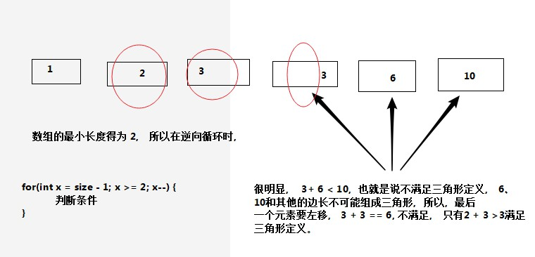
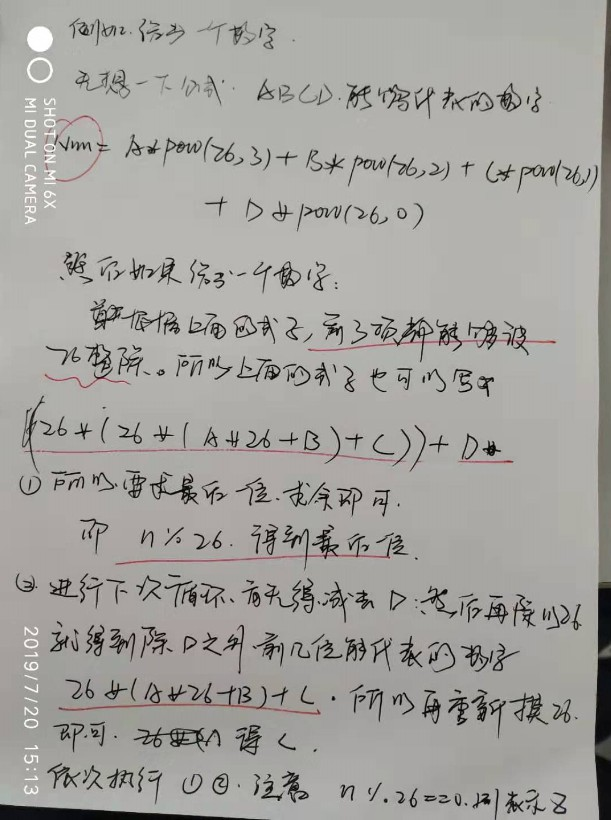

## 算法题

## Remember

##### math

###### Factorial Trailing Zeroes

> Given an integer *n*, return the number of trailing zeroes in *n*!.
>
> **Example 1:**
>
> ```
> Input: 3
> Output: 0
> Explanation: 3! = 6, no trailing zero.
> ```
>
> **Example 2:**
>
> ```java
> Input: 5
> Output: 1
> Explanation: 5! = 120, one trailing zero.
> ```
>
> Your solution should be in logarithmic time complexity.	// 你的解应该是对数时间复杂度。

```java
public int trailingZeroes(int n) {
     int ans = 0;
     while(n>0){
          ans+=(n/5);
          n/=5;
     }
     return ans;
}
```


### easy

##### Array

###### **Move Zeroes**  	

>283	  --*2019/4/13*
>
>Given an array `nums`, write a function to move all `0`'s to the end of it while maintaining the relative order of the non-zero elements.
>
>**Example:**
>
>```
>Input: [0,1,0,3,12]
>Output: [1,3,12,0,0]
>```
>
>**Note**:
>
>1. You must do this **in-place** without making a copy of the array.
>2. Minimize the total number of operations.

- 解法一

  ```java
  public static void moveZeroes(int[] nums) { // 解法1 
  /*
  虽然使用了数组，但是并没有 和 nums 为同一个引用， 所以也就遵循题目要求。
  */
  
      int []moveNums = new int[nums.length];
      int j = 0;
      for(int i = 0; i < nums.length; i++) { // 首先把 非零数 赋值给 新数组
          if(nums[i] != 0) {
              moveNums[j] = nums[i];
              j++;
          }
      }
      for(int n = 0; n < nums.length; n++) {// 如果， n < j, 表示新数组的长度（不为零的数）
          if(n < j) {
              nums[n] = moveNums[n];
          }else{
              nums[n] = 0;
          }
      }
  
  }
  ```

- 解法二

  ```java
  public static void moveZeroes(int[] nums) { // 解法 2
      int []moveNums = new int[nums.length];
      int zeroCount = 0;// 0 出现的次数
  
      for(int i = 0; i < (nums.length - zeroCount);) {   // 可以减少比较的次数
      /*
         这里并没有使用 i++, 因为 如果第一个为零， 就会发生数组的移动（类似于删除一个数）
         但是下标还是 为 0， 所以只有当前下标的元素不为零， 再回发生 i++
      */
          if(nums[i] != 0) {
              i++;
              continue;
          }
  
          for(int j = i; j < (nums.length - zeroCount - 1); j ++) {
              nums[j] = nums[j+1];
          }
          nums[nums.length - zeroCount - 1] = 0;    // 把 该位置上的 数值改为 0
          zeroCount++;
      }
  }
  ```

###### **Merge Sorted Array**

>Given two sorted integer arrays *nums1* and *nums2*, merge *nums2* into *nums1* as one sorted array.
>
>**Note:**
>
>- The number of elements initialized in *nums1* and *nums2* are *m* and *n* respectively.
>- You may assume that *nums1* has enough space (size that is greater or equal to *m* + *n*) to hold additional elements from *nums2*.
>
>**Example:**
>
>```java
>Input:
>nums1 = [1,2,3,0,0,0], m = 3
>nums2 = [2,5,6],       n = 3
>
>Output: [1,2,2,3,5,6]
>```

- 解法一

  ```java
  // 牺牲空间， 首先把 两个数组中的数据 添加到第三个 数组中，直到最后再把 数据添加到 第一个数组中， 遮掩
  // 会省掉部分 移动元素时间
  public static void merge(int[] nums1, int m, int[] nums2, int n) {
      List<Integer> list = new ArrayList<>();
      int mStartNum = 0;
      int nStartNum = 0;
      while(mStartNum < m && nStartNum < n) {
          if(nums1[mStartNum] <= nums2[nStartNum]) {
              list.add(nums1[mStartNum]);
              mStartNum ++;
          }else{
              list.add(nums2[nStartNum]);
              nStartNum ++;
          }
      }
      if(mStartNum < m) {
          for(; mStartNum < m; mStartNum++) {
              list.add(nums1[mStartNum]);
          }
      }
      if(nStartNum < n) {
          for(; nStartNum < n; nStartNum++) {
              list.add(nums2[nStartNum]);
          }
      }
      for(int i = 0; i < m+n; i ++) {
          nums1[i] = list.get(i);
      }
  }
  /*
  Runtime: 1 ms, faster than 80.11% of Java online submissions for Merge Sorted Array.
  Memory Usage: 37.3 MB, less than 78.73% of Java online submissions for Merge Sorted Array.
  */
  ```

- 解法二

  ```java
  // 只是把 数据添加到其中的一个数组中
  public static void merge1(int[] nums1, int m, int[] nums2, int n) {
      int mStartNum = 0;
      int nStartNum = 0;
      while(mStartNum < m && nStartNum < n) {
          if(nums1[mStartNum] > nums2[nStartNum]) {
              for(int moveStart = m; moveStart > mStartNum; moveStart --) {
                  nums1[moveStart] = nums1[moveStart - 1];
              }
              nums1[mStartNum] = nums2[nStartNum];
              nStartNum ++;
              m += 1;
          }
          mStartNum ++;
      }
      if(nStartNum < n) {
          for(; nStartNum < n; nStartNum++) {
              nums1[m++] = nums2[nStartNum];
          }
      }
  }
  
  Runtime: 1 ms, faster than 80.11% of Java online submissions for Merge Sorted Array.
  Memory Usage: 37.3 MB, less than 85.48% of Java online submissions for Merge Sorted Array.
  Status	Accepted
  Runtime	1 ms
  Memory	37.3 MB	
  Language	java
  ```

###### Plus One

>Given a **non-empty** array of digits representing a non-negative integer, plus one to the integer.
>
>The digits are stored such that the most significant digit is at the head of the list, and each element in the array contain a single digit.
>
>You may assume the integer does not contain any leading zero, except the number 0 itself.
>
>**Example 1:**
>
>```
>Input: [1,2,3]
>Output: [1,2,4]
>Explanation: The array represents the integer 123.
>```
>
>**Example 2:**
>
>```
>Input: [4,3,2,1]
>Output: [4,3,2,2]
>Explanation: The array represents the integer 4321.
>```

- 解法一

  ```java
  // 这里面并没有整数类型的限制， 只是需要把正数相加起来即可
  // 【9】  【1，0】	【1， 2， 3， 9】-- 【1， 2， 4， 0】
  /*
  	1.如果最后一位为 9， 如果进行加1， 就可能产生进位， 如果多位为 9 ， 也就说明 要有好几位上的数字都要发生改变
  	2.如果所有位都产生了进位， 则需要修改数组的长度。 例如 9 的结果 为 10， 即【9】 - 【1， 0】
  */
  public static int[] plusOne(int[] digits) {
      int number = 0;
      List<Integer> list = new ArrayList<>();
      int digLen = digits.length - 1;
      list.add(0);
      while(digLen >= 0 && (digits[digLen] + 1) == 10) {
          list.add((digits[digLen] + 1) % 10);
          digLen --;
      }
      if(list.size() == digits.length + 1) {
          digits = new int[list.size()];
          digits[0] = 1;
          for(int i = 1; i < digits.length; i ++) {
              digits[i] = 0;
          }
      }else{
          digits[digLen] = digits[digLen] + 1;
          for(int i = digLen + 1; i < digits.length; i++) {
              digits[i] = 0;
          }
      }
      return digits;
  }
  ```

###### Pascal's Triangle

>

- 解法一

  ```java
  // 这里众点查看  list 集合的操作
  public static List<List<Integer>> generate1(int numRows) {
      List<List<Integer>> Triangle = new ArrayList<>();
      // 注意判断 0 
      if(numRows <= 0 ) {
          return Triangle；
      }
      List<Integer> innerList = new ArrayList<>();
      innerList.add(1);
      Triangle.add(innerList);
      for(int row = 1; row < numRows; row ++) {
          innerList = new ArrayList<>();
          innerList.add(1);
          for(int col = 1; col < row; col++) {
              int number = Triangle.get(row - 1).get(col - 1) + Triangle.get(row - 1).get(col);
              innerList.add(number);
          }
          innerList.add(row, 1);
          Triangle.add(innerList);
      }
      return Triangle;
  }
  ```

- 解法二

  ```java
  public static int[][] generate(int numRows) {
      int [][] Triangle = new int[numRows][];
      if(numRows <= 0 ) {
          return Triangle；
      }
      for(int i = 0; i < numRows; i ++) {
          Triangle[i] = new int[i + 1];
      }
      for(int row = 0; row < numRows; row ++) {
          Triangle[row][0] = 1;
          for(int col = 1; col < Triangle[row].length - 1; col++) {
              Triangle[row][col] = Triangle[row - 1][col - 1] + Triangle[row - 1][col];
          }
          Triangle[row][Triangle[row].length - 1] = 1;
      }
  
      for(int []rowNums: Triangle) {
          for(int item: rowNums) {
              System.out.print(item + "\t");
          }
          System.out.println();
      }
  
      return Triangle;
  }
  ```

###### Best Time to Buy and Sell Stock II

>Say you have an array for which the *i*th element is the price of a given stock on day *i*.
>
>Design an algorithm to find the maximum profit. You may complete as many transactions as you like (i.e., buy one and sell one share of the stock multiple times).
>
>**Note:** You may not engage in multiple transactions at the same time (i.e., you must sell the stock before you buy again).
>
>**Example 1:**
>
>```
>Input: [7,1,5,3,6,4]
>Output: 7
>Explanation: Buy on day 2 (price = 1) and sell on day 3 (price = 5), profit = 5-1 = 4.
>             Then buy on day 4 (price = 3) and sell on day 5 (price = 6), profit = 6-3 = 3.
>```
>
>**Example 2:**
>
>```
>Input: [1,2,3,4,5]
>Output: 4
>Explanation: Buy on day 1 (price = 1) and sell on day 5 (price = 5), profit = 5-1 = 4.
>             Note that you cannot buy on day 1, buy on day 2 and sell them later, as you are
>             engaging multiple transactions at the same time. You must sell before buying again.
>```
>
>**Example 3:**
>
>```
>Input: [7,6,4,3,1]
>Output: 0
>Explanation: In this case, no transaction is done, i.e. max profit = 0.
>```

- 解法一

  ```java
  public int maxProfit(int[] prices) {
      int maxBonus = 0;
      int temp = -1;
      for(int i = 0; i < prices.length - 1; i ++) {
          if(prices[i] <= prices[i + 1]) {
              if(temp != -1) {
                  continue;
              }
              temp = i;
          }else{
              if(temp != -1) {
                  maxBonus = maxBonus + (prices[i] - prices[temp]);
                  temp = -1;
              }
          }
      }
      if(temp != -1) {
          maxBonus = maxBonus + (prices[prices.length - 1] - prices[temp]);
      }
      return maxBonus;
  }
  /*
  Runtime: 1 ms, faster than 79.91% of Java online submissions for Best Time to Buy and Sell Stock II.
  Memory Usage: 38.4 MB, less than 61.61% of Java online submissions for Best Time to Buy and Sell Stock II.
  */
  ```

- 解法二

  ```java
   public static int maxProfit(int[] prices) {
          List<Integer> numList = new ArrayList<>();
          int maxBonus = 0;
          for(int i = 0; i < prices.length - 1; i ++) {
              if(prices[i] <= prices[i + 1]) {
                  numList.add(prices[i]);
              }else{
                  if(numList.size() != 0) {
                      maxBonus = maxBonus + (prices[i] - numList.get(0));
                      numList.clear();
                  }
              }
          }
  
          if(numList.size() != 0) {
              maxBonus = maxBonus + (prices[prices.length - 1] - numList.get(0));
          }
          return maxBonus;
      }
      /*
       Runtime: 2 ms, faster than 5.78% of Java online submissions for Best Time to Buy and Sell Stock II.
  Memory Usage: 38.7 MB, less than 51.45% of Java online submissions for Best Time to Buy and Sell Stock II.
  */
  ```


- 解法三

  ```java
  与1不同， 并不会求出递增区间， 而是只要 后一个数比前一个数值大， 就可以前一天买入， 后一天抛出， 只是不太和逻辑的是 如果连续多天递增， 就会出现当天卖出， 当天买入的情况
  public static int maxProfit3(int[] prices) {
      int maxProfit = 0;
      for(int i = 0; i < prices.length - 1; i++) {
          if(prices[i] < prices[i+1]) {
              maxProfit += prices[i + 1] - prices[i];
          }
      }
      return maxProfit;
  }
  ```

###### Contains Duplicate

> Given an array of integers, find if the array contains any duplicates.
>
> Your function should return true if any value appears at least twice in the array, and it should return false if every element is distinct.
>
> **Example 1:**
>
> ```
> Input: [1,2,3,1]
> Output: true
> ```
>
> **Example 2:**
>
> ```
> Input: [1,2,3,4]
> Output: false
> ```
>
> **Example 3:**
>
> ```java
> Input: [1,1,1,3,3,4,3,2,4,2]
> Output: true
> ```

 - 解法一：

   ```java
       // 利用set集合的去重 。如果 集合的长度 与 原先数组的长度不同， 则证明又相同的元素
       if(nums.length == 0 || nums.length == 1) {
           return false;
       }
       Set<Integer> set = new HashSet<>();
       for(int i = 0; i < nums.length; i++) {
           set.add(nums[i]);
       }
       if(set.size() != nums.length) {
           return true;
       }
       return false;
   8 ms	44.1 MB	java
   ```

- 解法二

  ```java
      // 直接查找， 如果有重复的 ， 则返回
      if(nums.length == 0 || nums.length == 1) {
          return false;
      }
      for(int i = 0; i < nums.length - 1; i++) {
          for(int j = i + 1; j < nums.length; j++) {
              if(nums[i] == nums[j]) {
                  return true;
              }
          }
      }
      return false;
  // 效率最差
  //	330 ms	43.2 MB	java
  ```

- ==解法三==

  ```java
  // 对数组排序， 如果前后相等， 则有重复
  if(nums.length == 0 || nums.length == 1) {
      return false;
  }
  Arrays.sort(nums);
  for(int i = 0; i < nums.length - 1; i++) {
      if(nums[i] == nums[i+1]) {
          return true;
      }
  }
  return false;
  	5 ms	43.3 MB	java
  	效率最好
  ```

###### Count and Say

> The count-and-say sequence is the sequence of integers with the first five terms as following:
>
> ```
> 1.     1
> 2.     11
> 3.     21
> 4.     1211
> 5.     111221
> ```
>
> `1` is read off as `"one 1"` or `11`.
> `11` is read off as `"two 1s"` or `21`.
> `21` is read off as `"one 2`, then `one 1"` or `1211`.
>
> Given an integer *n* where 1 ≤ *n* ≤ 30, generate the *n*th term of the count-and-say sequence.
>
> Note: Each term of the sequence of integers will be represented as a string.
>
> **Example 1:**
>
> ```
> Input: 1
> Output: "1"
> ```
>
> **Example 2:**
>
> ```java
> Input: 4
> Output: "1211"
> ```

- 解法一

  ```java
  // 直接硬上 
  public static String countAndSay(int n) {
          String returnSeq = "";
          int count = 1;
          if(n < 1 || n > 30) {
              return "";
          }
          if(n == 1) {
              return "1";
          }else if(n == 2) {
              return "11";
          }
          String currStr = "11";
          for(int i = 3; i <= n; i ++ ) {
              returnSeq = "";
              char currCh = currStr.charAt(0);
              int j = 1;
              for(; j < currStr.length(); j++) {
                  if(currCh == currStr.charAt(j)) {
                      count += 1;
                  }else{
                      returnSeq = returnSeq + count + currCh;
                      currCh = currStr.charAt(j);
                      count = 1;
                  }
              }
              if(j == currStr.length()) {
                  currCh = currStr.charAt(currStr.length() - 1);
                  returnSeq = returnSeq + count + currCh;
                  count = 1;
              }
              currStr = returnSeq;
          }
          return returnSeq;
      }
  ```

- 解法二

  ```java
  public static String countAndSay2(int n) {
      if(n == 1) {
          return "1";
      }else{
          String currStr = countAndSay2(n - 1);?// 运用的递归
          String returnSeq = "";
          char currCh = currStr.charAt(0);
          int count = 1;
          int j = 1;
          for(; j < currStr.length(); j++) {
              if(currCh == currStr.charAt(j)) {
                  count += 1;
              }else{
                  returnSeq = returnSeq + count + currCh;
                  currCh = currStr.charAt(j);
                  count = 1;
              }
          }
          if(j == currStr.length()) {
              currCh = currStr.charAt(currStr.length() - 1);
              returnSeq = returnSeq + count + currCh;
          }
          return returnSeq;
      }
  }
  ```

###### Reverse String

>Write a function that reverses a string. The input string is given as an array of characters `char[]`.
>
>Do not allocate extra space for another array, you must do this by **modifying the input array in-place** with O(1) extra memory.
>
>You may assume all the characters consist of [printable ascii characters](https://en.wikipedia.org/wiki/ASCII#Printable_characters).
>
> 
>
>**Example 1:**
>
>```
>Input: ["h","e","l","l","o"]
>Output: ["o","l","l","e","h"]
>```
>
>**Example 2:**
>
>```
>Input: ["H","a","n","n","a","h"]
>Output: ["h","a","n","n","a","H"]
>```

- 解法一    

  ```java
  // 每次循环把最后一位的元素赋值给数组的第一个元素， 后面的元素依次后移。 	
  
  public static void reverseString2(char[] s) {
          char temp = 0;
          for(int i = 0; i < s.length; i++) {
              temp = s[s.length - 1];
              for(int j = s.length - 1; j > i; j--) {	
                  s[j] = s[j - 1];
              }
              s[i] = temp;	// s[i] 表示  每次循环都从 下标 为 i 的开始， 而不是从头开始
          }
  	}
  /*
  Runtime: 400 ms, faster than 6.32% of Java online submissions for Reverse String.
  Memory Usage: 47.6 MB, less than 78.96% of Java online submissions for Reverse String.
  */
  ```

- ==解法二==

  ```java
  // 有点类似一个反转， 利用 互补， a[i] <==> a[a.length - 1 - i]  互换位置
  public void reverseString(char[] s) {
      char temp = 0;
      for(int i = 0; i < s.length / 2; i++) {
          temp = s[i];
          s[i] = s[s.length - i - 1];
          s[s.length - i - 1] = temp;
      } 
  }
  /*
  Runtime: 1 ms, faster than 100.00% of Java online submissions for Reverse String.
  Memory Usage: 51.6 MB, less than 5.01% of Java online submissions for Reverse String.
  */
  ```
  

##### binary-search

###### Arranging Coins

> You have a total of *n* coins that you want to form in a staircase shape, where every *k*-th row must have exactly *k* coins.
>
> Given *n*, find the total number of **full** staircase rows that can be formed.
>
> *n* is a non-negative integer and fits within the range of a 32-bit signed integer.
>
> **Example 1:**
>
> ```
> n = 5
> 
> The coins can form the following rows:
> ¤
> ¤ ¤
> ¤ ¤
> 
> Because the 3rd row is incomplete, we return 2.
> ```
>
> **Example 2:**
>
> ```
> n = 8
> 
> The coins can form the following rows:
> ¤
> ¤ ¤
> ¤ ¤ ¤
> ¤ ¤
> 
> Because the 4th row is incomplete, we return 3.
> ```

```java
public static int arrangeCoins(int n) {
     /* 每次循环 ， 加上每层的个数
     int currCount = 0;
        int floorNum = 0;
        while(currCount >= 0 && currCount <= n) {
            currCount += (++floorNum);
        }
        return --floorNum;*/
	// 直接利用公式 (1 + x) * x / 2 = n
     int number = (int)(Math.floor(Math.sqrt( 2 * (long)n + 0.25) - 0.5) );
     return number;

     /*
     // 充分利用二分法， 如果(mid + 1) * mid / 2 <= (long)n， 
     // 一定要记住， 整数的易错的地方就是  low + high 有可能超出整数的范围
     // mid = low + (high - low) / 2;这儿也挺有意思，这儿算的是 二者之间的数,其实和（low + high) /2
     // 记住要减去 1， 因为 当 公式相等时， 也会low = mid + 1; 所以最后 low - 1
        long low = 1, high = n;
        long mid;
        if(n < 1) {
            return 0;
        }
        while(low <= high) {
            mid = low + (high - low) / 2;
            if((mid + 1) * mid / 2 <= (long)n) {
                low = mid + 1;
            }else
                high = mid - 1;
        }
        return (int)low - 1;*/
}
```


###### First Bad Version

> ​	You are a product manager and currently leading a team to develop a new product. Unfortunately, the latest version of your product fails the quality check. Since each version is developed based on the previous version, all the versions after a bad version are also bad.
>
> Suppose you have `n` versions `[1, 2, ..., n]` and you want to find out the first bad one, which causes all the following ones to be bad.
>
> You are given an API `bool isBadVersion(version)` which will return whether `version` is bad. Implement a function to find the first bad version. You should minimize the number of calls to the API.
>
> ```java
> Given n = 5, and version = 4 is the first bad version.
> 
> call isBadVersion(3) -> false
> call isBadVersion(5) -> true
> call isBadVersion(4) -> true
> 
> Then 4 is the first bad version. 
> ```
>
> - 这个也用到了二分法的思想， 不过要注意的是一定要保留 上一个 错误的版本， 因为 该版本是错的， 就会让 
>
>   right - 1, 有可能 上个版本就是第一个错误的版本， 这样就有可能不能正确 获取错误的版本号。

==但是这个一定要记得 要把 整形转换成long , 因为如果版本号很大时， right + left 可能要大于 Integer.MAX_VALUE==

```java
/*这个就用到了 刚才的思想， lastVersion 保存出现错误的版本， 无论是否为第一个错误的版本， 都会进行下次循环
*/
public boolean isBadVersion(int number) {
     if (number >= 5) {
          return true;
     }
     return false;
}
public int firstBadVersion2(int n) {
     long left = 1;
     long right = n;     
     int lastVersion = n;

     while (left <= right) {
          long mid = (left + right) / 2;
          boolean isBad = isBadVersion((int) mid);
          if (isBad) {
               right = mid - 1;
               lastVersion = (int)mid;
          } else {
               left = mid + 1;
          }
     }
     return lastVersion;
}
// 这个方法比下面这个性能较好
```

```java
/*
这个方法用到了 如果 当前版本为错误， 我就在检查一下 前一个版本是否有错， 如果有错， 则进行循环， 如果没错， 当前版本即为第一个出错版本， 如果当前版本没错， 而下一个版本有错， 那说明下一个版本就是第一个出错版本
*/
public int firstBadVersion(int n) {
    long left = 1;
    long right = n;
    int isBadIndex = n;

    while (left <= right) {
        long mid = (left + right) / 2;
        boolean isBad = isBadVersion((int) mid);
        if (isBad) {
            if (mid - 1 > 0 && isBadVersion((int) mid - 1)) {
                right = mid - 1;
            } else {
                return isBadIndex = (int) mid;
            }
        } else {
            if (mid + 1 <= n && isBadVersion((int) mid + 1)) {
                return isBadIndex = (int) mid + 1;
            }
            left = mid + 1;
        }
    }
    return isBadIndex;
}
```

###### Two Sum II - Input array is sorted

> Given an array of integers that is already **sorted in ascending order**, find two numbers such that they add up to a specific target number.
>
> The function twoSum should return indices of the two numbers such that they add up to the target, where index1 must be less than index2.
>
> **Note:**
>
> - Your returned answers (both index1 and index2) are not zero-based.
> - You may assume that each input would have *exactly* one solution and you may not use the *same* element twice.
>
> **Example:**
>
> ```java
> Input: numbers = [2,7,11,15], target = 9
> Output: [1,2]
> Explanation: The sum of 2 and 7 is 9. Therefore index1 = 1, index2 = 2.
> ```

- 暴力求解， 及双层循环

```java

public static int[] twoSum(int[] numbers, int target) {
    int []indexArr = {0, 1};

    for(int i = 0; i < numbers.length - 1; i++) {
        for(int j = i + 1; j < numbers.length; j++) {
            if(numbers[i] + numbers[j] == target) {
                indexArr[0] = i + 1;
                indexArr[1] = j + 1;
                break;
            }
        }
    }
    return indexArr;
}
Accepted	139 ms	36.3 MB	java
```

- 因为是两层循环，第二层利用 二分法‘

```java
public static int[] twoSum2(int[] numbers, int target) {
    int []indexArr = {0, 1};
    int left, right, mid, findNum;

    for(int i = 0; i < numbers.length - 1; i++) {
        left = i + 1;
        right = numbers.length - 1;
        findNum = target - numbers[i];
        while (left <= right) {		// 这里才用到了 二分法
            mid = (left + right) / 2;
            if(numbers[mid] == findNum) {
                indexArr[0] = i + 1;
                indexArr[1] = mid + 1;
                break;
            }else if(numbers[mid] < findNum) {
                left = mid + 1;
            }else{
                right = mid - 1;
            }
        }
    }
    return indexArr;
}
Accepted	4 ms	37.5 MB	java
```

- 利用二分法， 不过这个不同于以往的二分法， 如果二者之和 < target ， 则left ++; 如果 之和 > target ， 则 right --;

```java
public static int[] twoSum3(int[] numbers, int target) {
    int []indexArr = {0, 1};
    int left, right, mid, findNum;
    left = 0;
    right = numbers.length - 1;

    while(left <= right) {
        if(numbers[left] + numbers[right] > target) {
            right --;
        }else if(numbers[left] + numbers[right] < target) {
            left ++;
        }else {
            indexArr[0] = left + 1;
            indexArr[1] = right + 1;
            break;
        }
    }
    return indexArr;
}
Accepted	0 ms	37.3 MB	java
```

###### Peak Index in a Mountain Array

==这儿比较有意思的是 该数组是先递增后递减的， 并且只有一个顶峰， 所以只要 找到peak, 如果 后面一个数小于peak, 停止比较就可以==

> Let's call an array `A` a *mountain* if the following properties hold:
>
> - `A.length >= 3`
> - There exists some `0 < i < A.length - 1` such that `A[0] < A[1] < ... A[i-1] < A[i] > A[i+1] > ... > A[A.length - 1]`
>
> Given an array that is definitely a mountain, return any `i` such that `A[0] < A[1] < ... A[i-1] < A[i] > A[i+1] > ... > A[A.length - 1]`.

```java
int peakNum = A[0];
int peakIndex = 0;
for(int i = 1; i < A.length; i++) {
    if(peakNum < A[i]) {
        peakNum = A[i];
        peakIndex = i;
    }else{
        break;
    }
}
return peakIndex;
```

###### Search Insert Position

> Given a sorted array and a target value, return the index if the target is found. If not, return the index where it would be if it were inserted in order.
>
> You may assume no duplicates in the array.
>
> ```java
> Input: [1,3,5,6], 5
> Output: 2
> ```
>
> ```java
> Input: [1,3,5,6], 2
> Output: 1
> ```
>
> ```java
> Input: [1,3,5,6], 7
> Output: 4
> ```
>
> ```java
> Input: [1,3,5,6], 0
> Output: 0
> ```
>
> 这里要考虑的情况 数组只包含一个元素
>
> - target <= num[0] 就表示插入到 第 0 个
>
> - target > num[num.length - 1] 表示插入到最后一个， num.length 
>
> - 一定要注意比较最后一个元素， 例如上面中target = 6, 则需要插入到 最后一个元素之前， 首先要比较 最后一个元素， 
>
>   left <= right, 而不是
>
>   这里比较有意思的是，如果 target < nums[mid] ;只是赋值 right = mid;, 而不是 mid - 1

```java
public static int searchInsert(int[] nums, int target) {
     if(target <= nums[0]) {
          return 0;
     }else if(target > nums[nums.length - 1]){
          return nums.length;
     }
     int left = 1;
     int right = nums.length;
     int mid = (left + right ) / 2;
     if(target < nums[mid]) {
          right = mid;
     }else if(target == nums[mid]){
          return mid;
     }else{
          left = mid;
     }
     for(; left <= right; left++) {
          if(target <= nums[left]) {
               return left;
          }
     }
     return  0;
}
```

##### LinkedList

###### Reverse Linked List

> 想法一：
>
> 首先把把这添加到linkedList 中， 然后  currItem.next = listNode;
>
> 想法二：
>
> 就是在原来的基础上， 直接反转链表

解法一：

```java
public ListNode reverseList(ListNode head) {
     LinkedList<Integer> list = new LinkedList<>();
     while (head != null) {
          list.addFirst(head.val);
          head = head.next;
     }
     ListNode currItem = null;
     while (!list.isEmpty()) {
          int value = list.pop();

          ListNode listnode = new ListNode(value);
          if (head == null) {
               head = listnode;
               currItem = listnode;
          } else {
               currItem.next = listnode;
               currItem = listnode;
          }
          currItem.next = null;
     }
     return head;
}
```

解法二：


```java
public ListNode reverseList(ListNode head) {

     ListNode a = null, b, c;
     if(head == null || head.next == null) {
          return head;
     }
     b = head;
     c = head.next;
     while(c != null) {
          b.next = a;
          a = b;
          b = c;
          c = c.next;
     }
     b.next = a;
     head = b;
     return head;   
}
```

##### stack

###### Baseball Game

> You're now a baseball game point recorder.
>
> Given a list of strings, each string can be one of the 4 following types:
>
> 1. `Integer` (one round's score): Directly represents the number of points you get in this round.
> 2. `"+"` (one round's score): Represents that the points you get in this round are the sum of the last two `valid` round's points.
> 3. `"D"` (one round's score): Represents that the points you get in this round are the doubled data of the last `valid`round's points.
> 4. `"C"` (an operation, which isn't a round's score): Represents the last `valid` round's points you get were invalid and should be removed.
>
> Each round's operation is permanent and could have an impact on the round before and the round after.
>
> You need to return the sum of the points you could get in all the rounds.
>
> **Example 1:**
>
> ```
> Input: ["5","2","C","D","+"]
> Output: 30
> Explanation: 
> Round 1: You could get 5 points. The sum is: 5.
> Round 2: You could get 2 points. The sum is: 7.
> Operation 1: The round 2's data was invalid. The sum is: 5.  
> Round 3: You could get 10 points (the round 2's data has been removed). The sum is: 15.
> Round 4: You could get 5 + 10 = 15 points. The sum is: 30.
> ```
>
> **Example 2:**
>
> ```
> Input: ["5","-2","4","C","D","9","+","+"]
> Output: 27
> Explanation: 
> Round 1: You could get 5 points. The sum is: 5.
> Round 2: You could get -2 points. The sum is: 3.
> Round 3: You could get 4 points. The sum is: 7.
> Operation 1: The round 3's data is invalid. The sum is: 3.  
> Round 4: You could get -4 points (the round 3's data has been removed). The sum is: -1.
> Round 5: You could get 9 points. The sum is: 8.
> Round 6: You could get -4 + 9 = 5 points. The sum is 13.
> Round 7: You could get 9 + 5 = 14 points. The sum is 27.
> ```
>
> **Note:**
>
> The size of the input list will be between 1 and 1000.
>
> Every integer represented in the list will be between -30000 and 30000.

```java
/*
	1、如果字符串常量 为 ‘+’ 出栈两个元素， 求和， 然后再把 三个元素压栈
	2、如果字符串常量 为 ‘C’ 出栈， 但是 就相当于减去 栈顶的元素， 所以为 0 - number (表示求相反数)
	3、如果字符串常量 为 ‘D’ 表示栈顶元素 * 2， stack.peek() * 2
	4、如果为整数， 直接转化称数字， 然后入栈
*/
public int calPoints(String[] ops) {        
       Stack<Integer> stack = new Stack<>();        
        int strSum = 0;
        int number1 = 0, number2= 0, tempSum = 0;
        for (int i = 0; i < ops.length; i++) {
            if (ops[i].equals("+")) {	// 出栈一个 + 栈顶元素 = 和 （）
                number1 = !stack.isEmpty() ? stack.pop() : 0;
                number2 = !stack.isEmpty() ? stack.peek() : 0;
                tempSum = number1 + number2;
                strSum += tempSum;
                stack.push(number1);
                stack.push(tempSum);
            } else if (ops[i].equals("C")) {
                number1 = !stack.isEmpty() ? stack.pop() : 0;
                number2 = 0 - number1;
                strSum += number2;
            } else if (ops[i].equals("D")) {
                number1 = !stack.isEmpty() ? stack.peek() : 1;
                number2 = number1 * 2;
                strSum += number2;
                stack.push(number2);
            } else {
                number1 = Integer.parseInt(ops[i]);
                stack.push(number1);
                strSum += number1;
            }
        }
        return strSum;
    }
```

###### Remove Outermost Parentheses

> A valid parentheses string is either empty `("")`, `"(" + A + ")"`, or `A + B`, where `A` and `B` are valid parentheses strings, and `+` represents string concatenation.  For example, `""`, `"()"`, `"(())()"`, and `"(()(()))"` are all valid parentheses strings.
>
> A valid parentheses string `S` is **primitive** if it is nonempty, and there does not exist a way to split it into `S = A+B`, with `A` and `B` nonempty valid parentheses strings.
>
> Given a valid parentheses string `S`, consider its primitive decomposition: `S = P_1 + P_2 + ... + P_k`, where `P_i` are primitive valid parentheses strings.
>
> Return `S` after removing the outermost parentheses of every primitive string in the primitive decomposition of `S`. 
>
> **Example 1:**
>
> ```
> Input: "(()())(())"
> Output: "()()()"
> Explanation: 
> The input string is "(()())(())", with primitive decomposition "(()())" + "(())".
> After removing outer parentheses of each part, this is "()()" + "()" = "()()()".
> ```
>
> **Example 2:**
>
> ```
> Input: "(()())(())(()(()))"
> Output: "()()()()(())"
> Explanation: 
> The input string is "(()())(())(()(()))", with primitive decomposition "(()())" + "(())" + "(()(()))".
> After removing outer parentheses of each part, this is "()()" + "()" + "()(())" = "()()()()(())".
> ```
>
> **Example 3:**
>
> ```
> Input: "()()"
> Output: ""
> Explanation: 
> The input string is "()()", with primitive decomposition "()" + "()".
> After removing outer parentheses of each part, this is "" + "" = "".
> ```
>
>  **Note:**
>
> 1. `S.length <= 10000`
> 2. `S[i]` is `"("` or `")"`
> 3. `S` is a valid parentheses string

```java
/*
        先分段，
        如果碰到右括号， 则加一， 但是要注意 如果 右括号数量为 0 ， 则不添加， 表示 已删除右括号一个
        如果碰到左括号， 则减一， 但是要注意 如果 左括号数量为 1 ， 则表示最外部括号包含的括号全都在栈中，也就不会添加最后一个左括号。
        右括号， 先添加， 再自增（为了判断是否为第一个右括号）
        左括号、先减少， 再自减（为了判断是否为最后一个右括号）

    */
public String removeOuterParentheses(String S) {
     Stack<Character> stack = new Stack<>();

     int flagCount = 0, rightCount = 0;
     boolean flag = false;
     StringBuffer buffer = new StringBuffer();
     for(int i = 0; i < S.length(); i++) {
          char ch = S.charAt(i);
          if(ch == '(' ) {
               if(flagCount != 0) {
                    stack.push(ch);
               }
               flagCount ++;
          }else{
               flagCount --;
               if(flagCount > 0) {
                    stack.push(ch);
               }
          }
     }
     while(!stack.isEmpty()) {
          buffer.append(stack.pop());
     }
     return buffer.reverse().toString();
}
```

###### Remove Outermost Parentheses2

> 该题与上面一题的区别是， 只有括号内部有括号， 才会删除最外层括号， 但是只有（）， 并不删除。

> A valid parentheses string is either empty `("")`, `"(" + A + ")"`, or `A + B`, where `A` and `B` are valid parentheses strings, and `+` represents string concatenation.  For example, `""`, `"()"`, `"(())()"`, and `"(()(()))"` are all valid parentheses strings.
>
> A valid parentheses string `S` is **primitive** if it is nonempty, and there does not exist a way to split it into `S = A+B`, with `A` and `B` nonempty valid parentheses strings.
>
> Given a valid parentheses string `S`, consider its primitive decomposition: `S = P_1 + P_2 + ... + P_k`, where `P_i` are primitive valid parentheses strings.
>
> Return `S` after removing the outermost parentheses of every primitive string in the primitive decomposition of `S`. 
>
> **Example 1:**
>
> ```
> Input: "(()())(())"
> Output: "()()()"
> Explanation: 
> The input string is "(()())(())", with primitive decomposition "(()())" + "(())".
> After removing outer parentheses of each part, this is "()()" + "()" = "()()()".
> ```
>
> **Example 2:**
>
> ```
> Input: "(()())(())(()(()))"
> Output: "()()()()(())"
> Explanation: 
> The input string is "(()())(())(()(()))", with primitive decomposition "(()())" + "(())" + "(()(()))".
> After removing outer parentheses of each part, this is "()()" + "()" + "()(())" = "()()()()(()".
> ```

```java
/**
	首先添加一个 # 元素， 为了预防 stack.peek() 等操作出现 空  异常。
	如果 ch = '(', 并且当前栈顶元素 为 '(', 会设置 flag = true, 同时出现两个右括号， 表示 出现内部括号，
	但有必要区分的是， 只去掉最外层括号，所以 1的位置 表示 同时出现两个左括号， 并且flag == false 的情况下才会删除一个左括号， 其他情况正常添加。
	ch = ')', 并且当前栈顶元素 为 ')', 如果 flag = true; 则会删除一个 右括号(出现外层括号),其他情况正常添加 
*/

// 这个输出的是： 如果只是单括号， 则不删除
Stack<Character> stack = new Stack<>();
stack.push('#');
boolean flag = false;
for(int i = 0; i < S.length(); i++) {
     char ch = S.charAt(i);
     if(ch == '(' ) {				
          if(stack.peek() == '(' && !flag) { -----------------------  1
               flag = true;
          }else {
               stack.push(ch);
          }
     }else{
          if(stack.peek() == ')' && flag) {  -------------------------2
               flag = false;
          }else{
               stack.push(ch);
          }
     }
}
StringBuffer buffer = new StringBuffer();
int size = stack.size();
while(!stack.isEmpty() && --size > 0) {
     buffer.append(stack.pop());
}
return buffer.reverse().toString();
```

##### Sort

###### Largest Perimeter Triangle

>Given an array `A` of positive lengths, return the largest perimeter of a triangle with **non-zero area**, formed from 3 of these lengths.
>
>If it is impossible to form any triangle of non-zero area, return `0`.
>
>**Example 1:**
>
>```
>Input: [2,1,2]
>Output: 5
>```
>
>**Example 2:**
>
>```
>Input: [1,2,1]
>Output: 0
>```
>
>**Example 3:**
>
>```
>Input: [3,2,3,4]
>Output: 10
>```
>
>**Example 4:**
>
>```
>Input: [3,6,2,3]
>Output: 8
>```

==这个首先进行排序， 求长度最大的三角形的周长，要记住，如果数组的元素分别用abcdefg表示， 如果efg 不满足， 那么e之前的边长也不满足为三角形==



```java
public int largestPerimeter(int[] A) { // 进行排序
     Arrays.sort(A);
     for(int i = A.length - 1; i >= 2; i--) {
          if(A[i - 2] + A[i - 1] > A[i] && A[i - 2] > 0) {
               return A[i - 2] + A[i - 1] + A[i];
          }
     }
     return 0;
}
```

##### Math

###### ==Add Digits==

》 比较景点， 如果是 9 的整倍数， 返回一定 为 9 例如18 == 9， 279 = 9

如果 是 0 < x < 10, 返回则为元素，其他之则为 与 9 的余数

> Add Digits
>
> Given a non-negative integer `num`, repeatedly add all its digits until the result has only one digit.
>
> **Example:**
>
> ```
> Input: 38
> Output: 2 
> Explanation: The process is like: 3 + 8 = 11, 1 + 1 = 2. 
>              Since 2 has only one digit, return it.
> ```
>
> **Follow up:**
> Could you do it without any loop/recursion in O(1) runtime?

解法

```java
If you check the parttern you can see that after ever 9th value the result repeated
eg: for 1 to 9 the answer re 1 to 9
10 to 18 the answer are 1 to 9
19 to 27 the ans are 1 to 9
and so on.....
so we can do is return num%9 and if its equal to 0 then return 9
only the case when num =0 return 0 else return 9
```

```java
public int addDigits(int num) {
     if(num < 10) {
          return num;
     }
     if(num % 9 == 0  ){
          return 9;
     }
     return num % 9;
}
```
```java
public static int addDigits(int num) {
     while(num >= 10) {
          int number = 0;
          while(num > 0) {
               number += (num % 10);
               num /= 10;
          }
          num = number;
     }
     return num;
}
```

###### Binary Gap

> Given a positive integer `N`, find and return the longest distance between two consecutive 1's in the binary representation of `N`.
>
> If there aren't two consecutive 1's, return 0.
>
> **Example 1:**
>
> ```
> Input: 22
> Output: 2
> Explanation: 
> 22 in binary is 0b10110.
> In the binary representation of 22, there are three ones, and two consecutive pairs of 1's.
> The first consecutive pair of 1's have distance 2.
> The second consecutive pair of 1's have distance 1.
> The answer is the largest of these two distances, which is 2.
> ```
>
> **Example 2:**
>
> ```
> Input: 5
> Output: 2
> Explanation: 
> 5 in binary is 0b101.
> ```
>
> **Example 3:**
>
> ```
> Input: 6
> Output: 1
> Explanation: 
> 6 in binary is 0b110.
> ```
>
> **Example 4:**
>
> ```
> Input: 8
> Output: 0
> Explanation: 
> 8 in binary is 0b1000.
> There aren't any consecutive pairs of 1's in the binary representation of 8, so we return 0.
> ```
>
>  **Note:**
>
> - `1 <= N <= 10^9`

解法 1

> 就是先把 器二进制形式输出， 然后在比较如果出现，然后再找出其中最长距离的 两个 1

```java
public int binaryGap(int N) {
    StringBuffer buffer = new StringBuffer();
    int maxPad = 0;
    int startOne = 0;
    int currIndex = 0;
    while(N > 0) {
        buffer.append(N % 2);
        N = N / 2;
    }
    String info = buffer.reverse().toString();        
    startOne = info.indexOf("1");
    currIndex = startOne + 1;
    if(startOne == (info.length() - 1)) {
        return 0;
    }
    while(currIndex < info.length()) {
        char ch = info.charAt(currIndex);
        if(ch == '1') {
            int currPad = currIndex - startOne;
            if(currPad > maxPad) {
                maxPad = currPad;
            }
            startOne = currIndex;
        }
        currIndex ++;
    }
    return maxPad;
}
```

解法 2

> 这个是对第一个方法的改进，无需存储在队列中， 而是直接进行计算， 二进制队列 10011 和 11001虽然表示十进制数不同， 但是二者能够标识的 1 和 1之间的距离是相同的。
>
> 利用 再求余运算中直接进行统计， 如果第一次碰到 1， (判断 startOne  =  -1) 设置 startOne  = 1;
>
> 如果不是第一次碰到 1，则进行 Math.max(maxPad, currIndex - startOne); 求出当前最大 距离， 记住一定要
>
> startOne = currIndex;  
>
> currIndex ++; 表示当前第几个二进制位

```java
public int binaryGap(int N) {
     int maxPad = 0;
     int startOne = -1;
     int currIndex = 0;
     while(N > 0) {
          int reminder = N % 2;
          if(reminder == 1) {
               if(startOne == -1) {
                    startOne = currIndex;
               }else{
                    maxPad = Math.max(maxPad, currIndex - startOne);
                    startOne = currIndex;
               }
          }
          N = N / 2;
          currIndex ++;
     }

     return maxPad;
}
```

解法 3

> 首先，给定的数字是十进制的，因此需要一定的方法将其转化为二进制的形式。对于这道题，当我们在按位转换二进制时，依次对两个1之间的最大的值进行记录。counter是-32，是因为N可能会很大，因此取counter为-32.

```java
public static int binaryInfo(int number) {
     int res = 0, counter = -32;
     while(number > 0)
     {
          if((number&1) == 1)	// 如果， 模 2 位 零的话， 位运算 与 也为 零，否则 为 1.
          {
               res = Math.max(res, counter);
               counter = 0;
          }
          number = number>>1;
          counter++;
     }
     return res;
}
```

###### DI String Match

> Given a string `S` that **only** contains "I" (increase) or "D" (decrease), let `N = S.length`.
>
> Return **any** permutation `A` of `[0, 1, ..., N]` such that for all `i = 0, ..., N-1`:
>
> - If `S[i] == "I"`, then `A[i] < A[i+1]`
> - If `S[i] == "D"`, then `A[i] > A[i+1] 
>
> **Example 1:**
>
> ```
> Input: "IDID"
> Output: [0,4,1,3,2]
> ```
>
> **Example 2:**
>
> ```
> Input: "III"
> Output: [0,1,2,3]
> ```
>
> **Example 3:**
>
> ```
> Input: "DDI"
> Output: [3,2,0,1]
> ```
>
> **Note:**
>
> 1. `1 <= S.length <= 10000`
> 2. `S` only contains characters `"I"` or `"D"`.

> 首先是 1 - N, 元素的排列， 不能重复。 并且 返回的数组的长度要比 字符串长度 + 1
>
> 解体思路为：
>
> 如果 开始 为 ==I==表示从零开始， 如果 开始为 ==D==, 表示从 s.length()  开始。一次类推， 碰到 ==I==就加一， 碰到 ==D==就减一

```java
public int[] diStringMatch(String S) {
     int []nums = new int[S.length() + 1];
     int in_num = 0;
     int de_num = S.length();
     for(int i = 0; i < S.length(); i++) {
          char ch = S.charAt(i);
          if(ch == 'I') {
               nums[i] = in_num;
               in_num += 1;
          }else{
               nums[i] = de_num;
               de_num -= 1;
          }
     }
     nums[S.length()] = de_num;
     return nums;        
}
```

###### Excel Sheet Column Number

> Given a column title as appear in an Excel sheet, return its corresponding column number.
>
> For example:
>
> ```java
>     A -> 1
>     B -> 2
>     C -> 3
>     ...
>     Z -> 26
>     AA -> 27
>     AB -> 28 
>     ...
> ```
>
> **Example 1:**
>
> ```java
> Input: "A"
> Output: 1
> ```
>
> **Example 2:**
>
> ```java
> Input: "AB"
> Output: 28
> ```
>
> **Example 3:**
>
> ```java
> Input: "ZY"
> Output: 701
> ```

> 这个无疑就是  Z * Math.pow(26, 1) + Y * Math.pow(26, 0) ,然后得出该表达式能够代表的数字。下面这道题正好是这道题的一个反向计算。

```java
public int titleToNumber(String s) {
     int sum = 0;
     int startIndex = 0;
     for(;startIndex < s.length(); startIndex++) {
          char alpCh = s.charAt(startIndex);
          sum += ((alpCh - 64) * (int)Math.pow(26, s.length() - startIndex - 1));
     }
     return sum;
}
```
###### Excel Sheet Column Title

> Given a positive integer, return its corresponding column title as appear in an Excel sheet.
>
> For example:
>
> ```
>     1 -> A
>     2 -> B
>     3 -> C
>     ...
>     26 -> Z
>     27 -> AA
>     28 -> AB 
>     ...
> ```
>
> **Example 1:**
>
> ```
> Input: 1
> Output: "A"
> ```
>
> **Example 2:**
>
> ```
> Input: 28
> Output: "AB"
> ```
>
> **Example 3:**
>
> ```java
> Input: 701
> Output: "ZY"
> ```



```java
public String convertToTitle(int n) {
     StringBuffer buffer = new StringBuffer();
     int recycleNum = 0;
     while(n > 0) {
          char ch;
          int alpNum = (n % 26);
          if(alpNum == 0){
               alpNum += 26;
          }
          ch = (char)(alpNum + 64);
          buffer.append(ch);

          n = (n - alpNum) / 26;
          recycleNum ++;
     }
     return buffer.reverse().toString();
}
```