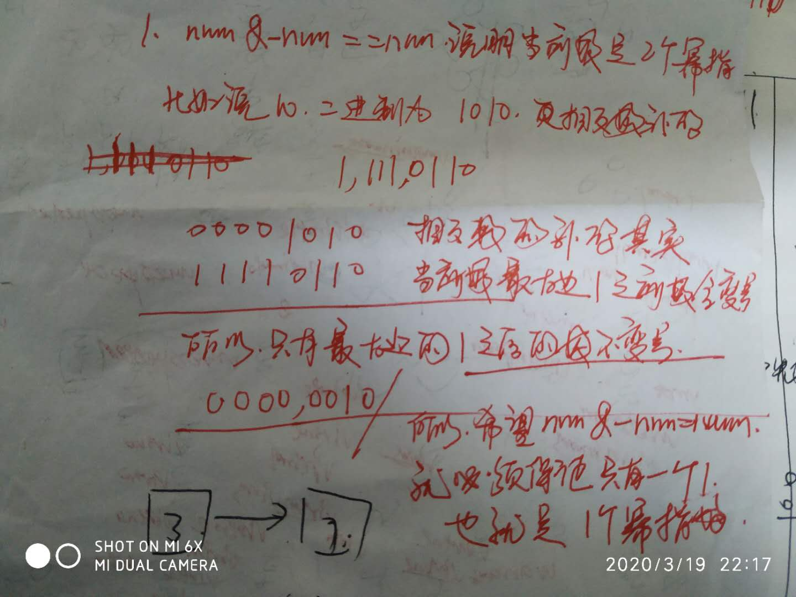
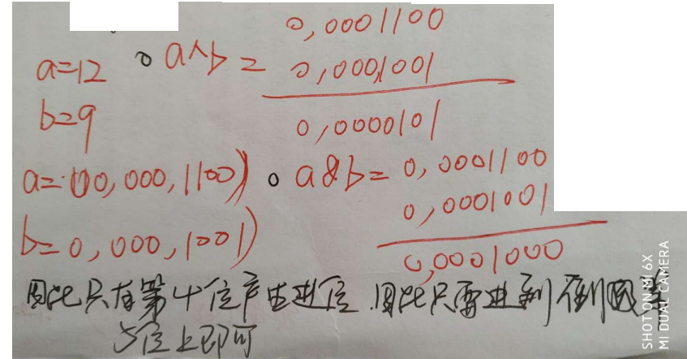

# 位运算

## 异或

> 交换律：a ^ b ^ c <=> a ^ c ^ b
>
> 任何数于0异或为任何数 0 ^ n => n
>
> 相同的数异或为0: n ^ n => 0

## 交换两个数字

> a = a ^ b;        
>
> b = a ^ b;  (a ^ b) ^ b == a ^ b ^ b = a
>
> a = a ^ b;  (a ^ b) ^ a  == a ^ b ^ a = b 

## 与运算

> 1. 希望判断 当前位 为  1; 可以利用 num & 1
>
>    例如： num = 10;   (10)b = 1010;   
>
>    1010 & 0001  == 1
>
> 2. 那如果  num & -num == num 说明什么 该数 是 2 的幂指数
>
> 3. 必须是2的幂指数，才能满足 (n & n - 1) == 0;
>
> 

## [191. 位1的个数](https://leetcode-cn.com/problems/number-of-1-bits/)

> 编写一个函数，输入是一个无符号整数，返回其二进制表达式中数字位数为 ‘1’ 的个数（也被称为[汉明重量](https://baike.baidu.com/item/汉明重量)）
>
> 其实这个还需要比较细心的是： 如果出现负数的情况， 因为 出现负数，如果只是简单的使用 >> 就会出现符号位右移； 所以需要无符号右移； 就是符号位不管是什么，都会在第一位添加 0；

## [190. 颠倒二进制位](https://leetcode-cn.com/problems/reverse-bits/)

## [136. 只出现一次的数字](https://leetcode-cn.com/problems/single-number/)

## [260. 只出现一次的数字 III](https://leetcode-cn.com/problems/single-number-iii/)

> 1. 这道题非常的经典， 就是 首先求出所有数字的异或结果；
> 2. 这个结果肯定有一某位数字是（因为全是零不符合题意）， 也就是说 那两个只出现一次的数字 在这一位上不同，因此，就根据这一位 把数组分成两部分，每一部分异或 的结果就是要找的  single number

## [268. 缺失数字](https://leetcode-cn.com/problems/missing-number/)

> 和上面只出现一次的整数相同，在0-n 之间缺少的数字，同样 下标也出现一次，这样 数字和下标出现两次

## `数组`面试题 17.19`. 消失的两个数字(==和两个只出现一次的数字问题相同==)

## [231. 2的幂](https://leetcode-cn.com/problems/power-of-two/)

> 这道题挺有意思，利用 n & -n == n; 但是有一点要注意的是    0    
>
> (n & n - 1) == 0;

```java
// 常规做法
public boolean isPowerOfTwo(int n) {
    if(n <= 0) {
        return false;
    }
    while(n % 2 == 0) {
        n >>= 1;
    }
    return n == 1;
}
```

## [342. 4的幂](https://leetcode-cn.com/problems/power-of-four/)

```java
public boolean isPowerOfFour(int n) {
    if(n <= 0) {
        return false;
    }
    while(n % 4 == 0) {
        n >>= 2;
    }
    return n == 1;
}
```

## [762. 二进制表示中质数个计算置位](https://leetcode-cn.com/problems/prime-number-of-set-bits-in-binary-representation/)

## 一个数n的二进制表示中第K位是几

## 一个数n的二进制表示中最后一个1

## [461. 汉明距离](https://leetcode-cn.com/problems/hamming-distance/)

> 两个整数之间的[汉明距离](https://baike.baidu.com/item/汉明距离)指的是这两个数字对应二进制位不同的位置的数目。
>
> 给出两个整数 `x` 和 `y`，计算它们之间的汉明距离。
>
> 首先获取 当前位的数， 利用异或， 求出两个数位上不同的数字的个数

## [762. 二进制表示中质数个计算置位](https://leetcode-cn.com/problems/prime-number-of-set-bits-in-binary-representation/)

```java
public int countPrimeSetBits(int L, int R) {
    int []primtSet = {
        0, 0, 1, 1, 0, 1, 0, 1, 0, 0, 0,    // 0 - 10
        1, 0, 1, 0, 0, 0, 1, 0, 1, 0, 0,   // 11 -21
        0, 1, 0, 0, 0, 0, 0, 1, 0, 1, 0   // 20 - 29
    };
    int primeCount = 0;
    for(; L <= R; L++) {
        int bitOneCount = 0;
        for(int tempNum = L; tempNum != 0; tempNum >>= 1) {
            bitOneCount += (tempNum & 1);
        }
        primeCount += primtSet[bitOneCount];
    }
    return primeCount;
}
```

## [476. 数字的补数](https://leetcode-cn.com/problems/number-complement/)

## [371. 两整数之和](https://leetcode-cn.com/problems/sum-of-two-integers/)

> 这题太他妈经典了
>
> `1. 记住：按照正常的加法， 0 + 1 == 1； 1 + 1 == 0（有进位）`，所以我们可以通过 
>
> a ^ b 计算出没有进位的两数字之和，
>
>  `2. 我们还要计算出两个数字产生进位，因为只有 1 + 1 才有进位，并且要知道，如果当前位 1+1 == 1, 应该是要往前 进一位，因此，需要将 (a & b) << 1`
>
> `3. 然后再将 普通之数加上进位之数`

**那这个会不会陷入死循环，首先 b = (a & b) << 1; 每次移位最后一位都会多个 0； 然后求与 依然保证 0 的存在， 一次递归，会让 b = 0**



## [415. 字符串相加](https://leetcode-cn.com/problems/add-strings/)(字符串骚操作)

> 我认为这道题也是为长的经典