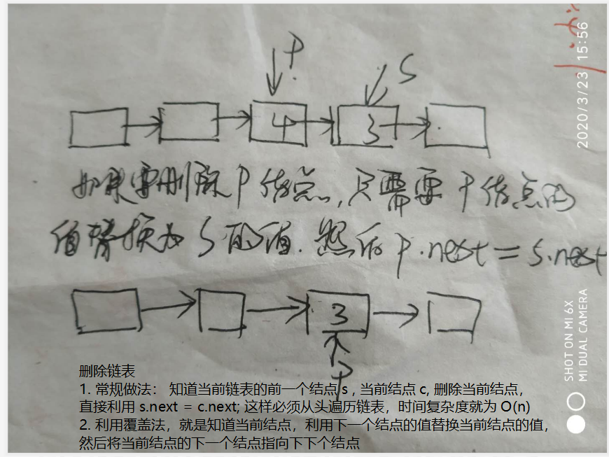

# 做题技巧

1. 如果碰到 整数可能溢出的情况，直接利用 long 代替 int

# 面试题

## [`1. 面试题03. 数组中重复的数字`](https://leetcode-cn.com/problems/shu-zu-zhong-zhong-fu-de-shu-zi-lcof/)

> 这道题在原书上绝对不是简单级别啊！
> 它考察的是程序员的沟通能力，先问面试官要时间/空间需求！！！
> 只是时间优先就用字典，
> 还有空间要求，就用指针+原地排序数组，
> 如果面试官要求空间O(1)并且不能修改原数组，还得写成二分法！！！

> 方法： 首先这道题 和找出数组中消失的元素相同，利用当前元素curr 把 nums[curr] 的元素变成负数，如果到最后，有那一没有变成负数，说明缺失元素。 同理，如果我们希望找出 重复的元素， 我们也是先根据 Curr 把 nums[curr] 变成负数， 首先判断 当前元素是否已经是 负数，如果是， 那说明 已经出现过，也就是 重复的元素。（但是要知道，  0  的相反数还是 0， 因此我们单独开辟一段地址存储 零 的个数， 如果 零的个数 大于 1， 说明 零 是 重复的元素。

```java
public int findRepeatNumber(int[] nums) {
    int countZero = 0;
    for(int i = 0; i < nums.length; i++) {
        int temp = nums[i];
        if(temp == 0) {
            countZero ++;
        }else{
            temp = temp > 0 ? temp : -temp;
            if(nums[temp] < 0) {
                return temp;
            }
            nums[temp] = -nums[temp];
        }
    }
    return countZero > 1 ? 0 : -1;
}
```

### 1. 时间复杂度 为o(n), 空间复杂度不做要求o(n)

> 构建新数组，用于统计所有数组中元素的个数，如果，某个元素的个数超过 1，就表示有重复，就可以退出

```java
public int findRepeatNumber(int[] nums) {
    int []tempArr = new int[nums.length];
    int i = 0;
    for(; i < nums.length && ++tempArr[nums[i]] < 2;) {
        i++;
    }
    return nums[i];
}
```

### 2. 时间复杂度 为o(n), 空间复杂度不做要求o(1)

> 直接在该数组上进行调动。
>
> 大约消耗 2n 的时间，但时间复杂度大概为 o(n)

```java
public int findRepeatNumber(int[] nums) {
    int numLen = nums.length;
    for(int i = 0; i < numLen; i++) {
        while(nums[i] != i) {
            // 如果当前下标的元素和当前下标不等，进行循环
            if(nums[i] == nums[nums[i]]) {
                return nums[i];
            }
            int temp = nums[i];
            nums[i] = nums[temp];
            nums[temp] = temp;
        }
    }
    return -1;
}
```

### [剑指offer第二版面试题2：数组中重复的数字（JAVA版）](https://www.cnblogs.com/xhlwjy/p/11255257.html)

## [2.  不修改数组找出重复的数字](https://www.acwing.com/problem/content/description/15/)

> 给定一个长度为 n+1的数组`nums`，数组中所有的数均在 1∼n 的范围内，其中 n≥1。
>
> 请找出数组中任意一个重复的数，但不能修改输入的数组。
>
> **样例**
>
> 给定 nums = [2, 3, 5, 4, 3, 2, 6, 7]。
>
> 返回 2 或 3。
>
> **思考题**：如果只能使用 O(1)的额外空间，该怎么做呢？

这道题不同于面试题 3， 这个里面提到了n + 1 个数存在了 n 个坑里，所以肯定会有重复的数字，但是 面试题 3 就不同了，n 个坑里存了 n 个数字。

```java
public int duplicateInArray(int[] nums) {
    int low = 1, high = nums.length - 1;
    // 首先数组的长度 为 n , 包含的数字只能从 1 - (n - 1) 中找出
    while(low < high) {
        // 为什么 不用 low <= high 
        int mid = low + (high - low) / 2;
        int numCount = 0;
        for(int item: nums) {// 统计出现在 Low <= x <= mid 中的数字的个数
            if(low <= item && item <= mid) {
                numCount += 1;
            }
        }
        if(numCount > (mid - low + 1)) {	// 如果numsCount > （范围 + 1）的长度，说明 在 low - mid 之间存在重复的数，当然也包括 mid ，因此我们需要 high = mid
            high = mid;
        }else{
            low = mid + 1;
        }
    }
    return high;
}
```

## `数组`[`面试题53 - II. 0～n-1中缺失的数字`](https://leetcode-cn.com/problems/que-shi-de-shu-zi-lcof/)

>  一个长度为n-1的递增排序数组中的所有数字都是唯一的，并且每个数字都在范围0～n-1之内。在范围0～n-1内的n个数字中有且只有一个数字不在该数组中，请找出这个数字。
>
>  首先查看是否有序，如果`·有序`， 并且每个数字都在范围 0-n-1, 并且只有一个数字不在该数组中，只要 下标和当前下标的元素不同，就返回该元素。
>
>  `如果，数组有序，并且可以利用 二分查找， 如果 nums[mid] == mid; 说明缺失的数字在右面·如果 nums[mid] > mid; 说明  左面缺失了 数字， 不会出现 nums[mid] < mid 的情况`

## `数组`[69. 数组中数值和下标相等的元素](\69. 数组中数值和下标相等的元素)

> 假设一个单调递增的数组里的每个元素都是整数并且是唯一的。
>
> 请编程实现一个函数找出数组中任意一个数值等于其下标的元素。
>
> 例如，在数组[-3, -1, 1, 3, 5]中，数字3和它的下标相等。
>
> 这道题真的很是经典， 首先我们知道  该数组是一个递增数组，也就是 nums[i] > nums[i - 1];
>
> 我们希望找到一个 nums[i] - i == 0 的元素， 并且我们可以证明 
>
> nums[i] - i >= nums[i - 1] - i - 1; 也就是  (nums[i] - i) 构成的数组也是非递减的（也就是说 可能存在 0）
>
> 这个时候，这道题就变成了  查找 0 的二分

## 3. [面试题04. 二维数组中的查找](https://leetcode-cn.com/problems/er-wei-shu-zu-zhong-de-cha-zhao-lcof/)

> 从右上角开始走，利用这个顺序关系可以在`O(m+n)`的复杂度下解决这个题：
>
> - 如果当前位置元素比target小，则row++
> - 如果当前位置元素比target大，则col--
> - 如果相等，返回true
> - 如果越界了还没找到，说明不存在，返回false

```java
public boolean findNumberIn2DArray(int[][] matrix, int target) {
    if(matrix == null || matrix.length == 0 || matrix[0].length == 0) {
        return false;
    }
    int row = matrix.length;
    int col = matrix[0].length;
    for(int i = 0, j = col - 1; i < row && j >= 0; ) {
        if(matrix[i][j] < target) {
            i++;
        }else if(matrix[i][j] > target) {
            j--;
        }else{
            return true;
        }
    }
    return false;
}
```

## [面试题05. 替换空格](https://leetcode-cn.com/problems/ti-huan-kong-ge-lcof/)

```java
private static String transform(StringBuilder str) {
    return str.toString().replaceAll("\\s", "%22");
}
public String replaceSpace(String s) {
    if(s == null) {
        return s;
    }
    StringBuffer buffer = new StringBuffer();
    char []tempArr = s.toCharArray();
    String insertStr = "%20";
    for(char ch: tempArr) {
        if(ch != ' ') {
            buffer.append(ch);
        }else{
            buffer.append(insertStr);
        }
    }
    return buffer.toString();
}
```

## [面试题06. 从尾到头打印链表](https://leetcode-cn.com/problems/cong-wei-dao-tou-da-yin-lian-biao-lcof/)

> 分两种方法，每次都需要同此链表的长度，从而创建新的数组
>
> 1. 遍历链表，
> 2. 反转链表

```java
public int[] reversePrint(ListNode head) {
    int count = 0;
    ListNode currNode = head;
    while(currNode != null) {
        count += 1;
        currNode = currNode.next;
    }
    int []returnArr = new int[count];
    currNode = head;
    for(int i = returnArr.length - 1; i >= 0; i--) {
        returnArr[i] = currNode.val;
        currNode = currNode.next;
    }
    return returnArr;
}
public int[] reversePrint(ListNode head) {
    ListNode prev = null;
    ListNode node = head;
    int count = 0;
    while(node != null) {
        ListNode next = node.next;
        node.next = prev;
        prev = node;
        node = next;
        count ++;
    }
    int []returnArr = new int[count];
    for(int i = 0; i < count; i++) {
        returnArr[i] = prev.val;
        prev = prev.next;
    }
    return returnArr;
}
```

## 面试题07. 如何反转链表

> 不能再链表基础上直接改


```java
public void reversePrint(ListNode head) {
    ListNode prev = null;
    ListNode node = head;
    while(node != null) {
        ListNode next = node.next;
        node.next = prev;
        prev = node;
        node = next;
    }
}
```

## `栈`[面试题09. 用两个栈实现队列](https://leetcode-cn.com/problems/yong-liang-ge-zhan-shi-xian-dui-lie-lcof/)

> 这道题其实挺有意思的，使用两个栈就可以
>
> (记住，删除 操作始终在栈 2)
>
> 1. 实现插入算法   直接插入到 栈 1
> 2. 实现删除算法：
> 		（1）  如果 栈 1 栈 2 都为空， 返回 -1
> 		（2） 如果 栈2 不为 空，  栈2 直接弹出
> 		（3） 如果栈 2 为空，就把栈 1 的元素放置到 栈 2中，然后弹出栈 2

## `栈`[面试题30. 包含min函数的栈](https://leetcode-cn.com/problems/bao-han-minhan-shu-de-zhan-lcof/)

## `栈`[面试题31. 栈的压入、弹出序列](https://leetcode-cn.com/problems/zhan-de-ya-ru-dan-chu-xu-lie-lcof/)（`比较难`）

```java
public boolean validateStackSequences(int[] pushed, int[] popped) {
    Stack<Integer> stack = new Stack<>();
    int pushIndex = 0, popIndex = 0; // 记录 两个数组的下标
    for(; popIndex < popped.length; ) { // 判断 出栈元素是否为空
        // 先入栈
        // 只要 栈 为 空， 或者 栈顶元素 ！= popped[popIndex] 
        // 这里最主要的就是 pushIndex 要小于入栈的长度
        while((stack.isEmpty() || stack.peek() != popped[popIndex]) && pushIndex < pushed.length) {
            stack.push(pushed[pushIndex++]);
        }
        // 弹出栈， 只要栈 非空， 栈顶和下个元素相同，就出栈
        while(!stack.isEmpty() && stack.peek() == popped[popIndex]) {
            stack.pop();
            popIndex ++;
        }
        // 如果 全部元素入栈，但是 栈还有空元素，就表明不满足
        // [1,2,3,4,5]
        // [3,4,5,1,2] 
        if(pushIndex >= pushed.length && !stack.isEmpty()) {
            return false;
        }
    }
    return true;
}
```

## `栈`[面试题 03.05. 栈排序](https://leetcode-cn.com/problems/sort-of-stacks-lcci/)

> 利用额外的栈，如果，插入元素大于栈顶元素，出栈，然后把元素插入额外栈，

## 18 还没做

## 19 还没做

## [面试题10- I. 斐波那契数列](https://leetcode-cn.com/problems/fei-bo-na-qi-shu-lie-lcof/)

> 首先 由三种做法： 
>
> （1） 递归
>
> （2） 常规 （这个比较省时间和空间复杂度）
>
> （3） 利用数组记录
>
> 但是要注意 0 和 1

> 写一个函数，输入 n ，求斐波那契（Fibonacci）数列的第 n 项。斐波那契数列的定义如下：
>
> F(0) = 0,   F(1) = 1
> F(N) = F(N - 1) + F(N - 2), 其中 N > 1.
> 斐波那契数列由 0 和 1 开始，之后的斐波那契数就是由之前的两数相加而得出。
>
> 答案需要取模 1e9+7（1000000007），如计算初始结果为：1000000008，请返回 1。  // 为了防止溢出
>

```java
public int fib(int n) {
    if(n == 0) {
        return 0;
    }
    int []nums = new int[n + 1];
    nums[1] = 1;
    for(int i = 2; i <= n; i++) {
        nums[i] = nums[i - 1] + nums[i - 2];
        nums[i] %= 1000000007;
    }
    return nums[n];
}
```

## [面试题14- I. 剪绳子](https://leetcode-cn.com/problems/jian-sheng-zi-lcof/)

> 这个题其实就是整数划分问题，但是要注意的是，这里面有一个硬性要求，就是绳子的段数必须大于等于2；
>
> 因此，在 n <= 3  直接  return 1 * (n - 1)
>
> 这里面有一个特别牛的定理：当 n >= 5 的时候， 3 * （n - 3) > n
>
> 当 n == 4, n % 3 == 1 ; 就会出现 2 * 2; 直接利用  2 * 2 * (n - 4)
>
> 当 n % 3 == 2   就会直接利用 2 * (n - 2)

## [面试题14- II. 剪绳子 II](https://leetcode-cn.com/problems/jian-sheng-zi-ii-lcof/)

> 这道题和前面相同，只不过的是要控制好溢出的情况， 用 long 代替int剪绳子

## [680. 剪绳子III](https://www.acwing.com/problem/content/682/)

## [面试题 01.06. 字符串压缩](https://leetcode-cn.com/problems/compress-string-lcci/) 还没做

## [面试题40. 最小的k个数](https://leetcode-cn.com/problems/zui-xiao-de-kge-shu-lcof/) 还没做

## [191. 位1的个数](https://leetcode-cn.com/problems/number-of-1-bits/)

## [`链表`28. 在O(1)时间删除链表结点](https://www.acwing.com/problem/content/85/)

> 这道题就非常有意思，为了防止删除的是头结点，我们首先创建一个结点，使其指向头结点；
>
> 最后返回 头结点的 newHead.next // 既头结点的下一个结点；



## [`链表`面试题18. 删除链表的节点](https://leetcode-cn.com/problems/shan-chu-lian-biao-de-jie-dian-lcof/)

## [`链表`82. 删除排序链表中的重复元素 II](https://leetcode-cn.com/problems/remove-duplicates-from-sorted-list-ii/) 双指针

## [`链表`面试题22. 链表中倒数第k个节点](https://leetcode-cn.com/problems/lian-biao-zhong-dao-shu-di-kge-jie-dian-lcof/) 双指针

## [`链表`面试题25. 合并两个排序的链表](https://leetcode-cn.com/problems/he-bing-liang-ge-pai-xu-de-lian-biao-lcof/)

## `链表`[面试题 02.06. 回文链表](https://leetcode-cn.com/problems/palindrome-linked-list-lcci/)

> 这道题有多种解法，最简单的就是利用数组，判断是不是回文，包括栈
>
> 甚至可以只 进栈一半， 如果另一半和栈中元素出栈相同就可以
>
> 3. 最最经典的方法，就是将前半段链表反转，  最骚

## [`链表`==环形链表 II==](https://leetcode-cn.com/problems/linked-list-cycle-ii/)


```java
// 可以利用HashMap 把所有结点存储起来，第一个能已经存在映射的话，就是环的入口
public ListNode detectCycle(ListNode head) {
    if(head == null || head.next == null) {
        return null;
    }
    HashMap<ListNode, Integer> map = new HashMap();
    while(head != null) {
        Integer temp = map.get(head);
        if(temp == null) {
            map.put(head, 1);
        }else if(temp == 1){
            return head;
        }
        head = head.next;
    }
    return null;
}
```

```java
public ListNode detectCycle(ListNode head) {
    if(head == null || head.next == null) {
        return null;
    }
    ListNode firstNode = head, secondNode = head;
    // 首先查找第一个 重合点，在循环内部，一定要判断 secondNode == null; 因为快指针要走两步
    while(secondNode != null) {
        firstNode = firstNode.next;
        secondNode = secondNode.next;
        if(secondNode ==null) {
            return null;
        }
        secondNode = secondNode.next;
        if(firstNode == secondNode) {
            break;
        }
    }
    // 这一步是为了判断 secondNode 是因为 等于 null 而停下，还是 找到了相遇点
    if(secondNode ==null) {
        return null;
    }
    // 将 慢指针回退，然后两个指针每次前进一步，两个指针相遇 就是第一个入口
    firstNode = head;
    while(firstNode != secondNode) {
        firstNode = firstNode.next;
        secondNode = secondNode.next;
    }
    return firstNode;
}
```

## [面试题 02.04. 分割链表](https://leetcode-cn.com/problems/partition-list-lcci/)


## [面试题 17.16. 按摩师](https://leetcode-cn.com/problems/the-masseuse-lcci/)

>  和[198. 打家劫舍](https://leetcode-cn.com/problems/house-robber/)是一模一样的重题，小偷系列一共三道都可以做做（198 213 337）

## [面试题16. 数值的整数次方](https://leetcode-cn.com/problems/shu-zhi-de-zheng-shu-ci-fang-lcof/)-- 快速幂

> 一定要考虑负数

```java
public double myPow(double x, int n) {
    if(n == 0) {
        return 1;
    }
    boolean isMinus = false;
    double powerNum = 1;
    long tempN = n;
    if(n < 0) {
        tempN = -tempN;
        isMinus = true;
    }
    while(tempN > 0) {
        if((tempN & 1) == 1) {
            powerNum = powerNum * x;
            tempN --;
        }
        x = x * x;
        tempN /= 2;
    }
    return isMinus ? 1 / powerNum : powerNum;
}
```

## [面试题21. 调整数组顺序使奇数位于偶数前面 双指针](https://leetcode-cn.com/problems/diao-zheng-shu-zu-shun-xu-shi-qi-shu-wei-yu-ou-shu-qian-mian-lcof/)

> 这个做法更棒，利用 oddIndex (奇数)指向第一个，而 evenIndex (偶数)指向最后一个，使得 oddIndex 指向第一个偶数，evenIndex  指向第一个 奇数，然后进行交换；

## [`数组`888. 公平的糖果交换](https://leetcode-cn.com/problems/fair-candy-swap/)

> #### [888. 公平的糖果交换](https://leetcode-cn.com/problems/fair-candy-swap/)
>
> 难度简单79
>
> 爱丽丝和鲍勃有不同大小的糖果棒：`A[i]` 是爱丽丝拥有的第 `i` 块糖的大小，`B[j]` 是鲍勃拥有的第 `j` 块糖的大小。
>
> 因为他们是朋友，所以他们想交换一个糖果棒，这样交换后，他们都有相同的糖果总量。*（一个人拥有的糖果总量是他们拥有的糖果棒大小的总和。）*
>
> 返回一个整数数组 `ans`，其中 `ans[0]` 是爱丽丝必须交换的糖果棒的大小，`ans[1]` 是 Bob 必须交换的糖果棒的大小。
>
> 如果有多个答案，你可以返回其中任何一个。保证答案存在。

## `数组`[905. 按奇偶排序数组](https://leetcode-cn.com/problems/sort-array-by-parity/)

> 给定一个非负整数数组 `A`，返回一个数组，在该数组中， `A` 的所有偶数元素之后跟着所有奇数元素。你可以返回满足此条件的任何数组作为答案。
>
> 应该时分两种，
>
> 1. 如果可以建立额外内存，建立新的数组，定义两个指针，指向第一个和最后一个
>
> 2. 如果再原地更改，也需要定义两个指针，如果奇数，放置最后，如果是偶数，放置在前面

## `数组`[922. 按奇偶交叉数组 II](https://leetcode-cn.com/problems/sort-array-by-parity-ii/)

> 这道题只是要把偶数放在奇数位上，无需排序

```java
public int[] sortArrayByParityII(int[] A) {
    // 采用插入排序
    int oddIndex = 0, evenIndex = 1;
    int []newArr = new int[A.length];
    for(int i = 0; i < A.length; i++) {
        int index = ((A[i] & 1) == 1) ? evenIndex : oddIndex;
        newArr[index] = A[i];  // 这一步必不可少
        if((A[i] & 1) == 1) {
            evenIndex += 2;
        }else{
            oddIndex += 2;
        }
    }
    return newArr;
}
```

## `数组`[922. 按奇偶排序数组 II](https://leetcode-cn.com/problems/sort-array-by-parity-ii/)

> 这道题利用插入排序，将数字按照奇偶性进行排序

```java
public int[] sortArrayByParityII(int[] A) {
    // 采用插入排序
    int oddIndex = 0, evenIndex = 1;
    int []newArr = new int[A.length];
    for(int i = 0; i < A.length; i++) {
        int index = ((A[i] & 1) == 1) ? evenIndex : oddIndex;
        newArr[index] = A[i]; // 这一步必不可少
        // 利用插入排序将 元素插入
        for(int j = index; j > 1 && newArr[index] < newArr[index - 2]; j -= 2) {
            int temp = newArr[index - 2];
            newArr[index - 2] = newArr[index];
            newArr[index] = temp;
        }
        if((A[i] & 1) == 1) {
            evenIndex += 2;
        }else{
            oddIndex += 2;
        }
    }
    return newArr;
}
```

## [`数组`1. 两数之和](https://leetcode-cn.com/problems/two-sum/) （非有序）

> 利用hashMap 记录每个出现在数组中的位置，
>
> ```java
> for(int i = 0; i < nums.length; i++) {
>     int subNum = target - nums[i];
>     Integer index = map.get(subNum);
>     if(index != null && index != i) {
>         returnArr[0] = i;
>         returnArr[1] = index;
>         break;
>     }
> }
> ```

## [`数组 167. 两数之和 II - 输入有序数组`](https://leetcode-cn.com/problems/two-sum-ii-input-array-is-sorted/)

> 利用双指针，startIndex  和 endIndex 分别指向第一个和最后一个

## [15. 三数之和](https://leetcode-cn.com/problems/3sum/)

> 给你一个包含 n 个整数的数组 nums，判断 nums 中是否存在三个元素 a，b，c ，使得 a + b + c = 0 ？请你找出所有满足条件且不重复的三元组。
>
> 注意：答案中不可以包含重复的三元组。
>
> 示例：
>
> 给定数组 nums = [-1, 0, 1, 2, -1, -4]，
>
> 满足要求的三元组集合为：
> [
>   [-1, 0, 1],
>   [-1, -1, 2]
> ]
>
> 我们可以利用 两数之和的思想，利用hashmap, 但是要注意的是，我们需要 不重复的三元素，记住，只要说 不重复，那我们可能就需要对其进行排序，并且，需要 用 lastNum 记录元素，每次都要做比较。

```java
class Solution {
    public List<List<Integer>> threeSum(int[] nums) {
        List<List<Integer>> list = new ArrayList<>();
        if(nums == null || nums.length < 3) {
            return list;
        }
        Arrays.sort(nums);

        HashMap<Integer, Integer> hash = new HashMap<>();
        for(int i = 0; i < nums.length; i++) {
            hash.put(nums[i], i);
        }
        int outerLast = 0;
        for(int i = 0; i < nums.length; i++) {
            if(i > 0 && outerLast == nums[i]) {
                continue; // 去掉重复
            }

            int innerLast = 0;
            for(int j = i + 1; j < nums.length; j++) {
                List<Integer> innerList = new ArrayList<>();
                // 这儿一定要注意， j > i + 1; 可不是 j > 0
                if(j > i + 1 && innerLast == nums[j]) {
                    continue;
                }
                int secondSub = 0 - (nums[i] + nums[j]);
                Integer index = hash.get(secondSub);
                if(index != null && index > j) {
                    innerList.add(nums[i]);
                    innerList.add(nums[j]);
                    innerList.add(nums[index]);
                }
                innerLast = nums[j];
                if(!innerList.isEmpty()) {
                    list.add(innerList);
                }
            } 
            outerLast = nums[i];
        }
        return list;
    }
}
```

## `数组`[找出无序数组中的中位数]

> 这道题有点麻烦，找出无序数组，
>
> 最简单的方式 就是先将数组进行排序，然后找出中间位置一个数字或者两个数之和。
>
> 可以利用堆排序 对数组进行排序，但是，更简单的方式，就是对 堆排序进行一半的排序，因为，我们只需要保证 我们取到的中间位置。

```java
package com.bourne.rabbitmq;
import java.util.Arrays;
public class Median {
    /**
     * @param arr
     * @param start
     * @param end
     */
    public void maxHeapSort(int[] arr, int start, int end) {

        int currIndex = start, childIndex = start * 2 + 1;

        for (; childIndex <= end; currIndex = childIndex, childIndex = childIndex * 2 + 1) {

            if (childIndex < end && arr[childIndex] < arr[childIndex + 1]) {
                childIndex++;
            }
            if (arr[currIndex] < arr[childIndex]) {
                swap(arr, currIndex, childIndex);
            } else {
                break;
            }
        }
    }
    public void maxHeapMain(int[] arr, int sortK) {
        int arrLen = arr.length;
        for (int i = arrLen / 2; i >= 0; i--) {
            maxHeapSort(arr, i, arrLen - 1);
        }
        for (int i = arrLen - 1; i >= sortK; i--) {
            maxHeapSort(arr, 0, i);
            swap(arr, 0, i);
        }
        System.out.println(Arrays.toString(arr));
    }
    public void swap(int[] arr, int start, int end) {
        int temp = arr[start];
        arr[start] = arr[end];
        arr[end] = temp;
    }
    /**
     * 在所有无序正数数组中 查找
     *
     * @param arr
     * @return
     */
    public int findMedian(int[] arr) {
        if (arr == null || arr.length == 0) {
            return -1;
        }
        int arrLen = arr.length, sortK = (arr.length - 1) / 2 ; // sortK 排序的中间位置，采用大根堆。
        maxHeapMain(arr, sortK);
        int median = arr[(arrLen - 1) / 2];
        if((arrLen & 1) == 0) {
            median =( median + arr[arrLen / 2]) / 2;
        }
        return median;
    }
    public static void main(String[] args) {
        int[] arr = {8, 10, 3, 6, 0, 39, 30,  30, 5, 0, 5, 3, 8};
        Median me = new Median();
        int median = me.findMedian(arr);
        System.out.println(median);
    }
}
```

## `中位数`[剑指 Offer 41. 数据流中的中位数](https://leetcode-cn.com/problems/shu-ju-liu-zhong-de-zhong-wei-shu-lcof/)

> 如何得到一个数据流中的中位数？如果从数据流中读出奇数个数值，那么中位数就是所有数值排序之后位于中间的数值。如果从数据流中读出偶数个数值，那么中位数就是所有数值排序之后中间两个数的平均值。
>
> 例如，
>
> [2,3,4] 的中位数是 3
>
> [2,3] 的中位数是 (2 + 3) / 2 = 2.5
>
> 设计一个支持以下两种操作的数据结构：
>
> void addNum(int num) - 从数据流中添加一个整数到数据结构中。
> double findMedian() - 返回目前所有元素的中位数。
> 示例 1：
>
> 输入：
> ["MedianFinder","addNum","addNum","findMedian","addNum","findMedian"]
> [[],[1],[2],[],[3],[]]
> 输出：[null,null,null,1.50000,null,2.00000]

> 这道题的做法实际是 利用两个 PriorityQueue 实现 大根堆 和 小根堆，大根堆 存储 较小的一部分，最大值就是中间值，而小根堆存储较大的一部分，最小值就是中间值

```java
class MedianFinder {

    PriorityQueue<Integer> maxQueue;
    PriorityQueue<Integer> minQueue;
    int addCount = 0;
	
    /** initialize your data structure here. */
    public MedianFinder() {
        maxQueue = new PriorityQueue<Integer>((item1, item2)->{
            return item2 - item1;
        });
        minQueue = new PriorityQueue<Integer>((item1, item2)->{
            return item1 - item2;
        });
    }
    public void moveItem() {
        if(maxQueue.size() - minQueue.size() == 2) {
            //  maxQueue 弹出元素，插入 minQueue
            minQueue.add(maxQueue.poll());
        } else if(maxQueue.size() - minQueue.size() == -2) {
            // minQueue 弹出 元素，插入 maxQueue
            maxQueue.add(minQueue.poll());
        }
    }
	/*
	插入元素，如果 maxQueue == 0 ，则直接插入，否则，判断 num < maxQueue.peek() 元素。
	*/
    public void addNum(int num) {
        addCount ++;
        if(maxQueue.isEmpty()) {
            maxQueue.add(num);
        } else if(num <= maxQueue.peek()) {
            maxQueue.add(num);
        } else {
            minQueue.add(num);
        }
        moveItem();
    }
    /**
    如果， maxQueue.size() == 0 返回 -1
    如果，maxQueue.size() > minQueue.size()， 返回 maxQueue中的第一个元素，否则返回 minQueue 中的第一个元素
    如果，maxQueue.size() == minQueue.size(), 返回 中间值。
    */
    public double findMedian() {
        if(maxQueue.size() == 0) {
            return -1;
        }
        if((addCount & 1) == 1) {
            return maxQueue.size() > minQueue.size() ? maxQueue.peek() : minQueue.peek();
        } 
        return (maxQueue.peek() + minQueue.peek()) / 2D;
    }
}
```

## `数组`面试题 17.19`. 消失的两个数字(==和两个只出现一次的数字问题相同==)

## [`数组`448. 找到所有数组中消失的数字](https://leetcode-cn.com/problems/find-all-numbers-disappeared-in-an-array/)

> 解题思路：使用数组的下标来标记数字的出现于否，通过一遍遍历即可标记出全部已经出现的数组
>
> `记住，比较重要的是，可能已经有的元素被置为负数（也就是说已经出现一次了，这个时候就需要跳过）  `   
>
> [4,3,2,7,8,2,3,1] 初始数据
>
> [4,3,2,-7,8,2,3,1] // 第一个数据 4 出现，将数组的第四个也就是下标 3 的数据修改为负数。-7 计算时，通过绝对值处理一下即可不影响数据的计算
>  [4,3,-2,-7,8,2,3,1]
>
> [4,-3,-2,-7,8,2,3,1]
>  [4,-3,-2,-7,8,2,-3,1]
>
> [4,-3,-2,-7,8,2,-3,-1]
>  [4,-3,-2,-7,8,2,-3,-1]
>
> [4,-3,-2,-7,8,2,-3,-1]
>  [-4,-3,-2,-7,8,2,-3,-1

## `数组`[搜索旋转排序数组 II](https://leetcode-cn.com/problems/search-in-rotated-sorted-array-ii/)

## [`数组` ==189. 旋转数组==](https://leetcode-cn.com/problems/rotate-array/)

## `数组`[面试题 10.01. 合并排序的数组](https://leetcode-cn.com/problems/sorted-merge-lcci/)

> 这道题与下面的题采用完全不同的套路，这道题先把大的放在后面，而下面这道题采用的是先放置小小数，这样就必须把 数组 A的copy到数组的末尾。

## `数组`[88. 合并两个有序数组](https://leetcode-cn.com/problems/merge-sorted-array/)

## `数组`[面试题42. 连续子数组的最大和](https://leetcode-cn.com/problems/lian-xu-zi-shu-zu-de-zui-da-he-lcof/)

## `数组`[`摩尔投票面试题39. 数组中出现次数超过一半的数字`](https://leetcode-cn.com/problems/shu-zu-zhong-chu-xian-ci-shu-chao-guo-yi-ban-de-shu-zi-lcof/)

## [229. 求众数 II](https://leetcode-cn.com/problems/majority-element-ii/)

> 给定一个大小为 n 的数组，找出其中所有出现超过 ⌊ n/3 ⌋ 次的元素。
>
> 说明: 要求算法的时间复杂度为 O(n)，空间复杂度为 O(1)。
>
> 示例 1:
>
> 输入: [3,2,3]
> 输出: [3]
> 示例 2:
>
> 输入: [1,1,1,3,3,2,2,2]
> 输出: [1,2]

```java
class Solution {
    public List<Integer> majorityElement(int[] nums) {
        List<Integer> list = new ArrayList<>();
        if(nums == null || nums.length == 0) {
            return list;
        }
        HashMap<Integer, Integer> map = new HashMap<>();
        int len = nums.length;
        for(int i = 0; i < len; i++) {
            // 查看 map 容量
            // 首先查看是否包含
            // 如果不包含，查看容量 等于，删除
            // 如果，小于，则直接插入
            if(map.containsKey(nums[i])) {
                map.put(nums[i], map.get(nums[i]) + 1);
            } else {
                if(map.size() == 3) {
                    //  删除操作
                    deleteMap(map);
                } else {
                    map.put(nums[i], 1);
                }
            }
        }
        List<Integer> innerList = new ArrayList<>();
        for(Map.Entry<Integer, Integer> entry: map.entrySet()) {
            innerList.add(entry.getKey());
        }
        for(int i = 0; i < innerList.size(); i++) {
            int count = 0;
            for(int j = 0; j < len; j++) {
                if(nums[j] == innerList.get(i)) {
                    count ++;
                }
            }
            if(count > (len / 3)) {
                list.add(innerList.get(i));
            }
        }
        return list;
    }

    public void deleteMap(HashMap<Integer, Integer> map) {
        List<Integer> list = new ArrayList<>();
        for(Map.Entry<Integer, Integer> entry: map.entrySet()) {
            int count = entry.getValue() - 1;
            if(count == 0) {
                // 删除
                list.add(entry.getKey());
            } else {
                map.put(entry.getKey(), count);
            }
        }+
        for(int item: list) {
            map.remove(item);
        }
    }
}
```

## `数组`[剑指 Offer 51. 数组中的逆序对](https://leetcode-cn.com/problems/shu-zu-zhong-de-ni-xu-dui-lcof/)

## `数组`[==775. 全局倒置与局部倒置==](https://leetcode-cn.com/problems/global-and-local-inversions/)

> 采用和 上题一样的逆序对方式，率先求出  局部逆序对，然后 对数组进行 归并排序，利用归并排序找出所有的逆序对，然后比较。不过，这是非常麻烦的做法，因为 上面 是  0 - N - 1 的长度数组中存储了 0 - N - 1； 查看那些放错了位置。
>
> 方法二： 记住最小的值 【通过】
> 思路
>
> 暴力法中需要检查是否存在满足 j >= i+2 的 A[i] > A[j]，这和检查 A[i] > min(A[i+2:]) 是等价的。如果提前计算出 min(A[0:]), min(A[1:]), min(A[2:]), ... 这些区间的最小值，就可以立即完成检查操作。
>
> 算法
>
> 从右往左遍历数组 A，保存见到的最小的数。定义 floor = min(A[i:]) 来保存最小的数，如果 A[i-2] > floor，直接返回 False，当遍历结束都没有返回 False，返回 True。
>
> ```java
> class Solution {
>     public boolean isIdealPermutation(int[] A) {
>         int N = A.length;
>         int floor = N;
>         for (int i=N-1; i>=2; --i) {
>             floor = Math.min(floor, A[i]);
>             if (A[i-2] > floor) return false;
>         }
>         return true;
>     }
> }
> ```

## `数组`[剑指 Offer 53 - I. `在排序数组中查找数字 I`](https://leetcode-cn.com/problems/zai-pai-xu-shu-zu-zhong-cha-zhao-shu-zi-lcof/)

## `数组`[剑指 Offer 64. 求1+2+…+n](https://leetcode-cn.com/problems/qiu-12n-lcof/)

## [`最大队列` ==数组==  239. 滑动窗口最大值==重要==](https://leetcode-cn.com/problems/sliding-window-maximum/)

> 这道题还是比较经典的

## `最大队列`[剑指 Offer 59 - II. 队列的最大值](https://leetcode-cn.com/problems/dui-lie-de-zui-da-zhi-lcof/)

> 利用两个队列， 一个存储普通元素，一个存储 最大值
>
> maxQueue 保证 是一个非递减数列，也就是如果插入元素， 小于等于则插入，如果大于，则从后置 出队列
>
> originQueu 存储元素
>
> 在出队时，如果当前出对元素 == maxQueue 中的第一个元素，maxQueue 也要出队。

## [面试题40. 最小的k个数](https://leetcode-cn.com/problems/zui-xiao-de-kge-shu-lcof/)

> - `0 <= k <= arr.length <= 10000`
> - `0 <= arr[i] <= 10000`
>
> 根据该题的限制条件，可以利用计数法和最大堆， `因为 数组种的每个元素都是小于 等于 10000，因此只需要创建 10001 的数组就可以，`  `而利用大根堆， 返回 前 k 个元素，并且，这 k 个元素是无序的，而构建大根堆的时候，只需要  end >= k 就可以`

## [面试题 17.14. 最小K个数](https://leetcode-cn.com/problems/smallest-k-lcci/)

> 这道题要比上面的一道题更妖， 限制条件
>
> - `0 <= len(arr) <= 100000`
> - `0 <= k <= min(100000, len(arr))`
>
> 这里没有限制数组元素的大小，并且数组的长度在 0 - 100000 之间， 利用计数法不太好。因此我们利用最大堆操作

## [最小K个数](https://www.acwing.com/problem/content/49/)

> 这里是 ACwing 上面的一道题，只给出了下面的限制
>
> **注意：**
>
> - 数据保证k一定小于等于输入数组的长度;
> - 输出数组内元素请按从小到大顺序排序;
>
> `比上面的题有意思的是， 我要返回的数组必须是有序的。`

## `数组` [剑指 Offer 57. 和为s的两个数字](https://leetcode-cn.com/problems/he-wei-sde-liang-ge-shu-zi-lcof/)

## `数组`[560. 和为K的子数组](https://leetcode-cn.com/problems/subarray-sum-equals-k/)==`重要`==

###### ==target 是可以等于 0==

> 这道题 和下面这道题 异曲同工，
>
> 560 题，利用 key 存储 加和，而 value 存储 当前 key 的个数。（这是因为，我们需要的是 个数，也就是说 出现 和 为 key 的 元素可能有多个，因为，有负数）
>
> ```java
> public int subarraySum(int[] nums, int target) {
>         if(nums == null || nums.length == 0 || target == 0) {
>             return 0;
>         }
>         HashMap<Integer, Integer> map = new HashMap<>();
>         map.put(0, 1); // 因为 有些数字 可能 == target 
>         int tempNum = 0;
>         int count = 0;
>         for(int i = 0; i < nums.length; i++) {
>             tempNum += nums[i];
>             if(map.containsKey(tempNum - target)) {
>                 count += map.get(tempNum - target);
>             }
>             map.put(tempNum, map.getOrDefault(tempNum, 0) + 1);
>         }
>         return count;
>     }
> ```
>
> 
>
> 一个利用 HashMap 存储 key (表示当前数值的和) value 存储 和 == key 的下标，（而这个是为了获取最长 的子数组，如果，包含，则不更新，否则 插入新的 key 和 下标）

## [`数组`未排序数组累加和为给定值的最长子数组系列](左神 p384)

## [`数组1. 两数之和`](https://leetcode-cn.com/problems/two-sum/)

> ==这个还是有点难度的==

## [`15. 三数之和`](https://leetcode-cn.com/problems/3sum/)

```java
List<List<Integer>> outerList;
public List<List<Integer>> threeSum(int[] nums) {
    outerList = new LinkedList<>();
    if(nums == null || nums.length < 3) {
        return outerList;
    } 
    Arrays.sort(nums);
    int numsLen = nums.length;
    long firstLast = 0;
    for(int i = 0; i < numsLen; i++) {
        if(i != 0 && firstLast == nums[i]) {
            continue;
        }
        int start = i + 1, end = numsLen - 1;
        while(start < end) {
            int sum = nums[start] + nums[end] + nums[i];
            if(sum < 0) {
                start ++;
            } else if(sum > 0) {
                end --;
            } else {

                outerList.add(Arrays.asList(nums[i], nums[start], nums[end]));
                while(start < end && nums[start] == nums[start + 1]) {
                    start++;
                }
                while(start < end && nums[end] == nums[end - 1]) {
                    end --;
                }
                start ++;
                end --;
            }
        }
        firstLast = nums[i];
    }
    return outerList;
}
```

## [`数组`剑指 Offer 57 - II. 和为s的连续正数序列](https://leetcode-cn.com/problems/he-wei-sde-lian-xu-zheng-shu-xu-lie-lcof/)

> 这道题还是挺难的，主要是麻烦，和 左神的 找出和 为  s 的最长子序列 

```java
public int[][] findContinuousSequence(int target) {
    if(target <= 1) {
        return new int[0][0];
    }
    List<int[]> list = new ArrayList<>();
    int sum = 0, start = 1;
    for(int i = 1; i < target; i++) {
        sum += i;
        while(sum > target) {
            sum -= start ; 
            start ++;
        }
        if(sum == target && i - start + 1 >= 2) {
            // 将 start - i 放进 集合中
            int temp = start;
            int []tempArr = new int[i - start + 1];
            int index = 0;
            while(temp <= i) {
                tempArr[index++] = temp++;
            }
            list.add(tempArr);
        }
    }
    int [][] newArr = new int[list.size()][];
    for(int i = 0; i < list.size(); i++) {
        newArr[i] = list.get(i);
    }
    return newArr;
}
```

## `数组`[`220. 存在重复元素 III·`](https://leetcode-cn.com/problems/contains-duplicate-iii/)

> 这道题还是挺难的

## `数组`[剑指 Offer 66. 构建乘积数组](https://leetcode-cn.com/problems/gou-jian-cheng-ji-shu-zu-lcof/)

> 给定一个数组 A[0,1,…,n-1]，请构建一个数组 B[0,1,…,n-1]，其中 B 中的元素 B[i]=A[0]×A[1]×…×A[i-1]×A[i+1]×…×A[n-1]。不能使用除法。
>
> 1. 首先额外空间复杂度不能 除了数组，不能使用额外数组
>
> 2. 不能使用除法
>
> 解决办法： 
>
> ​	b[i] = b[0] * ...b[i - 1] * b[i + 1] ...b[n];
>
> 因此，我们可以分成两部分， 首先计算b[0] *****b[i-1]; 然后再逆序计算 b[i + 1]...b[n];
>
> ````java
> public int[] constructArr(int[] a) {
>     if(a == null || a.length < 2) {
>         return a;
>     }
>     int aLen = a.length;
>     int []multiArr = new int[aLen];
>     for(int i = 0, mulitTemp = 1; i < aLen; i++) {
>         multiArr[i] = mulitTemp;
>         mulitTemp *= a[i];
>     }
>     for(int i = aLen - 1, mulitTemp = 1; i >= 0; i--) {
>         multiArr[i] *= mulitTemp;
>         mulitTemp *= a[i];
>     }
>     return multiArr;
> }
> ````

## `树`[572. 另一个树的子树](https://leetcode-cn.com/problems/subtree-of-another-tree/)

> 这道题非常有意思，如果 S 的一个子树包括 t 的所有结点；（就是从该节点到所有叶子节点都重合）
>
> 如果， s == null && t == null 返回 true

## `树`[面试题27. 二叉树的镜像](https://leetcode-cn.com/problems/er-cha-shu-de-jing-xiang-lcof/)

> 左右结点互换

```java
public TreeNode mirrorTree(TreeNode root) {
    if(root == null) {
        return root;
    }
    TreeNode tempNode = root.left;
    root.left = root.right;
    root.right = tempNode;
    mirrorTree(root.left);
    mirrorTree(root.right);
    return root;
}
```

## `树`[面试题28. 对称的二叉树](https://leetcode-cn.com/problems/dui-cheng-de-er-cha-shu-lcof/)

## `树`[`110. 平衡二叉树`](https://leetcode-cn.com/problems/balanced-binary-tree/)

>1. 左右子树高度差的绝对值不超过1。
>
>2. 左右子树也要为 平衡树

## `树`[面试题32 - I. 从上到下打印二叉树](https://leetcode-cn.com/problems/cong-shang-dao-xia-da-yin-er-cha-shu-lcof/)

## `树`[面试题32 - II. 从上到下打印二叉树 II](https://leetcode-cn.com/problems/cong-shang-dao-xia-da-yin-er-cha-shu-ii-lcof/)

>  这道题真的很经典， 同样是利用 queue 添加元素， 每次利用两层循环，首先用一个 currRowCount 记录当前队列中元素的个数，然后进入循环，把上一层的元素依次出栈，

` int currRowCount = queue.size() 这是最重要的一句代码，要在循环外层调用;//`

````java
public List<List<Integer>> levelOrder(TreeNode root) {
    List<List<Integer>> list = new ArrayList<>();
    if(root == null) {
        return list;
    }
    List<Integer> childList = null;
    LinkedList<TreeNode> queue = new LinkedList<>();
    queue.addLast(root);
    while(!queue.isEmpty()) {
        childList = new ArrayList<>();
        int currRowCount = queue.size() ;
        while(currRowCount-- > 0) {
            TreeNode currNode = queue.pollFirst();
            childList.add(currNode.val);
            if(currNode.left != null) {
                queue.addLast(currNode.left);
            }
            if(currNode.right != null) {
                queue.addLast(currNode.right);
            }
        }
        list.add(childList);
    }
    return list;
}
````

## [`236. 二叉树的最近公共祖先`](https://leetcode-cn.com/problems/lowest-common-ancestor-of-a-binary-tree/)

> 这道题比 搜索二叉树的最近公共祖先的难点 是元素的结点时无序的。

## [`面试题68 - I. 二叉搜索树的最近公共祖先`]`‘贼难’`

## [`671. 二叉树中第二小的节点`](https://leetcode-cn.com/problems/second-minimum-node-in-a-binary-tree/)

> 如果左右子树存在，并且一定大于等于当前结点，根节点 = value
>
> 1. 如果 当前结点 > value; 也就是说 这个结点是 该节点以及该节点的子树中最小的value; 所以直接返回
> 2. 如果 左右子树的最小值 都大于 value, 只要获取较小的值返回
> 3. 如果，不是第1，2种情况，那说明可能有一个 小于 value, 有一个 大于 vlaue, 或者 两个都等于 value, 这个时候我们要去二者之间的最大值， 因为 if(currNode == null) return -1;  所以返回值有可能是 -1； 我们获取较大值。

```java
public int findSecondMinimumValue(TreeNode root) {
    if(root == null || root.left == null || root.right == null) {
        return -1;
    }
    return  findSecondMinimumValue2(root, root.val);
}

public int findSecondMinimumValue2(TreeNode currNode, int firstMin) {
    if(currNode == null) {
        return -1;
    }
    if(currNode.val > firstMin) {
        return currNode.val;
    }
    int leftMin = findSecondMinimumValue2(currNode.left, firstMin);
    int rightMin = findSecondMinimumValue2(currNode.right,firstMin);
    if(leftMin > currNode.val && rightMin > currNode.val) {
        return Math.min(leftMin, rightMin);
    }
    return Math.max(leftMin, rightMin);
}
```

## `树`[面试题33. 二叉搜索树的后序遍历序列](https://leetcode-cn.com/problems/er-cha-sou-suo-shu-de-hou-xu-bian-li-xu-lie-lcof/)

> 这道题充分利用 二叉搜索树的性质， 最后一个结点往往是左右子树的分界点，也就是 小于 最后一个元素的都在左子树上，大于他的都在右子树
>
> 其中，有一个判断， 首先利用一个变量存储 小于 root.val 的所有元素，再判断之后的元素如果出现小于 root.val 的元素，说明不能构成二叉搜索树。
>
>    if(start >= end) { // 为什么 是 start >= end;  因为我们知道有可能所有元素有可能都在一个子树上        		return true;
>     }

```java
public boolean verifyPostorder(int[] postorder) {
    if(postorder == null || postorder.length < 2) {
        return true;
    }
    return verifyPostorder2(postorder, 0, postorder.length - 1);
}
public boolean verifyPostorder2(int []postorder, int start, int end) {
    if(start >= end) { // 说明当前子树已经判定合格
        return true;
    }
    int rootVal = postorder[end];
    int smallRootStart = start;
    while(smallRootStart < end && postorder[smallRootStart] < rootVal) {
        smallRootStart ++;
    }
    for(int i = smallRootStart; i < end ; i++) {
        if(postorder[i] < rootVal) {
            return false;
        }
    }
    return verifyPostorder2(postorder, start, smallRootStart - 1) && 
        verifyPostorder2(postorder, smallRootStart, end - 1);
}
```

## [`二叉树，根据中序和前序构造二叉树`剑指 Offer 07. 重建二叉树](https://leetcode-cn.com/problems/zhong-jian-er-cha-shu-lcof/)

## [114. 二叉树展开为链表](https://leetcode-cn.com/problems/flatten-binary-tree-to-linked-list/)

> 这里是单链表，利用前序遍历， 这道题比下面有意思的是， 根节点的顺序始终不变，因此，我们首先将根节点入栈， 然后让  currNode = currNode.left (要知道前序遍历的判断条件 `当前元素不为空`，或者`栈元素不为空`);
>
> 1. 先将 root 进栈
> 2. 使得所有结点都为与父节点的左孩子上
> 3. 将所有结点的左孩子修改为右孩子（比较重要的是： `一定要将 左孩子的指向设为空`）

```java
public void flatten(TreeNode root) {
    if(root == null) {
        return;
    }
    //  其实这里最重要的思想： 就是先将 root 入栈， 使得  currNode = root.left;  因为 单链表 是根据先序遍历的，但是如果中序遍历 就需要 新增结点。
    TreeNode preNode = root, currNode = null;
    Stack<TreeNode> stack = new Stack<>();
    stack.push(root);
    currNode = root.left;
    while(currNode != null || !stack.isEmpty()) {
        while(currNode != null) {
            // 通过前序遍历，使得所有结点都位于父节点的左孩子位置
            preNode.left = currNode;
            preNode = currNode;
            stack.push(currNode);
            currNode = currNode.left;
        }
        currNode = stack.pop();
        if(currNode.right != null) {
            currNode = currNode.right;
        }else{
            currNode = null;
        }
    }
    // 然后将所有结点的左孩子 放在当前节点的右孩子，   
    // **************
    // *******************
    // 千万记得将 左孩子设为 空
    preNode = root;
    while(preNode != null) {
        preNode.right = preNode.left;
        preNode.left = null;
        preNode = preNode.right;
    }
}
```

## [面试题36. 二叉搜索树与双向链表](https://leetcode-cn.com/problems/er-cha-sou-suo-shu-yu-shuang-xiang-lian-biao-lcof/)

> 这个还是比较简单的，直接利用 一个暂时结点 ， 利用中序遍历 右子树指向后置接点，左子树指向前置结点， 但是要记住， 最后修改 最后一个结点的`前置指向`

## `二叉树`[111. 二叉树的最小深度](https://leetcode-cn.com/problems/minimum-depth-of-binary-tree/)

## `二叉树`[104. 二叉树的最大深度](https://leetcode-cn.com/problems/maximum-depth-of-binary-tree/)

## `二叉树 ` [230. 二叉搜索树中第K小的元素](https://leetcode-cn.com/problems/kth-smallest-element-in-a-bst/)

> 最简单的方法就是 中序遍历，但是非递归中序遍历 比较慢，所以可以利用 递归

````java
class Solution {
    int kValue = 0, k;
    public int kthSmallest(TreeNode root, int k) {
        if(root == null) {
            return -1;
        }
        this.k = k;
        midTransfer(root);
        return kValue;
    }
    public void midTransfer(TreeNode root) {
        if(root == null) {
            return;
        }
        midTransfer(root.left); // k 是全局变量，在遍历左子树的时候，只有 k == 0, 才会返回
        k--;	// 如果，执行到这一点，说明左子树的全部已经遍历，并且 结点的数目也减去
        if(k == 0) {
            kValue = root.val;
            return;
        }
        midTransfer(root.right); // 然后再次遍历 右子树
    }
}
````

## ` 二叉树` [剑指 Offer 54. 二叉搜索树的第k大节点](https://leetcode-cn.com/problems/er-cha-sou-suo-shu-de-di-kda-jie-dian-lcof/)

> 这道题就是利用中序遍历，率先遍历 右子树

## `矩阵`[面试题 10.09. 排序矩阵查找](https://leetcode-cn.com/problems/sorted-matrix-search-lcci/)

## [`矩阵`23. 矩阵中的路径](https://www.acwing.com/problem/content/description/21/)

## [·`面试题44. 数字序列中某一位的数字`](https://leetcode-cn.com/problems/shu-zi-xu-lie-zhong-mou-yi-wei-de-shu-zi-lcof/)

```java
public int findNthDigit(int n) {
    if(n < 10) {
        return n;
    }
    int digit = 1;
    while(true) {
        int currDigitCount = getCountNum(digit);
        if(n / currDigitCount < digit) {
            return getNumAtIndex(digit, n);
        }
        n = n - (currDigitCount * digit);
        digit += 1;
    }
}// 找出数字
public int getNumAtIndex(int digit, int n) {
    int findNum = getBeginNum(digit) + (n / digit);
    int findIndex = n % digit;
    return Integer.toString(findNum).charAt(findIndex) - '0';
}// 获取该区间数字的个数
public int getCountNum(int digit) {
    if(digit == 1) {
        return 10;
    }
    return 9 * (int)Math.pow(10, digit - 1);
}// 获取当前位数开始的数字
public int getBeginNum(int digit) {
    if(digit == 1){
        return 0;
    }
    return (int)Math.pow(10, digit - 1);
}
```

```java
public int findNthDigit(int n) {
    // 首先如果是一位，直接返回
    if(n < 10) {
        return n;
    }
    int digit = 2; // 至少两位
    long beginNum = 1;	// 开始都是 1
    long digitCount = 9;// 开始是 9
    n -= 10;
    while(true) {
        digitCount *= 10;	// 每次获取 该区间数字的个数
        beginNum *= 10;	// 每个区间开始的数字
        if(n / digitCount < digit) {	// 判断是否小于
            break;
        }
        n -= (digit * digitCount);	// 记得减去区间的数字
        digit += 1;
    }
    // 抽取字符串的数字
    return Long.toString((n / digit + beginNum)).charAt(n % digit) - '0';
}
```

## `字符串`[64. 字符流中第一个只出现一次的字符](https://www.acwing.com/problem/content/60/)

> 

```java
//Insert one char from stringstream   
int []hashArr = new int[256];
LinkedList<Character> list = new LinkedList<>();
public void insert(char ch){
    hashArr[ch]++;
    if(hashArr[ch] == 1) {
        list.addLast(ch);
    }
}
//return the first appearence once char in current stringstream
public char firstAppearingOnce(){
    while(list.size() != 0 && hashArr[list.peekFirst()] != 1) {
        list.pop();
    }
    return list.size() != 0 ? list.peekFirst() : '#';
}
```
## [剑指 Offer 49. 丑数

## [414. 第三大的数](https://leetcode-cn.com/problems/third-maximum-number/)

## [`数组`189. 旋转数组](https://leetcode-cn.com/problems/rotate-array/)

> 右旋转

## [`字符串`剑指 Offer 58 - II. 左旋转字符串](https://leetcode-cn.com/problems/zuo-xuan-zhuan-zi-fu-chuan-lcof/)

> 这个可是要看清楚的，是左旋转，不同于 

```java
public String reverseLeftWords(String s, int n) {
    if(s == null || s.length() == 0 || n == 0 || n >= s.length()) {
        return s;
    }
    return s.substring(n) + s.substring(0, n);
}
```

```java
private void reverseLeftWords(char []chArr, int start, int end) {
    char tempCh = ' ';
    while(start < end) {
        tempCh = chArr[start];
        chArr[start] = chArr[end];
        chArr[end] = tempCh;
        start ++;
        end --;
    }
}
public String reverseLeftWords(String s, int n) {
    if(s == null || s.length() == 0 || n == 0 || n >= s.length()) {
        return s;
    }
    char []sTOChArr = s.toCharArray();
    int sLen = sTOChArr.length;
    n %= sLen;
    reverseLeftWords(sTOChArr, 0, sLen - 1);	// 
    reverseLeftWords(sTOChArr, 0, sLen - n - 1);
    reverseLeftWords(sTOChArr, sLen - n, sLen - 1);
    return new String(sTOChArr);
}
```

## [剑指 Offer 43. 1～n整数中1出现的次数](https://leetcode-cn.com/problems/1nzheng-shu-zhong-1chu-xian-de-ci-shu-lcof/)


## 打印从 1 到 n 最大的 n 位

> 就是每次我先假定 设置好当前 位 的数字，有点类似于全排列的枚举。

```java
public void getNum(int n) {
    char[] numChs = new char[n];
    for(int i = 0; i < 10; i++) {
        numChs[0] = '0';
        numChs[0] += i;
        printDigitsRe(numChs, n, 1);
    }
}
// 记住，当前是哪一位，这里运用了 递归算法
public void printDigitsRe(char []numChs, int n, int currIndex) {
    if(currIndex == n) {
        printDigit(numChs, n);
        return;
    }
    for(int i = 0; i < 10; i++) {
        numChs[currIndex ] = '0';
        numChs[currIndex ] += i;
        printDigitsRe(numChs, n, currIndex + 1);
    }
}
// 从 第一个 非零 开始打印
public void printDigit(char []numChs, int n) {
    int i = 0;
    for(; i < n && numChs[i] == '0'; i++);
    if(i != n) {
        System.out.println(new String(numChs, i, n - i));
    }
}
```

## `数组`[==剑指 Offer 62. 圆圈中最后剩下的数字)`==](https://leetcode-cn.com/problems/yuan-quan-zhong-zui-hou-sheng-xia-de-shu-zi-lcof/)

## [约瑟夫环 圆圈中最后剩下的数字](https://www.nowcoder.com/practice/41c399fdb6004b31a6cbb047c641ed8a?tpId=117&&tqId=35273&rp=1&ru=/ta/job-code-high&qru=/ta/job-code-high/question-ranking)

> 据说著名犹太历史学家 Josephus 有过以下故事：在罗马人占领乔塔帕特后，39 个犹太人与 Josephus 及他的朋友躲到一个洞中，39 个犹太人决定宁愿死也不要被敌人抓到，于是决定了一种自杀方式，41 个人排成一个圆圈，由第 1 个人开始报数，报数到 3 的人就自杀，然后再由下一个人重新报 1，报数到 3 的人再自杀，这样依次下去，直到剩下最后一个人时，那个人可以自由选择自己的命运。这就是著名的约瑟夫问题。现在请用单向环形链表得出最终存活的人的编号。
>
>  n 表示环形链表的长度， m 表示每次报数到 m 就自杀。
>
> > 示例1
> >
> > 输入
> >
> > 5,2
> >
> > 输出
> >
> > 3
> >
> > 备注:
> >
> > 1 \leq n, m \leq 100001≤n,m≤10000

> 最简单的方式就是通过链表的方式，例如，我们可以分别 从 任意一个点开始报数，只需要从新建的链表结尾开始出发

```java
import java.util.*;


public class Solution {
    /**
     * 
     * @param n int整型 
     * @param m int整型 
     * @return int整型
     */
    static class Node {
        int id;
        Node next;
        Node(int id) {
            this.id = id;
        }
    }
    
    // 建立链表， preNode 指向最有一个结点，head 指向第一个节点
    public Node buildNode(int n) {
        int start = 1;
        Node newHead = new Node(-1), preNode = newHead, currNode = null, head = null;
        while(start <= n) {
            currNode = new Node(start);
            preNode.next = currNode;
            preNode = currNode;
            start ++;
        }
        head = newHead.next;
        preNode.next = head;
        return preNode;
    }

    public int ysf (int n, int m) {
        // write code here
        if(n <= 0) {
            return -1;
        }
        Node preNode = buildNode(n), head = preNode.next;
        // 这儿表示 走到 第 m 个结点开始
        int i = 1;  
        while(i ++ < start) {
            preNode = head;
            head = head.next;
        }
        while(head.next != head) {
            int start = 1;
            while(start < m) {
                preNode = head;
                head = head.next;
                start ++;
            }
            head = head.next;
            preNode.next = head;            
        }      
        return head.id;        
    }
}
```

```java
public int gotLastLive(int all, int start, int step) {
    if(all == 0) {
        return -1;
    }
    Node newHead = new Node(-1), preNode = newHead, head = null, currNode = null;
    // 构建环形链表
    int i = 1;
    while(i <= all) {
        currNode = new Node(i++);
        preNode.next = currNode;
        preNode = currNode;
    }
    head = newHead.next;
    preNode.next = head;
    // 跳转至第一个报数
    i = 1;
    while(i ++ < start) {
        preNode = head;
        head = head.next;
    }
    // 外层循环 判断 head.next == head 表示最后一个元素
    while(head.next != head) {
        int index = 1;
        // 而内层循环，每次走 step
        while(index ++ < step) {
            preNode = head;
            head = head.next;
        }
        // 循环之后，删除 head 结点
        head = head.next;
        preNode.next = head;
    }
    return head.id;
}
```

