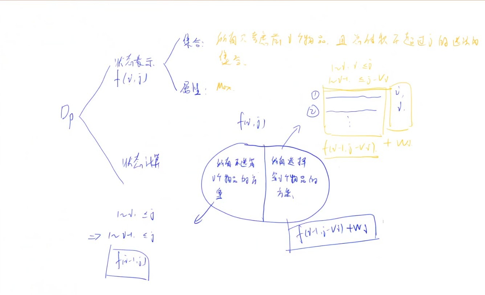
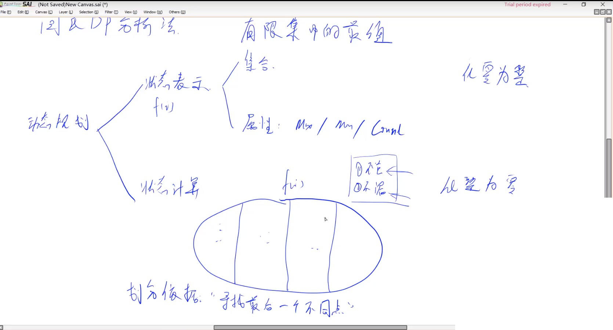
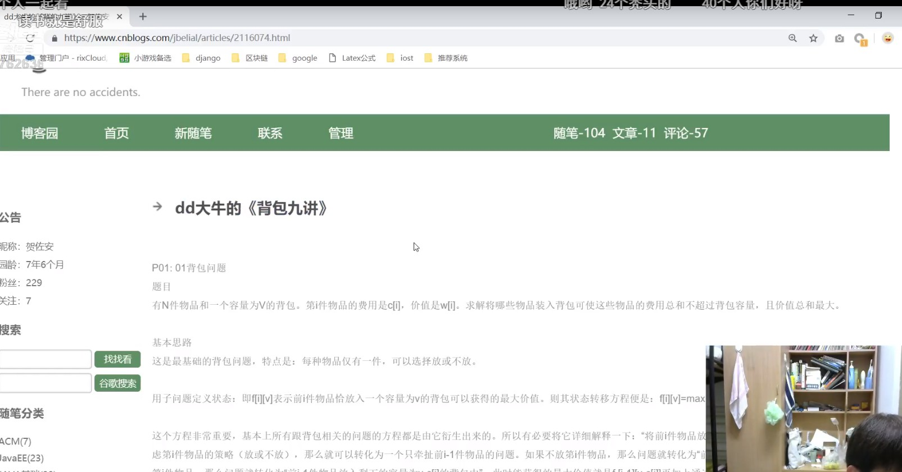
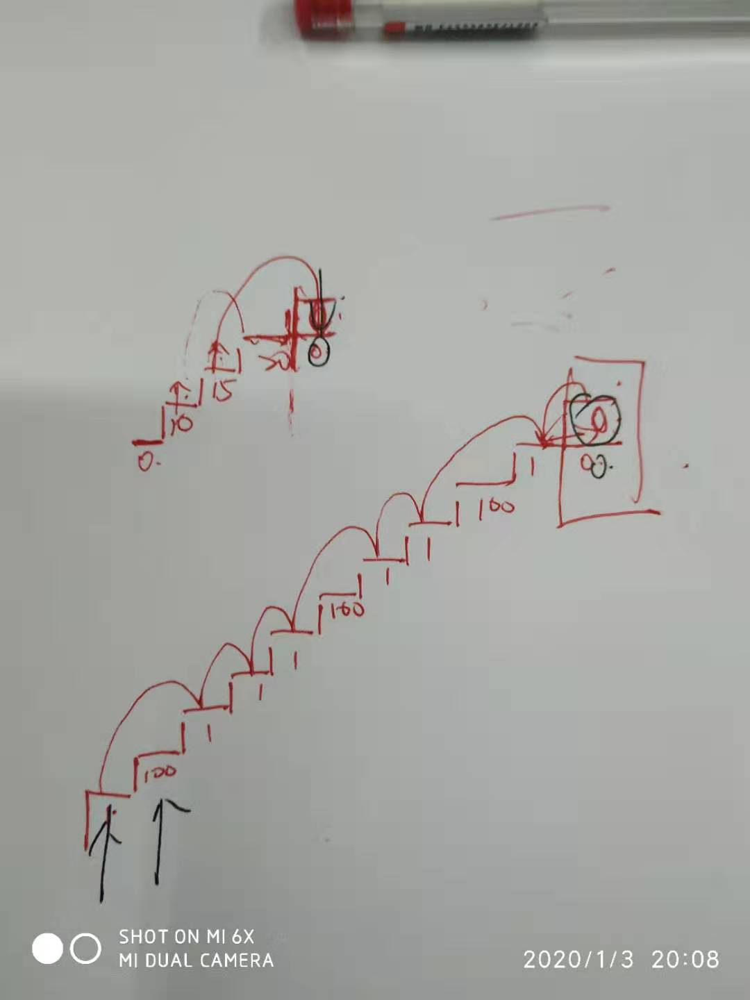
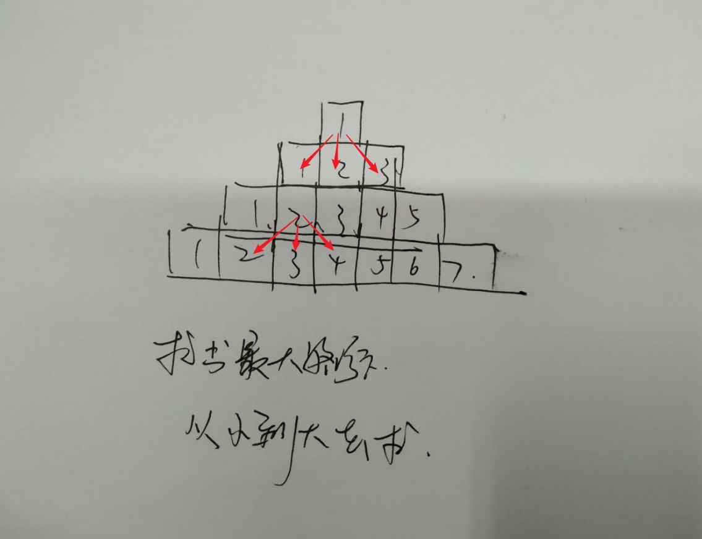
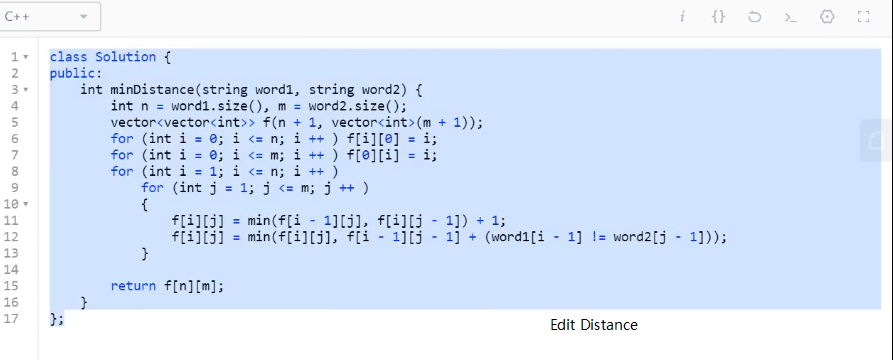
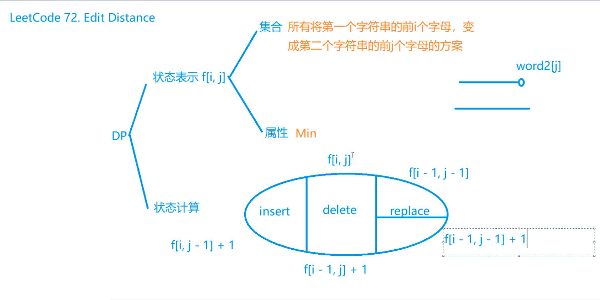

# 动态规划







## 简单

### [53. 最大子序和](https://leetcode-cn.com/problems/maximum-subarray/)

### [674. 最长连续递增序列](https://leetcode-cn.com/problems/longest-continuous-increasing-subsequence/)

### [718. 最长重复子数组](https://leetcode-cn.com/problems/maximum-length-of-repeated-subarray/)

### [剑指 Offer 63. 股票的最大利润](https://leetcode-cn.com/problems/gu-piao-de-zui-da-li-run-lcof/)

### [122. 买卖股票的最佳时机 II](https://leetcode-cn.com/problems/best-time-to-buy-and-sell-stock-ii/)

### [123. 买卖股票的最佳时机 III](https://leetcode-cn.com/problems/best-time-to-buy-and-sell-stock-iii/)

### [898.数字三角形](https://www.acwing.com/problem/content/900/)

> 给定一个如下图所示的数字三角形，从顶部出发，在每一结点可以选择移动至其左下方的结点或移动至其右下方的结点，一直走到底层，要求找出一条路径，使路径上的数字的和最大。
>
> ```
>         7
>       3   8
>     8   1   0
>   2   7   4   4
> 4   5   2   6   5
> ```
>
> #### 输入格式
>
> 第一行包含整数n，表示数字三角形的层数。
>
> 接下来n行，每行包含若干整数，其中第 i 行表示数字三角形第 i 层包含的整数。
>
> #### 输出格式
>
> 输出一个整数，表示最大的路径数字和。
>
> #### 数据范围
>
> 1≤n≤5001≤n≤500,
> −10000≤三角形中的整数≤10000−10000≤三角形中的整数≤10000
>
> #### 输入样例：
>
> ```
> 5
> 7
> 3 8
> 8 1 0 
> 2 7 4 4
> 4 5 2 6 5
> ```

==其实这道题很有意思，主要的目的是求出从第0行到最后一行所经之处最大值，如果利用递归的方式，就会造成越低层计算的次数越多，所以比较适合利用动态规划。==

==动态规划的方式就是利用一个二位数组记录当前元素之前的最大值==

==而我比较习惯的就是从右上角往左上角计算，从而，左上角记录最大值==

```java
import java.io.*;
import java.util.*;
public class Main {
     public int triangle(int [][]nums, int row, int  col, int [][]newArr) {

          if(row == nums.length || col == nums.length) {
               return 0;
          }
          if(newArr[row][col] != 0) {
               return newArr[row][col];
          }
          newArr[row][col] = nums[row][col] + Math.max(triangle(nums, row+1, col, newArr), triangle(nums, row + 1, col + 1, newArr));
          return newArr[row][col];
     }
     public static void main(String args[]) throws Exception {
          Main main = new Main();
          Scanner cin=new Scanner(System.in);
          int row = cin.nextInt();
          int [][]nums = new int[row][];
          for(int i = 0; i < row; i++) {
               int col = i + 1;
               nums[i] = new int[col];
               for(int j = 0; j < col; j++) {
                    nums[i][j] = cin.nextInt();
               }
          }
          int [][]newArr = new int[row][row];
          int maxNum = main.triangle(nums, 0, 0, newArr);
          System.out.println(maxNum);
     }
}
```

```java
public class Main {
    /*   
5
7
3 8
8 1 0 
2 7 4 4
4 5 2 6 5

输出
[30, 0, 0, 0, 0]
[23, 21, 0, 0, 0]
[20, 13, 10, 0, 0]
[7, 12, 10, 10, 0]
[4, 5, 2, 6, 5]
30
*/
    public static void main(String args[]) throws Exception {
        Main main = new Main();
        Scanner cin=new Scanner(System.in);
        int row = cin.nextInt();
        int [][]nums = new int[row][];
        for(int i = 0; i < row; i++) {
            int col = i + 1;
            nums[i] = new int[col];
            for(int j = 0; j < col; j++) {
                nums[i][j] = cin.nextInt();
            }
        }
        int [][]newArr = new int[row][col];
        /*for(int i = 0; i < row; i ++) {
            for(int j = 0; j < i + 1; j++) {
                if(i == 0 && j == 0) {
                    newArr[i][j] = nums[i][j];
                }
                if(i >  0) {
                    newArr[i][j] = Math.max(newArr[i][j], newArr[i - 1][j] + nums[i][j]);
                }
                if(j > 0) {
                    newArr[i][j] = Math.max(newArr[i][j], newArr[i-1][j - 1] + nums[i][j]);
                }
            }
        }*/
        // 这一块是从下往上求，但是这个与 N * N的网格不同，并且当前nums[row][col]的最大值 只与下一行的同列 和 同列 + 1 有关，即 [row + 1][col] 和 [row + 1][col + 1]
        // 并且比较有意思的是， 最后一行只与当前值有关
        for(int i = row - 1; i >= 0; i--) {
            for(int j = i; j >= 0; j--) {
                if(i == row - 1) {	// 最后一行，只与当前值有关。
                    newArr[i][j] = nums[i][j];
                    continue;
                }
                if(i < row - 1) {
                    newArr[i][j] = Math.max(nums[i][j], newArr[i + 1][j] + nums[i][j]);
                }
                if(j < col - 1) {
                    newArr[i][j] = Math.max(newArr[i][j], newArr[i + 1][j + 1] + nums[i][j]);
                }
            }
        }
        /*
          这个版本只是下标从 1 开始
          for(int i = row; i > 0; i--) {
               for(int j = i; j > 0; j--) {
                    if(i == row) {
                         newArr[i - 1][j - 1] = nums[i - 1][j - 1];
                         continue;
                    }
                    if(i < row) {
                         newArr[i - 1][j - 1] = Math.max(nums[i - 1][j - 1], newArr[i][j - 1] + nums[i - 1][j - 1]);
                    }
                    if(j < row) {
                         newArr[i - 1][j - 1] = Math.max(newArr[i - 1][j - 1], newArr[i][j] + nums[i - 1][j - 1]);
                    }
               }
          }
          */

        for(int []item: newArr) {
            System.out.println(Arrays.toString(item) )   ;
        }
        System.out.println(newArr[0][0]);
    }
}
```

### [1089. 最低通行费](https://www.acwing.com/problem/content/1020/)

> 一个商人穿过一个N×N的正方形的网格，去参加一个非常重要的商务活动。
>
> 他要从网格的左上角进，右下角出。
>
> 每穿越中间1个小方格，都要花费1个单位时间。
>
> 商人必须在(2N-1)个单位时间穿越出去。
>
> 而在经过中间的每个小方格时，都需要缴纳一定的费用。
>
> 这个商人期望在规定时间内用最少费用穿越出去。
>
> 请问至少需要多少费用？
>
> 注意：不能对角穿越各个小方格（即，只能向上下左右四个方向移动且不能离开网格）。
>
> #### 输入格式
>
> 第一行是一个整数，表示正方形的宽度N。
>
> 后面N行，每行N个不大于100的整数，为网格上每个小方格的费用。
>
> #### 输出格式
>
> 输出一个整数，表示至少需要的费用。
>
> #### 数据范围
>
> 1≤N≤1001≤N≤100
>
> #### 输入样例：
>
> ```txt
> 5
> 1  4  6  8  10 
> 2  5  7  15 17 
> 6  8  9  18 20 
> 10 11 12 19 21 
> 20 23 25 29 33
> ```

```java
import java.io.*;
import java.util.*;

public class Main {
         public static void main(String args[]) throws Exception {
          Main main = new Main();
          Scanner cin=new Scanner(System.in);
          int row = cin.nextInt();
          int [][]nums = new int[row][row];
          for(int i = 0; i < row; i++) {
               for(int j = 0; j < row; j++) {
                    nums[i][j] = cin.nextInt();
               }
          }
          int [][]newArr = new int[row][row];

          /*for(int i = 0; i < row; i++) {  // 这里要注意的是，因为我们要  newArr[i][j] = Integer.MAX_VALUE; 但是如果 row = 0; col = 0 
        // 我们如果不 continue 的话，就会让 newArr[i][j] = Integer.MAX_VALUE, 并且后面的都不会执行到。
            for(int j = 0; j < row; j++) {
                if(i == 0 && j == 0) {
                    newArr[i][j] = nums[i][j];
                    continue;
                }
                newArr[i][j] = Integer.MAX_VALUE;
                if(i > 0) {
                    newArr[i][j] = Math.min(newArr[i][j], nums[i][j] + newArr[i - 1][j]);
                }
                if(j > 0) {
                    newArr[i][j] = Math.min(newArr[i][j], nums[i][j] + newArr[i][j - 1]);
                }
            }
        }
        */
		// 从下往上
          for(int i = row; i > 0; i--) {
               for(int j = row; j > 0; j--) {
                    if(i == row && j == row) {
                         newArr[i - 1][j - 1] = nums[i - 1][j - 1];
                         continue;
                    }
                    newArr[i - 1][j - 1] = Integer.MAX_VALUE;
                    if(i < row) {
                         newArr[i - 1][j - 1] = Math.min(newArr[i - 1][j - 1], nums[i - 1][j - 1 ] + newArr[i][j - 1]);
                    }
                    if(j < row) {
                         newArr[i - 1][j - 1] = Math.min(newArr[i - 1][j - 1], nums[i - 1][j - 1] + newArr[i - 1][j]);
                    }
               }
          }

          System.out.println(newArr[0][0]);
     }
}
```


### [509. 斐波那契数](https://leetcode-cn.com/problems/fibonacci-number/)

> 一定要关注 0 和 1，循环要从 2 开始

>斐波那契数，通常用 F(n) 表示，形成的序列称为斐波那契数列。该数列由 0 和 1 开始，后面的每一项数字都是前面两项数字的和。也就是：
>
>F(0) = 0,   F(1) = 1
>F(N) = F(N - 1) + F(N - 2), 其中 N > 1.
>给定 N，计算 F(N)。 
>
>示例 1：
>
>输入：2
>输出：1
>解释：F(2) = F(1) + F(0) = 1 + 0 = 1.
>示例 2：
>
>输入：3
>输出：2
>解释：F(3) = F(2) + F(1) = 1 + 1 = 2.
>示例 3：
>
>输入：4
>输出：3
>解释：F(4) = F(3) + F(2) = 2 + 1 = 3.
>
>常规获取 Fibonacci 数列就是利用递归的方式， 但是递归的方式中间会有较多的重复计算， fib(0) + fib(1) 这种，如果数值越大，底层重复计算的次数就越多，所以就会影响程序执行的效率。

```java
// 常规操作，也是最简单的方式，但也是最暴力的方式
public int fib(int N) {
     if(N == 1) {
          return 1;
     }
     if(N == 0) {
          return 0;
     }
     return fib(N -1) + fib(N -2);
}
```

```java
// 利用非递归方式，采用数组的形式记录元素
public int fib(int N) {
     if(N == 0 || N == 1) {
          return N;
     }
     int []fibNums = new int[N + 1];
     fibNums[0] = 0;
     fibNums[1] = 1;
     for(int i = 2; i < N + 1; i++) {
          fibNums[i] = fibNums[i - 1] + fibNums[i - 2];
     }
     return fibNums[N];
}
```

```java
// 利用递归方式，采用数组的形式记录元素. 
// 但这里比较有意思的是，我要把全部数组填充为 -1， 然后利用 fibNums[N] != -1; 直接返回
public int fib(int []fibNums, int N) {
     if(N == 0 || N == 1) {
          fibNums[N] = N;
          return fibNums[N];
     }
     if(fibNums[N] != -1) {
          return fibNums[N];
     }
   	fibNums[N] = fib(fibNums, i - 1) + fib(fibNums, i - 2);
     return fibNums[N];
}
```

### ==746. [使用最小花费爬楼梯](https://leetcode-cn.com/problems/min-cost-climbing-stairs/)==

> 可以 从 0 或者 1 出发，
>
> 如果只有两个台阶， 那么从 0 or 1 都可以。
>
> minCost[i] = Min(minCost[i - 1], minCost[i - 2]) + cost[i]; 
>
> // 就是当前台阶的 最小花费 == 前两个台阶的最小 + 当前台阶的花费

>数组的每个索引做为一个阶梯，第 i个阶梯对应着一个非负数的体力花费值 cost[i](索引从0开始)。
>
>每当你爬上一个阶梯你都要花费对应的体力花费值，然后你可以选择继续爬一个阶梯或者爬两个阶梯。
>
>您需要找到达到楼层顶部的最低花费。在开始时，你可以选择从索引为 0 或 1 的元素作为初始阶梯。
>
>示例 1:
>
>输入: cost = [10, 15, 20]
>输出: 15
>解释: 最低花费是从cost[1]开始，然后走两步即可到阶梯顶，一共花费15。
> 示例 2:
>
>输入: cost = [1, 100, 1, 1, 1, 100, 1, 1, 100, 1]
>输出: 6
>解释: 最低花费方式是从cost[0]开始，逐个经过那些1，跳过cost[3]，一共花费6。
>注意：
>
>cost 的长度将会在 [2, 1000]。
>每一个 cost[i] 将会是一个Integer类型，范围为 [0, 999]。

==其实这个想法很简单，我只需要再数组最后面添加一个元素，消耗为零，可以跨一步，也可以跨两步，当然，也可以从下标0 开始，也可以从下表1开始。==



```java
public int minCostClimbingStairs(int[] cost) {
     if(cost == null || cost.length < 2) {
          return 0;
     }
     int []tempConsume = new int[cost.length + 1];
     tempConsume[0] = cost[0];
     tempConsume[1] = cost[1];
     int i = 2;
     for(; i < cost.length; i++){
          tempConsume[i] = Math.min(tempConsume[i - 1], tempConsume[i - 2]) + cost[i];
     }
     tempConsume[i] = Math.min(tempConsume[i - 1], tempConsume[i - 2]);
     return tempConsume[cost.length];
}
```

### [面试题 17.16. 按摩师](https://leetcode-cn.com/problems/the-masseuse-lcci/)

### [母牛的故事(hdoj 2018,动态规划递推,详解)](https://www.cnblogs.com/zyacmer/p/9906440.html)

> 那如果，母牛在第十年 都会 死掉， 怎么搞
>
> 很简单： 如果不是 f[n] = f[n - 1] + f[n - 3];
>
> 如果，第十年，f[n] = f[n - 1] + f[n - 3] - f[n - 10];

### 三角形



```java
public static void main(String[] args) {
    int row = 4;
    int [][]nums = {{1},{1,2,3},{1,2,3,4,5},{1,3,5,7,9,11,13}};
    for(int i = row - 2; i >= 0; i--) {
        int col = i * 2 + 1;
        for(int j = 0; j < col; j++) {
            nums[i][j] = Math.max(nums[i + 1][j], Math.max(nums[i+1][j+1], nums[i+1][j+2])) + nums[i][j];
        }
    }
    System.out.println(nums[0][0]);
}
```

## 中等

### [120. 三角形最小路径和](https://leetcode-cn.com/problems/triangle/)

> 给定一个三角形，找出自顶向下的最小路径和。每一步只能移动到下一行中相邻的结点上。
>
> 例如，给定三角形：
>
> [
>      [2],
>     [3,4],
>    [6,5,7],
>   [4,1,8,3]
> ]
> 自顶向下的最小路径和为 11（即，2 + 3 + 5 + 1 = 11）。
>
> 说明：
>
> ==如果你可以只使用 O(n) 的额外空间（n 为三角形的总行数）来解决这个问题，那么你的算法会很加分。==新挑战
>
> 执行结果：通过显示详情
>
> 执行用时 :1 ms, 在所有 java 提交中击败了100.00%的用户
>
> 内存消耗 :37.6 MB, 在所有 java 提交中击败了64.08%的用户

```java
public int minimum(List<List<Integer>> triangle, int row, int col, int [][]newTriangle) {
     if(triangle.size() == row) {
          return 0;
     }
     if(newTriangle[row][col] != 0) {
          return newTriangle[row][col];
     }
     newTriangle[row][col] = triangle.get(row).get(col) + 
          Math.min(
          	minimum(triangle, row + 1, col, newTriangle),
          	minimum(triangle, row + 1, col + 1,  newTriangle)
     	);
     return newTriangle[row][col];
}
public int minimumTotal(List<List<Integer>> triangle) {
     if(triangle.size() == 0) {
          return 0;
     }else if(triangle.size() == 1) {
          return triangle.get(0).get(0);
     }
     int [][]newTriangle = new int[triangle.size()][triangle.size()];
     return minimum(triangle, 0, 0, newTriangle);
}
```

### [`63. 不同路径 II`](https://leetcode-cn.com/problems/unique-paths-ii/)

`这个一定要注意，有可能 start 的地方就可能 为零`

>一个机器人位于一个 m x n 网格的左上角 （起始点在下图中标记为“Start” ）。
>
>机器人每次只能向下或者向右移动一步。机器人试图达到网格的右下角（在下图中标记为“Finish”）。
>
>现在考虑网格中有障碍物。那么从左上角到右下角将会有多少条不同的路径？
>
>
>
>网格中的障碍物和空位置分别用 1 和 0 来表示。
>
>说明：m 和 n 的值均不超过 100。
>
>输入:
>[
>  [0,0,0],
>  [0,1,0],
>  [0,0,0]
>]
>输出: 2
>解释:
>3x3 网格的正中间有一个障碍物。
>从左上角到右下角一共有 2 条不同的路径：
>
>1. 向右 -> 向右 -> 向下 -> 向下
>2. 向下 -> 向下 -> 向右 -> 向右
>

### [174. 地下城游戏](https://leetcode-cn.com/problems/dungeon-game/)

> 一些恶魔抓住了公主（P）并将她关在了地下城的右下角。地下城是由 M x N 个房间组成的二维网格。我们英勇的骑士（K）最初被安置在左上角的房间里，他必须穿过地下城并通过对抗恶魔来拯救公主。
>
> 骑士的初始健康点数为一个正整数。如果他的健康点数在某一时刻降至 0 或以下，他会立即死亡。
>
> 有些房间由恶魔守卫，因此骑士在进入这些房间时会失去健康点数（若房间里的值为负整数，则表示骑士将损失健康点数）；其他房间要么是空的（房间里的值为 0），要么包含增加骑士健康点数的魔法球（若房间里的值为正整数，则表示骑士将增加健康点数）。
>
> 为了尽快到达公主，骑士决定每次只向右或向下移动一步。
>
>  
>
> 编写一个函数来计算确保骑士能够拯救到公主所需的最低初始健康点数。
>
> 例如，考虑到如下布局的地下城，如果骑士遵循最佳路径 右 -> 右 -> 下 -> 下，则骑士的初始健康点数至少为 7。
>
> | -2 (K) | -3   | 3      |
> | ------ | ---- | ------ |
> | -5     | -10  | 1      |
> | 10     | 30   | -5 (P) |
>
>  其实这道题，还是挺有意思的，就是我们要知道，这道题不是说 将整条路经 加和 ，看是否大于零。而是要求 在 每个 空格，都要保持血量 大于等于与 1；
>
> 因此，我们可以从右下角开始计算，
>
> 1. 右下角， 利用 1 - （x）(表示当前空可需要要好的血量)； 如果 ，大于零，直接存储就可以，但是如果小于零，说明 当前空格 是可以加血的，也就是 进到当前空格只要有一颗血

## 困难

### ==[72. 编辑距离](https://leetcode-cn.com/problems/edit-distance/)==

> ```
> 执行结果：通过显示详情
> 执行用时 :7 ms, 在所有 Java 提交中击败了79.28%的用户
> 内存消耗 :35.9 MB, 在所有 Java 提交中击败了87.02%的用户
> ```
> 这道题的非常有意思，按照往常，只需要创建 tempArr[ word1Len] [word2Len] 的数组，但在这个数组中，我们用tempArr[i][j] 表示把前 i 个字符改编成 前 j 个字符所需要的次数
>
> tempArr[i][0] 表示 第一个字符串的前 i 个字符 变成第 i 个字符串的前 0 个字符 肯定需要删除 i 次， tempArr[0][0] 肯定为 0
>
> temoArr[0][i] 表示 第一个字符串的前 0 个字符 变成第 i 个字符串的前 i 个字符 肯定需要添加 i 词， tempArr[0][0] 肯定为 0
>
> int len1 = word1  + 1;
> int len2 = word2 + 1;
> tempArr[len1 - 1][len2 - 1] 才表示完整的字符串之间的转变





```java
class Solution {
    public int minDistance(String word1, String word2) {
        char []words1 = word1.toCharArray();
        char []words2 = word2.toCharArray();
        int wordLen1 = words1.length + 1;
        int wordLen2 = words2.length + 1;
        int [][]tempArr = new int[wordLen1][wordLen2];
        // 把 第一个字符串的前 i 个字符变成第二个字符串的前 0 个字符
        for(int i = 0; i < wordLen1; i++) {
            tempArr[i][0] = i;
        }
        // 把 第一个字符串的前 0 个字符变成第二个字符串的前 i 个字符
        for(int i = 0; i < wordLen2; i++) {
            tempArr[0][i] = i;
        }
        for(int i = 1; i < wordLen1; i ++) {
            for(int j = 1; j < wordLen2; j++) {
                tempArr[i][j] = Math.min(tempArr[i][j-1], tempArr[i - 1][j]) + 1;
                tempArr[i][j] = Math.min(tempArr[i][j], tempArr[i- 1][j - 1] + (words1[i - 1] == words2[j - 1] ? 0 : 1));
            }
        }
        // System.out.println(Arrays.deepToString(tempArr));
        return tempArr[wordLen1 - 1][wordLen2 - 1];
    }
}
```

