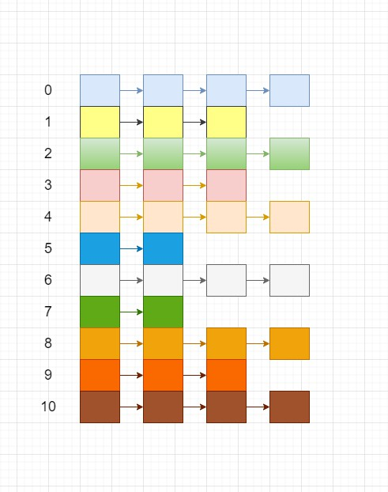

# 图

> 一个图，v 表示结点的个数，e 表示 边的个数
>
> 如果，采用连接矩阵 存储，时间复杂度和空间复杂度都是 o(v ^2)
>
> 采用邻接表存储，时间复杂度和空间复杂度都是 o(v + e)

> 采用邻接表方式存储矩阵
>
> 

## 结点

```java
static class Node {
    int val;  // 用来存储下一个元素的下标
    int weight; // 权重
    Node next;	// 利用拉链法存储
    public Node(int val) {
        this.val = val;
    }
}
```

## 建图

> 一般，题目会给出一组 [index1, index2] 用来存储 从 结点 index1 指向 index2 的边

```java
// Interval 
// 存储的就是 一条边的信息
static class Interval {
    int start;
    int end;
    public Interval(int start, int end) {
        this.start = start;
        this.end = end;
    }
    @Override
    public String toString() {
        return "\t" + this.start + "\t" + this.end;
    }
}
/**
     * 采用头插法的方式， 并且第一个元素就会存储值
     * @param N
     * @param conn
     * @return
     */
public Node[] buildMap(int N, Interval []conn) {
    Node []nodeNet = new Node[N + 1];
    for(int i = 0; i < conn.length; i++) {
        int start = conn[i].start;
        int end = conn[i].end;
        Node newNode = new Node(end);
        if(nodeNet[i] == null) {
            nodeNet[i] = newNode;
        } else {
            newNode.next = nodeNet[i];
            nodeNet[i] = newNode;
        }
    }
    return nodeNet;
}
```

## 遍历图

### 深度优先遍历

```java
**
 * 深度优先遍历
 * @param nodeNet
 * @param N
 */
public void printGraph(Node[] nodeNet, int N) {
    if (nodeNet == null || nodeNet.length == 0) {
        return;
    }
    boolean[] mark = new boolean[N + 1];
    for(int i = 0; i < nodeNet.length; i++) {
        if(!mark[i]) {
            DFSGraph(nodeNet, mark, i);
        }
        System.out.println();
    }
}

/**
 * 深度优先遍历，每次先将 mark[index] = true; 然后深度 遍历 所有结点
 * @param nodeNet
 * @param mark  
 * @param index  当前 结点的下标
 */
public void DFSGraph(Node[]nodeNet, boolean []mark, int index) {
    mark[index] = true;
    Node currNode = nodeNet[index];
    System.out.print(index + "\t");
    while(currNode != null) {
        if(!mark[currNode.val]) {
            // 递归遍历所有结点，
            DFSGraph(nodeNet, mark, currNode.val);
        }
        currNode = currNode.next;
    }
 }
```

### 广度优先遍历（输出边）

```java
/**
     * 广度优先遍历，假设是 有向图； 会输出 所有的 有向边
     * @param nodeNet
     * @param N
*/
public void printGraph(Node []nodeNet, int N) {
    if(nodeNet == null || nodeNet.length == 0) {
        return;
    }
    boolean []mark = new boolean[N + 1];
    int nodeLen = nodeNet.length;
    for(int i = 0; i < nodeLen; i++) {
        Node currNode = nodeNet[i];
        while(currNode != null) {
            System.out.print(i + "------>" + currNode.val + "\t");
            currNode = currNode.next;
        }
        System.out.println();
    }
}
/*
0------>3	0------>2	0------>1	
1------>4	
2------>6	
3------>4	
4------>5	
5------>6	
6------>9	6------>7	
7------>8	
8------>3	
9------>10
*/
```

### 广度优先遍历（输出结点）

```java
/**
 * 广度优先遍历， 输出所有的结点
 *
 * @param nodeNet
 * @param N
 */
public void printGraph(Node[] nodeNet, int N) {
    if (nodeNet == null || nodeNet.length == 0) {
        return;
    }
    boolean[] mark = new boolean[N + 1];
    int nodeLen = nodeNet.length;
    for (int i = 0; i < nodeLen; i++) {
        Node currNode = nodeNet[i];
        while (currNode != null) {
            if (!mark[currNode.val]) {
                System.out.print(currNode.val + "\t");
                mark[currNode.val] = true;
            }
            currNode = currNode.next;
        }
        System.out.println();
    }
}
```

## 题目1


```java
public class Solution {
    //图结点，
    static class Node {
        int val;
        Node next;
        public Node(int val) {
            this.val = val;
        }
    }
	// start-end 构成边
    static class Interval {
        int start;
        int end;

        public Interval(int start, int end) {
            this.start = start;
            this.end = end;
        }

        @Override
        public String toString() {
            return "\t" + this.start + "\t" + this.end;
        }
    }
	// 构建邻接表
    public Node[] buildMap(int N, Interval []conn) {
        Node []nodeNet = new Node[N + 1];
        for(int i = 0; i < conn.length; i++) {
            int start = conn[i].start;
            int end = conn[i].end;
            if(nodeNet[start] == null) {
                nodeNet[start] = new Node(end);
            } else {
                Node newNode = new Node(end);
                Node preNode = nodeNet[start];
                while(preNode.next != null) {
                    preNode = preNode.next;
                }
                preNode.next = newNode;
            }
        }
        return nodeNet;
    }
    int sum = 0;
    int count = 0;
    LinkedList<Integer> linkedList = new LinkedList<>();

    int [] arr ;
	// 
    public Interval trim (int N, int M, Interval[] conn) {
        // write code here
        arr = new int[N + 1];
        Node []nodeNet = buildMap(N, conn);
        Node currNode = nodeNet[0];
        if(currNode != null) {
            currNode = currNode.next;
        }
        while(currNode != null) {
            if(currNode.val == -1 || currNode.val == 0) {
                continue;
            }
            linkedList.addLast(currNode.val);
            findPath(nodeNet, currNode.val);
            linkedList.pollLast();
            currNode = currNode.next;
        }
        // 将所有合法的数字加法求和
        for(int i = 0; i < arr.length; i++) {
            if(arr[i] != 0) {
                count ++;
                sum = sum % 100000007 + i % 100000007;
            }
        }
        return new Interval(count, sum);
    }
	// 递归查找
    public void findPath(Node []nodeNet, int currIndex) {
        if(currIndex > nodeNet.length || currIndex == 0 || currIndex == -1 || nodeNet[currIndex] == null) {
            return;
        }
        Node currNode = nodeNet[currIndex];
        currNode = currNode.next;
        while(currNode != null) {
            if(currNode.val == -1) {
                // 输出
                printList();
            } else {
                linkedList.addLast(currNode.val);
                findPath(nodeNet, currNode.val);
                linkedList.pollLast();
            }
            currNode = currNode.next;
        }
    }
	// 将 出现合法的汉字 记录在 arr 数组中
    public void printList() {
        Iterator<Integer> iterator = linkedList.iterator();
        while (iterator.hasNext()) {
            Integer next = iterator.next();
            arr[next] ++;
        }
    }
	
    public static void main(String[] args) {
        Solution solution = new Solution();
        /*int N = 10, M = 14;
        Interval []intervals = new Interval[]{
                new Interval(0, 1),
                new Interval(0, 2),
                new Interval(0, 3),
                new Interval(1, 4),
                new Interval(3, 4),
                new Interval(2,6),
                new Interval(4,5),
                new Interval(5,6),
                new Interval(6 ,7),
                new Interval(7, 8),
                new Interval(6, 9),
                new Interval(9, 10),
                new Interval(8, -1),
                new Interval(10, -1)
        };*/

        int N = 3, M = 4;
        Interval []intervals = new Interval[]{
                new Interval(0, 1),
                new Interval(0, 2),
                new Interval(2,-1),
                new Interval(2, 1)
        };
        Interval trim = solution.trim(N, M, intervals);
        System.out.println(trim);
        /*Node[] nodes = solution.buildMap(N, intervals);
        for(int i = 0; i < nodes.length; i++) {
            Node currNode = nodes[i];
            if(currNode != null) {
                currNode = currNode.next;
            }
            while(currNode != null) {
                System.out.print(currNode.val + "\t");
                currNode = currNode.next;
            }
            System.out.println();
        }*/
    }
}
```

