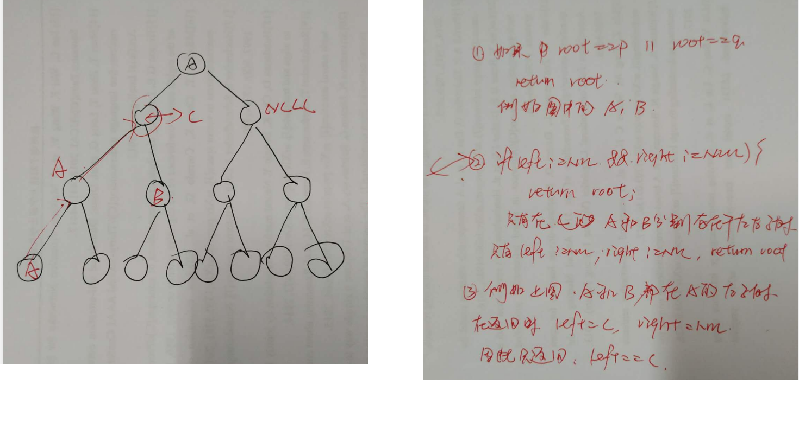

# Tree

## 获取一个结点的高度

> 首先找到该节点，然后，取高度中的较大值

> ```java
> /**
>  * 获取一个结点元素的 高度
>  * @param root
>  * @param x
>  * @return
>  */
> public int findNode(Node<Integer> root, int x) {
>     if(root == null) {
>         return -1;
>     }
>     if(root.value == x) {
>         return Math.max(getHeight(root.left), getHeight(root.right)) + 1;
>     }
>     return Math.max(findNode(root.left, x), findNode(root.right, x));
> }
> 
> public int getHeight(Node<Integer> root) {
>     if(root == null) {
>         return 0;
>     }
>     return Math.max(getHeight(root.left), getHeight(root.right)) + 1;
> }
> ```

## 获取一个元素的深度

> 如果，在一个字数上没包含该节点，就会一直返回 -1；  root.value == x 直接返回 level

> ```java
> /**
>  * 获取当前结点所处的深度， 层次 从上往下
>  * @param root
>  * @param x
>  * @return
>  */
> public int getDepth(Node<Integer> root, int x, int level) {
>     if(root == null) {
>         return -1;
>     }
>     if(root.value == x) {
>         return level;
>     }
>     return Math.max(getDepth(root.left, x, level + 1), getDepth(root.right, x, level + 1));
> }
> ```

```java
/**
 * 获取最大路径
 *
 * @param currNode
 * @return
 */
public int getMaxPath(Node<Integer> currNode) {
    if (currNode == null) {
        return 0;
    }
    int maxPath = 0;
    maxPath = max(getMaxPath(currNode.left), getMaxPath(currNode.right)) + currNode.value;
    return maxPath;
}

/**
 * 获取最小路径
 *
 * @param currNode
 * @return
 */
public int getMinPath(Node<Integer> currNode) {
    if (currNode == null) {
        return 0;
    }
    int minPath = 0;
    if (currNode.left == null) {
        minPath = getMinPath(currNode.right);
    } else if (currNode.right == null) {
        minPath = getMinPath(currNode.left);
    } else {
        minPath = min(getMinPath(currNode.left), getMinPath(currNode.right));
    }
    return minPath + currNode.value;
}
```

## [572. 另一个树的子树](https://leetcode-cn.com/problems/subtree-of-another-tree/)

> 这道题非常有意思，如果 S 的一个子树包括 t 的所有结点；（就是从该节点到所有叶子节点都重合）
>
> 如果， s == null && t == null 返回 true

## [面试题27. 二叉树的镜像](https://leetcode-cn.com/problems/er-cha-shu-de-jing-xiang-lcof/)

> 左右结点互换

```java
public TreeNode mirrorTree(TreeNode root) {
    if(root == null) {
        return root;
    }
    TreeNode tempNode = root.left;
    root.left = root.right;
    root.right = tempNode;
    mirrorTree(root.left);
    mirrorTree(root.right);
    return root;
}
```

## [101. 对称二叉树](https://leetcode-cn.com/problems/symmetric-tree/)

## [`113. 路径总和 II`](https://leetcode-cn.com/problems/path-sum-ii/)

````java
public static void addPathList(List<List<Integer>> pathList, int []arr, int currIndex) {
    List<Integer> tempList = new ArrayList<>();
    for(int i = 0; i <= currIndex; i++) {
        tempList.add(arr[i]);
    }
    pathList.add(tempList);
}
public static void addPathListStr(List<String> pathList, int []arr, int currIndex) {
    StringBuffer buffer = new StringBuffer();
    for(int i = 0; i <= currIndex; i++) {
        buffer.append(arr[i]);
        buffer.append("->");
    }
    pathList.add(buffer.toString().substring(0, buffer.length() - 2));
}
/*
有一点要注意的是，结点有可能是负数，所以，只有在左右结点都为空，并且 sum == currNode.val 才把路径添加至 链表中。
*/
public static void getPathList(List<List<Integer>> pathList, TreeNode currNode, int []arr, int currIndex, int sum) {
    if(currNode.left == null && currNode.right == null && sum == currNode.val) {
        arr[currIndex] = currNode.val;
        addPathList(pathList, arr, currIndex);
        return;
    }
    arr[currIndex] = currNode.val;
    sum -= currNode.val;
    currIndex ++;
    if(currNode.left != null) {
        getPathList(pathList, currNode.left, arr, currIndex, sum);
    }
    if(currNode.right != null) {
        getPathList(pathList, currNode.right, arr, currIndex, sum);
    }
}
public List<List<Integer>> pathSum(TreeNode root, int sum) {
    List<List<Integer>> pathList = new ArrayList<>();
    if(root == null) {
        return pathList;
    }
    int []arr = new int[1000];
    getPathList(pathList, root, arr, 0, sum);
    return pathList;
}
````

## [`257. 二叉树的所有路径`](https://leetcode-cn.com/problems/binary-tree-paths/)

## 获取最大路径之和

```java
public int getMaxPath(Node<Integer> currNode) {
    if(currNode == null) {
        return 0;
    }
    int maxPath = 0;
    maxPath = max(getMaxPath(currNode.left), getMaxPath(currNode.right)) + currNode.value;
    return maxPath;
}
```

## `获取最小路径之和`

> 要知道的最小路径之和，一定要注意的是 只能是路径 的之和，而路径则必须是 从根节点到 叶子结点。
>
> 
>
> 如图所示，途中只有两条路径， 49 - 36 - 25  和 49 - 56
>
> 必须是这条路径所有结点之和，一定要注意左右子树为 null 的时候。

````java
public int getMinPath(Node<Integer> currNode) {
    if(currNode == null) {
        return 0;
    }
    int minPath = 0;
    if(currNode.left == null) {
        minPath = getMinPath(currNode.right);
    }else if(currNode.right == null) {
        minPath = getMinPath(currNode.left);
    }else{
        minPath = min(getMinPath(currNode.left), getMinPath(currNode.right));
    }
    return minPath +  currNode.value;
}
````

## [`98. 验证二叉搜索树`](https://leetcode-cn.com/problems/validate-binary-search-tree/)

> 利用中序遍历


```java
public boolean isValidBST(TreeNode root) {
    if(root == null) {
        return true;
    }
    return isValidBSTRe(root,  Integer.MIN_VALUE, Integer.MAX_VALUE);
}
public boolean isValidBSTRe(TreeNode currNode, long minNum, long maxNum) {
    if(currNode == null) {
        return true;
    }
    if(currNode.val < minNum || currNode.val > maxNum) {
        return false;
    }
    return isValidBSTRe(currNode.left, minNum, currNode.val - 1L) && 
        isValidBSTRe(currNode.right, currNode.val + 1L, maxNum);
}
```

```java
/*
中序遍历的速度相对较慢， 利用 lastNum 记录　上一个值，如果当前值 《= lastNum; 返回false; 知道最后
*/
public boolean isValidBST(TreeNode root) {
    if(root == null) {
        return true;
    }
    Stack<TreeNode> stack = new Stack<>();
    TreeNode currNode = root;
    long lastNum = -2147483649L;
    while(currNode != null || !stack.isEmpty()) {
        while(currNode != null) {
            stack.push(currNode);
            currNode = currNode.left;
        }
        currNode = stack.pop();
        if(lastNum >= currNode.val) {
            return false;
        }
        lastNum = currNode.val;
        if(currNode.right != null) {
            currNode = currNode.right;
        }else{
            currNode = null;
        }
    }
    return true;
}
```

## [`671. 二叉树中第二小的节点`](https://leetcode-cn.com/problems/second-minimum-node-in-a-binary-tree/)

> 如果左右子树存在，并且一定大于等于当前结点，根节点 = value
>
> 1. 如果 当前结点 > value; 也就是说 这个结点是 该节点以及该节点的子树中最小的value; 所以直接返回
> 2. 如果 左右子树的最小值 都大于 value, 只要获取较小的值返回
> 3. 如果，不是第1，2种情况，那说明可能有一个 小于 value, 有一个 大于 vlaue, 或者 两个都等于 value, 这个时候我们要去二者之间的最大值， 因为 if(currNode == null) return -1;  所以返回值有可能是 -1； 我们获取较大值。

```java
public int findSecondMinimumValue(TreeNode root) {
    if(root == null || root.left == null || root.right == null) {
        return -1;
    }
    return  findSecondMinimumValue2(root, root.val);
}

public int findSecondMinimumValue2(TreeNode currNode, int firstMin) {
    if(currNode == null) {
        return -1;
    }
    if(currNode.val > firstMin) {
        return currNode.val;
    }
    int leftMin = findSecondMinimumValue2(currNode.left, firstMin);
    int rightMin = findSecondMinimumValue2(currNode.right,firstMin);
    if(leftMin > currNode.val && rightMin > currNode.val) {
        return Math.min(leftMin, rightMin);
    }
    return Math.max(leftMin, rightMin);
}
```

## [404. 左叶子之和](https://leetcode-cn.com/problems/sum-of-left-leaves/)

> 计算给定二叉树的所有`左叶子之和`。

```java
public int sumOfLeftLeaves(TreeNode root) {
    if(root == null) {
        return 0;
    }
    return sumOfLeftLeaves2(root, root.left) + sumOfLeftLeaves2(root, root.right);
}

public int sumOfLeftLeaves2(TreeNode parentNode, TreeNode childNode) {
    if(childNode == null) {
        return 0;
    }
    int num = 0;
    if(parentNode.left == childNode && childNode.left == null && childNode.right == null) { // 只有是左叶子结点才相加
        num += childNode.val;
    }
    return num + sumOfLeftLeaves2(childNode, childNode.left) + sumOfLeftLeaves2(childNode, childNode.right);
}
```

## 左孩子之和（如果当前结点时左孩子，就相加）

```java
public int sumOfLeftLeaves(TreeNode root) {
    if(root == null) {
        return 0;
    }
    return sumOfLeftLeaves2(root, root.left) + sumOfLeftLeaves2(root, root.right);
}

public int sumOfLeftLeaves2(TreeNode parentNode, TreeNode childNode) {
    if(childNode == null) {
        return 0;
    }
    int num = 0;
    if(parentNode.left == childNode) { // 如果当前结点时 parntNode 的左孩子， 就相加
        num += childNode.val;
    }
    return num + sumOfLeftLeaves2(childNode, childNode.left) + sumOfLeftLeaves2(childNode, childNode.right);
}
```

## `树`[==面试题33. 二叉搜索树的后序遍历序列==](https://leetcode-cn.com/problems/er-cha-sou-suo-shu-de-hou-xu-bian-li-xu-lie-lcof/)

> 这道题充分利用 二叉搜索树的性质， 最后一个结点往往是左右子树的分界点，也就是 小于 最后一个元素的都在左子树上，大于他的都在右子树
>
> 其中，有一个判断， 首先利用一个变量存储 小于 root.val 的所有元素，再判断之后的元素如果出现小于 root.val 的元素，说明不能构成二叉搜索树。
>
>    if(start >= end) { // 为什么 是 start >= end;  因为我们知道有可能所有元素有可能都在一个子树上        		return true;
>     }

```java
public boolean verifyPostorder(int[] postorder) {
    if(postorder == null || postorder.length < 2) {
        return true;
    }
    return verifyPostorder2(postorder, 0, postorder.length - 1);
}
public boolean verifyPostorder2(int []postorder, int start, int end) {
    if(start >= end) { // 说明当前子树已经判定合格, 有可能左右子树上只有一个结点，就可以了
        return true;
    }
    int rootVal = postorder[end];
    int smallRootStart = start;
    while(smallRootStart < end && postorder[smallRootStart] < rootVal) {
        smallRootStart ++;
    }
    for(int i = smallRootStart; i < end ; i++) {
        if(postorder[i] < rootVal) {
            return false;
        }
    }
    return verifyPostorder2(postorder, start, smallRootStart - 1) && 
        verifyPostorder2(postorder, smallRootStart, end - 1);
}
```

## [==105. 从前序与中序遍历序列构造二叉树==](https://leetcode-cn.com/problems/construct-binary-tree-from-preorder-and-inorder-traversal/)


````java
public TreeNode buildTree(int[] preorder, int[] inorder) {
    if(preorder == null || preorder.length == 0 || 
       inorder == null || inorder.length == 0) {
        return null;
    }
    return buildTree2(preorder, 0, preorder.length - 1, inorder, 0, inorder.length - 1);
}
public TreeNode buildTree2(int []preorder, int prestart, int preend, int []inorder, int instart, int inend) {
    // preStart == preend 是可以的，例如， 左子树，只有一个结点， 
    // 这个时候的 leftCount + prestart == 1 + prestart;
    // buildTree2(preorder, prestart + 1, prestart + leftCount)
    if(prestart > preend) {
        return null;
    }
    int rootVal = preorder[prestart];
    int rootIndex = instart; 
    for(; rootIndex <= inend && inorder[rootIndex] != rootVal; rootIndex ++);
    int leftCount = rootIndex - instart; // 左子树 个数
    TreeNode rootNode = new TreeNode(rootVal);
    rootNode.left = buildTree2(preorder, prestart + 1, prestart + leftCount ,inorder,  instart, rootIndex -1);
    rootNode.right = buildTree2(preorder, prestart + leftCount + 1, preend , inorder, rootIndex + 1, inend);
    return rootNode;
}
````

## [==889. 根据前序和后序遍历构造二叉树==](https://leetcode-cn.com/problems/construct-binary-tree-from-preorder-and-postorder-traversal/)

## [==106. 从中序与后序遍历序列构造二叉树==](https://leetcode-cn.com/problems/construct-binary-tree-from-inorder-and-postorder-traversal/)

## [==1008. 先序遍历构造二叉树==](https://leetcode-cn.com/problems/construct-binary-search-tree-from-preorder-traversal/)

## [199. 二叉树的右视图](https://leetcode-cn.com/problems/binary-tree-right-side-view/)

> 这道题 挺有意思的，右视图，其实就是从右边看这棵树的所有结点，也就是每一层的最后一个元素，所以只要层序遍历

```java
public List<Integer> rightSideView(TreeNode root) {
    List<Integer> nodeVals = new ArrayList<>();
    if(root == null) {
        return nodeVals;
    }
    LinkedList<TreeNode> queue = new LinkedList<>();
    queue.addLast(root);
    while(!queue.isEmpty()) {
        int size = queue.size(); // 获取 size 的尺寸
        TreeNode lastNode = queue.peekLast();
        nodeVals.add(lastNode.val);
        while(size -- > 0) {
            TreeNode currNode = queue.pop();
            if(currNode.left != null) {
                queue.addLast(currNode.left);
            }
            if(currNode.right != null) {
                queue.addLast(currNode.right);
            }
        }
    }
    return nodeVals;
}
```

## [993. 二叉树的堂兄弟节点](https://leetcode-cn.com/problems/cousins-in-binary-tree/)

## `二叉树`[剑指 Offer 68 - II. 二叉树的最近公共祖先](https://leetcode-cn.com/problems/er-cha-shu-de-zui-jin-gong-gong-zu-xian-lcof/)



> 这道题比 搜索二叉树的最近公共祖先的难点 是元素的结点时无序的。

## [`面试题68 - I. 二叉搜索树的最近公共祖先`](https://leetcode-cn.com/problems/er-cha-sou-suo-shu-de-zui-jin-gong-gong-zu-xian-lcof/)

```java
public TreeNode lowestCommonAncestor(TreeNode root, TreeNode p, TreeNode q) {
    if(root == null) {
        return null;
    }
    if(root == p || root == q) {
        return root;
    }
    if(p.val < root.val && q.val < root.val) {
        return lowestCommonAncestor(root.left, p, q);
    } else if(p.val > root.val && q.val > root.val) {
        return lowestCommonAncestor(root.right, p, q);
    } else {
        return root;
    }
}
```

## [`543. 二叉树的直径`](https://leetcode-cn.com/problems/diameter-of-binary-tree/)

> 1. 这道题也是非常的有意思，首先获取每个结点的深度，然后用一个变量记录 每个结点的最大直径，每次与最大直径进行比较。
>
> 2. 每次返回的结果是 每个结点的层次（每个结点距离叶子结点最远的值）

## [`124. 二叉树中的最大路径和`](https://leetcode-cn.com/problems/binary-tree-maximum-path-sum/)

> 给定一个**非空**二叉树，返回其`最大路径`和。
>
> 本题中，`路径被定义为一条从树中任意节点出发，达到任意节点的序列。该路径**至少包含一个**节点，且不一定经过根节点`。
>
> ==首先这是一条路径题，为了获取从当前结点的左子树路过当前节点到右子树的之和，每次将每个几点的路径和和最大值比较；
>
> 但是我们每次要返回的内容是： 每个结点到叶子结点的最大和（如果左子树和右子树都为负值，最大和则是当前结点的值）``易错点`
>
> 1. 如果 树为空返回 -2147483648
>
> 2. 如果当前结点的左右子树都为负值，则返回当前结点的值
>
>    ```java
>    int currNodePathSum = 0;
>    if(left > 0) {
>        currNodePathSum += left;
>    }
>    if(right > 0) {
>        currNodePathSum += right;
>    }
>    currNodePathSum += currNode.val;
>    ```
>
> 3. 否则， 返回  Math.max(left, right) + currNode.val

````java
int maxPathSNum = Integer.MIN_VALUE;
public int maxPathSum(TreeNode root) {
    if(root == null) {
        return maxPathSNum;
    }
    getChildPathSum(root);
    return maxPathSNum;
}
public int getChildPathSum(TreeNode currNode) {
    if(currNode == null) {
        return 0;
    }
    int left = getChildPathSum(currNode.left);
    int right = getChildPathSum(currNode.right);
    int currNodePathSum = 0;
    if(left > 0) {
        currNodePathSum += left;
    }
    if(right > 0) {
        currNodePathSum += right;
    }
    currNodePathSum += currNode.val;
    if(maxPathSNum < currNodePathSum) {
        maxPathSNum = currNodePathSum;
    }

    return left < 0 && right < 0 ? currNode.val : Math.max(left, right) + currNode.val;
}
````

## [114. 二叉树展开为链表](https://leetcode-cn.com/problems/flatten-binary-tree-to-linked-list/)

> 这里是单链表，利用前序遍历， 这道题比下面有意思的是， 根节点的顺序始终不变，因此，我们首先将根节点入栈， 然后让  currNode = currNode.left (要知道前序遍历的判断条件 `当前元素不为空`，或者`栈元素不为空`);
>
> 1. 先将 root 进栈
> 2. 使得所有结点都为与父节点的左孩子上
> 3. 将所有结点的左孩子修改为右孩子（比较重要的是： `一定要将 左孩子的指向设为空`）

```java
public void flatten(TreeNode root) {
    if(root == null) {
        return;
    }
    //  其实这里最重要的思想： 就是先将 root 入栈， 使得  currNode = root.left;  因为 单链表 是根据先序遍历的，但是如果中序遍历 就需要 新增结点。
    TreeNode preNode = root, currNode = null;
    Stack<TreeNode> stack = new Stack<>();
    stack.push(root);
    currNode = root.left;
    while(currNode != null || !stack.isEmpty()) {
        while(currNode != null) {
            // 通过前序遍历，使得所有结点都位于父节点的左孩子位置
            preNode.left = currNode;
            preNode = currNode;
            stack.push(currNode);
            currNode = currNode.left;
        }
        currNode = stack.pop();
        if(currNode.right != null) {
            currNode = currNode.right;
        }else{
            currNode = null;
        }
    }
    // 然后将所有结点的左孩子 放在当前节点的右孩子，   
    // **************
    // *******************
    // 千万记得将 左孩子设为 空
    preNode = root;
    while(preNode != null) {
        preNode.right = preNode.left;
        preNode.left = null;
        preNode = preNode.right;
    }
}
```

## [面试题36. 二叉搜索树与双向链表](https://leetcode-cn.com/problems/er-cha-sou-suo-shu-yu-shuang-xiang-lian-biao-lcof/)

> 这个还是比较简单的，直接利用 一个暂时结点 ， 利用中序遍历 右子树指向后置接点，左子树指向前置结点， 但是要记住， 最后修改 最后一个结点的`前置指向`

## [173. 二叉搜索树迭代器](https://leetcode-cn.com/problems/binary-search-tree-iterator/)

> next() 和 hasNext() 操作的时间复杂度是 O(1)，并使用 O(h) 内存，其中 h 是树的高度。
> 你可以假设 next() 调用总是有效的，也就是说，当调用 next() 时，BST 中至少存在一个下一个最小的数。
>
> 你可以看到里面定义的 内存占有 O(h) 树的深度，next 操作的事件复杂度为 O(1)
>
> 我们知道只能通过中序遍历，才能有序，但是如果利用栈，每次把所有的元素存到栈中，这样需要的空间其实也是 `树的高度`，但是，需要额外的空间存储元素

## [108. 将有序数组转换为二叉搜索树](https://leetcode-cn.com/problems/convert-sorted-array-to-binary-search-tree/)

## 有点类似链表的中间结点[109. 有序链表转换二叉搜索树](https://leetcode-cn.com/problems/convert-sorted-list-to-binary-search-tree/)

> 这道题是让求出一个高度平衡的二叉树，非常有意思，其实就是利用一个快慢指针，当快指针走到结尾的时候，慢指针刚好走到中间，就这样，慢指针之前的作为左子树，而慢指针之后的左右右子树
>
> 但是，这里面有两个坑：
>
>  1. preNode 作为慢指针的前置结点，需要将其 preNode.next = null;  这样才不会永久循环
>
>  2. `如果 head == slowNode (说明左子树为空)`
>
>     ```java
>     if(head != slowNode) {
>         slowPreNode.next = null;
>         root.left = sortedListToBST(head);
>     }
>     ```

## [111. 二叉树的最小深度](https://leetcode-cn.com/problems/minimum-depth-of-binary-tree/)

> 获取 最小深度，
>
> 我们利用 min 成员变量 记录 叶子节点的最小 深度

```java
class Solution {
    int min = Integer.MAX_VALUE;
    public int minDepth(TreeNode root) {
        if(root == null) {
            return 0;
        }
        nowDepth(root, 1);
        return min;
    }
    public void nowDepth(TreeNode root, int index) {
        if(root == null) {
            return;
        }
        if(root.left == null && root.right == null && min > index) {
            min = index;
        }
        nowDepth(root.left, index + 1);
        nowDepth(root.right, index + 1);
    }
}
```

## [104. 二叉树的最大深度](https://leetcode-cn.com/problems/maximum-depth-of-binary-tree/)

## [面试题 04.02. 最小高度树](https://leetcode-cn.com/problems/minimum-height-tree-lcci/)

```java
class Solution {
    public TreeNode sortedArrayToBST(int[] nums) {
        if(nums == null || nums.length == 0) {
            return null;
        }
        int numsLen = nums.length;
        return getBalanceTree(nums, 0, numsLen - 1);
    }

    public TreeNode getBalanceTree(int []nums, int start, int end) {
        if(start <= end) {
            int mid = start + (end - start) / 2;
            TreeNode root = new TreeNode(nums[mid]);
            root.left = getBalanceTree(nums, start, mid - 1);
            root.right = getBalanceTree(nums, mid + 1, end);
            return root;
        }
        return null;
    }
}
```

## `层序遍历`[637. 二叉树的层平均值](https://leetcode-cn.com/problems/average-of-levels-in-binary-tree/)

> 这个一定要注意，因为这里利用了 整数相加， 因此，我们应该利用  long 类型，而不是 int 类型的数组

## [538. 把二叉搜索树转换为累加树](https://leetcode-cn.com/problems/convert-bst-to-greater-tree/)

> 这道题经典：
>
> 给定一个二叉搜索树（Binary Search Tree），把它转换成为累加树（Greater Tree)，使得每个节点的值是原来的节点值加上所有大于它的节点值之和。
>
> 输入: 原始二叉搜索树:
>               5
>             /   \
>            2     13
>
> 输出: 转换为累加树:
>              18
>             /   \
>           20     13
>
> 因为是 搜索二叉树，将所有大于当前节点的元素 与当前元素 val 求和
>
> 利用中序遍历，从右往左遍历

## [701. 二叉搜索树中的插入操作](https://leetcode-cn.com/problems/insert-into-a-binary-search-tree/)

> 无论当前二叉树是否包含当前结点，都会插入。大于等于 右子树，小于 左子树