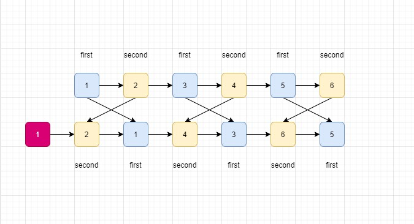
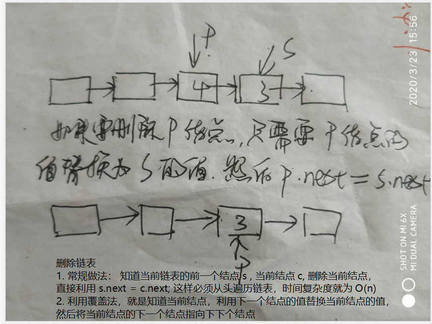
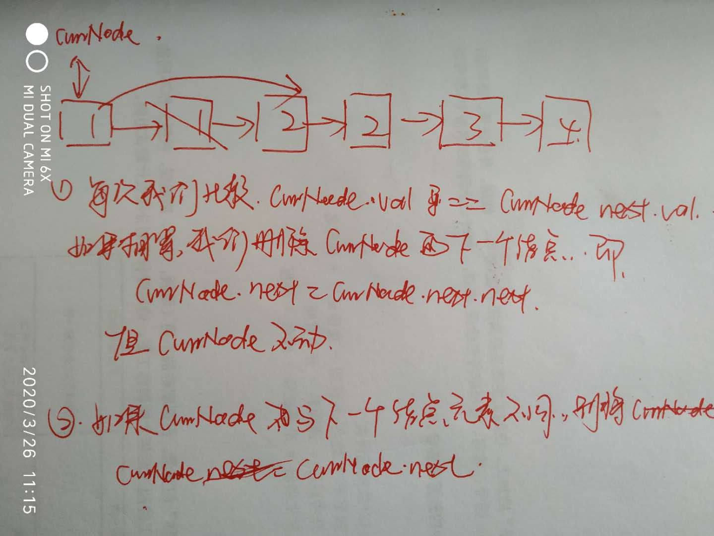
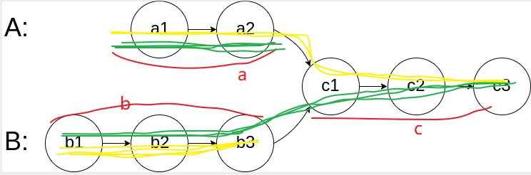

# 链表操作

## （链表操作要点）

> 一定要记住链表是否为空， 在第一句一定要加上  
>
> if(head != null)
>
> 甚至有时候  if(head != null || head.next != null)  也要判断是否只包含一个结点。

## 有点类似链表的中间结点[109. 有序链表转换二叉搜索树](https://leetcode-cn.com/problems/convert-sorted-list-to-binary-search-tree/)

> 这道题是让求出一个高度平衡的二叉树，非常有意思，其实就是利用一个快慢指针，当快指针走到结尾的时候，慢指针刚好走到中间，就这样，慢指针之前的作为左子树，而慢指针之后的左右右子树
>
> 但是，这里面有两个坑：
>
>  1. preNode 作为慢指针的前置结点，需要将其 preNode.next = null;  这样才不会永久循环
>
>  2. `如果 head == slowNode (说明左子树为空)`
>
>     ```java
>     if(head != slowNode) {
>         slowPreNode.next = null;
>         root.left = sortedListToBST(head);
>     }
>     ```

## [面试题22. 链表中倒数第k个节点](https://leetcode-cn.com/problems/lian-biao-zhong-dao-shu-di-kge-jie-dian-lcof/) 双指针

> 其实这道题和“[19. 删除链表的倒数第N个节点](https://leetcode-cn.com/problems/remove-nth-node-from-end-of-list/)”这道题真的很像，但是不同的是， 下面的这道题我们需要获取 倒数 第 N 个结点的前一个结点，而我们这一个则需要正好获取 第 K 个结点。
>
> 但是有一点我们要注意的是，因为下面一个结点 需要删除结点，所以需要新增头结点，那么 lowNode 和 highNode 的距离必须正好为 K
>
> 我们这道题不需要设置头结点，只需要使得  lowNode 和 highNode 的距离为 K - 1

## [19. 删除链表的倒数第N个节点](https://leetcode-cn.com/problems/remove-nth-node-from-end-of-list/) 真难

> 只要牵扯到 删除链表结点，就有可能删除头结点，因此，使用额外结点指向头结点
>
> 我们始终希望 lowNode 结点指向倒数 N + 1 个结点，因此 lowNode = newHead
>
> 而highNode 同样指向 newHead; start = 0;
>
> 然后，每次lowNode 和 highNode 都后移，知道 highNode == null 为止

```java
public ListNode removeNthFromEnd(ListNode head, int n) {
    if(n <= 0 || head == null) {
        return head;
    }
    ListNode newHead = new ListNode(-1), lowNode, highNode;
    newHead.next = head;
    lowNode = newHead;
    highNode = newHead;
    int start = 0;
    while(start < n) {
        highNode = highNode.next;
        start++;
    }
    // 这一个方法什么意思那，就是说明当 n == 链表的长度
    if(highNode == null) {
        return head.next;
    }
    /*
        但是有一点要注意的是，每次执行 low 和 high 都会后移，但是要注意 如果使用 highNode == null;  lowNode 会指向倒数第 N 个结点，但是我们希望 lowNode 指向倒数第 N + 1 个结点；
        然后再利用 lowNode.next = lowNode.next.next;
        */
    while(highNode.next != null) {
        lowNode = lowNode.next;
        highNode = highNode.next;
    }
    lowNode.next = lowNode.next.next;
    return newHead.next;
}
```

## [24. 两两交换链表中的节点](https://leetcode-cn.com/problems/swap-nodes-in-pairs/)

> firstNode 记录第一个节点，secondNode 记录第二个节点。
>
> 每次 判断 
>
> ​		if(secondNode == null)  preNode.next = secondNode
>
> ​		if(firstNode == null) preNode.next = firstNode;



```java
public ListNode swapPairs(ListNode head) {
    if(head == null) {
        return head;
    }
    ListNode newHead = new ListNode(-1), firstNode = newHead, secondNode = newHead, currNode = head, preNode = newHead;
    while(currNode != null) {
        // 首先找出两个节点
        if(currNode != null) {
            firstNode = currNode;
            currNode = currNode.next;
        }           
        if(currNode != null) {
            secondNode = currNode;
            currNode = currNode.next;
        }
        // 连接到 preNode 之后
        if(secondNode != null) {
            preNode.next = secondNode;
            preNode = preNode.next;
        }
        if(firstNode != null) {
            preNode.next = firstNode;
            preNode = preNode.next;
        }
        secondNode = firstNode = null;
    }
    preNode.next = null;
    return newHead.next;
}
```

## [61. 旋转链表](https://leetcode-cn.com/problems/rotate-list/)

> 这个一定要注意  head == null 和 k == 0
>
> 并且 k 有可能大于 链表的长度，那么就是一个循环的操作， 一定要  k %= n;
>
> 再次判断 k == 0; 如果等于 0； 结束就可以了

```java
public ListNode rotateRight(ListNode head, int k) {
    if(head == null || head.next == null || k == 0) {
        return head;
    }
    int listCount = 0;
    // 首先知道链表的长度
    for(ListNode startNode = head; startNode != null;startNode = startNode.next) {
        listCount ++;
    }
    k %= listCount;
    if(k == 0) {
        return head;
    }
    ListNode newHead = new ListNode(-1);
    newHead.next = head;
    ListNode lowNode = newHead, highNode = head;
    int start = 1;
    while(start < k) {
        highNode = highNode.next;
        start ++;
    }
    while(highNode.next != null) {
        lowNode = lowNode.next;
        highNode = highNode.next;
    }
    newHead.next = lowNode.next;
    lowNode.next = null;
    highNode.next = head;
    return newHead.next;
}
```

## [面试题06. 从尾到头打印链表](https://leetcode-cn.com/problems/cong-wei-dao-tou-da-yin-lian-biao-lcof/)

## [面试题24. 反转链表](https://leetcode-cn.com/problems/fan-zhuan-lian-biao-lcof/)  用到反转

## [面试题 02.06. 回文链表](https://leetcode-cn.com/problems/palindrome-linked-list-lcci/)


> 这道题有多种解法，最简单的就是利用数组，判断是不是回文，包括栈
>
> 甚至可以只 进栈一半， 如果另一半和栈中元素出栈相同就可以
>
> 最最经典的方法，就是将前半段链表反转，  最骚
>
> 1. 首先找到中间节点，slowNode 始终指向中间节点（要么是中间节点后一个元素）
> 2. 将 slowNode 之前的节点进行反转
> 3. 判断 偶数和奇数

## [876. 链表的中间结点](https://leetcode-cn.com/problems/middle-of-the-linked-list/)

> 给定一个带有头结点 head 的非空单链表，返回链表的中间结点。
>
> 如果有两个中间结点，则返回第二个中间结点。 
>
> 示例 1：
>
> 输入：[1,2,3,4,5]
> 输出：此列表中的结点 3 (序列化形式：[3,4,5])
> 返回的结点值为 3 。 (测评系统对该结点序列化表述是 [3,4,5])。
> 注意，我们返回了一个 ListNode 类型的对象 ans，这样：
> ans.val = 3, ans.next.val = 4, ans.next.next.val = 5, 以及 ans.next.next.next = NULL.
> 示例 2：
>
> 输入：[1,2,3,4,5,6]
> 输出：此列表中的结点 4 (序列化形式：[4,5,6])
> 由于该列表有两个中间结点，值分别为 3 和 4，我们返回第二个结点。
>
> `如果，奇数个元素，就是中间点，否则，就是中间的后一个元素`

```java
/**
 * Definition for singly-linked list.
 * public class ListNode {
 *     int val;
 *     ListNode next;
 *     ListNode(int x) { val = x; }
 * }
 */
class Solution {
    public ListNode middleNode(ListNode head) {
        if(head == null || head.next == null) {
            return head;
        }
        ListNode slowNode = head, fastNode = head;
        int count = 0; // 记录节点的个数， 每次进入循环体 count ++;
        // 记住，slowNode 只有 count & 1 == 0 的情况下才会后移
        while(fastNode != null) {
            count ++;
            if((count & 1) == 0) {
                slowNode = slowNode.next;
            }
            fastNode = fastNode.next;            
        }
        return slowNode;
    }
}
```

## [92. 反转链表 II](https://leetcode-cn.com/problems/reverse-linked-list-ii/)


## [面试题18. 删除链表的节点](https://leetcode-cn.com/problems/shan-chu-lian-biao-de-jie-dian-lcof/)

> 这道题就非常有意思，为了防止删除的是头结点，我们首先创建一个结点，使其指向头结点；
>
> 最后返回 头结点的 newHead.next // 既头结点的下一个结点；



```java
删除链表
1. 常规做法： 知道当前链表的前一个结点 s , 当前结点 c, 删除当前结点，直接利用 s.next = c.next; 这样必须从头遍历链表，时间复杂度就为 O(n)
2. 利用覆盖法，就是知道当前结点，利用下一个结点的值替换当前结点的值，然后将当前结点的下一个结点指向下下个结点
```

## [83. 删除排序链表中的重复元素](https://leetcode-cn.com/problems/remove-duplicates-from-sorted-list/)

> 下面的递归和迭代都是这种思想



```java
// 递归做法：
public ListNode deleteDuplicates(ListNode head) {
    // 首先如果，当前结点或者当前结点下一个结点为 空， 则返回 head
    if(head == null || head.next == null) {
        return head;
    }
    // 因为上面已经判断肯定存在下一个元素，所以，比较当前结点和下一个结点，如果当前结点和下一个结点相同，则用 head.next = nextNode.next;
    但是要传递的是 head; 而不是 head.next
        (2) 如果不等，则直接传递 下一个结点
        ListNode nextNode = head.next;
    if(head.val == nextNode.val) {
        head.next = nextNode.next;
        deleteDuplicates(head);
    }else{
        deleteDuplicates(head.next);
    }
    return head;
}
public ListNode deleteDuplicates(ListNode head) {
    if(head == null) {
        return head;
    }
    ListNode newHead = head, preNode = newHead, currNode = head.next;
    // 直接让 newHead 指向第一个结点， preNode 指向newHead, currNode 从head.next 开始
    while(currNode != null) {
        ListNode nextNode = currNode.next;
        if(preNode.val != currNode.val) {
            preNode.next = currNode;
            preNode = currNode;                
        } 
        currNode = nextNode;
    }
    preNode.next = null;
    return newHead;
}
```

## [82. 删除排序链表中的重复元素 II](https://leetcode-cn.com/problems/remove-duplicates-from-sorted-list-ii/)

> 这道题很经典，利用双指针，慢指针指向 上一类 值的最后一个结点，而快指针指向下一类的最后一个结点

```java
public ListNode deleteDuplicates(ListNode head) {
    if(head == null) {
        return null;
    }
    ListNode newHead = new ListNode(-1), preNode = newHead, nextNode = null, currNode = head;

    while(true) {
        // 每次先记录当前结点，currNode = currNode.next;
        ListNode tempNode = currNode;
        currNode = currNode.next;
        int count = 1;
        // 统计当前结点出现的次数
        while(currNode != null && currNode.val == tempNode.val) {
            nextNode = currNode.next;
            count ++;
            currNode = nextNode; // currNode 始终指向 currNode.next
        }
        // 如果等于 1，则插入链表尾部
        if(count == 1) {
            preNode.next = tempNode;
            preNode = tempNode;
        } 
        // 记得退出 while 循环
        if(currNode == null) {
            break;
        }
    }
    preNode.next = null;
    return newHead.next;
}
```

## [160. 相交链表](https://leetcode-cn.com/problems/intersection-of-two-linked-lists/)



> 一共有两种解法，（第二种方式比较麻烦，但效率较高）
>
> 1. 第一种 使用两个指针， ANode 和 bNode;  A 走完 a + c; 再走  b ;
>
>    B 走完 b + c； 再走 a;  这样两个结点走的路径一样长，如果两条链表的确没有焦点， 
>
>    a == b (因为 a 和 b 都指向了 null)
>
> 2. 先遍历一遍 A 和 B, 然后计算出 A长度 和 B 长度的差值，根据差值distance； 如果差值小于 0； 说明 B链表长，允许 链表B先走 distance步， 否则， A链表 走  distance 步；
>
>    最后在进行链表内容的比较

## [判断有环](https://blog.csdn.net/u010983881/article/details/78896293)

## [==141. 环形链表==](https://leetcode-cn.com/problems/linked-list-cycle/)

> 这个是为了判断链表是否有环

```java
// 这也是利用  hashMap 查找出
public ListNode detectCycle(ListNode head) {
    if(head == null || head.next == null) {
        return null;
    }
    HashMap<ListNode, Integer> map = new HashMap();
    while(head != null) {
        Integer temp = map.get(head);
        if(temp == null) {
            map.put(head, 1);
        }else if(temp == 1){
            return head;
        }
        head = head.next;
    }
    return null;
}
```

```java
public ListNode detectCycle(ListNode head) {
    if(head == null || head.next == null) {
        return false;
    }
    ListNode firstNode = head, secondNode = head;
    // 首先查找第一个 重合点，在循环内部，一定要判断 secondNode == null; 因为快指针要走两步
    while(secondNode != null) {
        firstNode = firstNode.next;
        secondNode = secondNode.next;
        if(secondNode ==null) { // 一定要判断 快指针是否为空，因为快指针每次走两步
            return false;
        }
        secondNode = secondNode.next;
        if(firstNode == secondNode) {
            return true;
        }
    }
    return false;
}
```

## [==环形链表 II==](https://leetcode-cn.com/problems/linked-list-cycle-ii/)


```java
// 可以利用HashMap 把所有结点存储起来，第一个能已经存在映射的话，就是环的入口
public ListNode detectCycle(ListNode head) {
    if(head == null || head.next == null) {
        return null;
    }
    HashMap<ListNode, Integer> map = new HashMap();
    while(head != null) {
        Integer temp = map.get(head);
        if(temp == null) {
            map.put(head, 1);
        }else if(temp == 1){
            return head;
        }
        head = head.next;
    }
    return null;
}
```

```java
public ListNode detectCycle(ListNode head) {
    if(head == null || head.next == null) {
        return null;
    }
    ListNode firstNode = head, secondNode = head;
    // 首先查找第一个 重合点，在循环内部，一定要判断 secondNode == null; 因为快指针要走两步
    while(secondNode != null) {
        firstNode = firstNode.next;
        secondNode = secondNode.next;
        if(secondNode ==null) {
            return null;
        }
        secondNode = secondNode.next;
        if(firstNode == secondNode) {
            break;
        }
    }
    // 这一步是为了判断 secondNode 是因为 等于 null 而停下，还是 找到了相遇点
    if(secondNode ==null) {
        return null;
    }
    // 将 慢指针回退，然后两个指针每次前进一步，两个指针相遇 就是第一个入口
    firstNode = head;
    while(firstNode != secondNode) {
        firstNode = firstNode.next;
        secondNode = secondNode.next;
    }
    return firstNode;
}
```

## [86. 分隔链表](https://leetcode-cn.com/problems/partition-list/)

> 其实就是建立高低链表，有点像 hash-map 改变下标相同，利用高低位；但是要记住链表最后一个元素 要赋值 null

## [2. 两数相加](https://leetcode-cn.com/problems/add-two-numbers/)（从前往后）

> 这道题这是非常的有意思，利用链表求两数之和，然后把数字存储在链表中，肯定少不了的就是新建头结点。
>
> 非常重要重要的就是： 千万不要忘了使用进位，如果进位标志 为 true; 我们则需要多增加 1
>
> 在循环结束的时候，也就是两个链表都是空的时候，我们需要判断是否还有进位，如果还有进位，我们需要再次添加一个结点。

```java
public ListNode addTwoNumbers(ListNode l1, ListNode l2) {
    boolean isJin = false;
    ListNode newHead = new ListNode(-1), currNode = newHead;
    while(l1 != null || l2 != null) {
        int val1 = l1 == null ? 0 : l1.val;
        int val2 = l2 == null ? 0 : l2.val;
        int tempSum = val1 + val2 + (isJin ? 1 : 0);
        isJin = false;
        if(tempSum > 9) {
            tempSum %= 10;
            isJin = true;
        }
        ListNode newNode = new ListNode(tempSum);
        currNode.next = newNode;
        currNode = newNode;
        l1 = l1 == null ? null : l1.next; // 非常重要
        l2 = l2 == null ? null : l2.next; 
    }
    if(isJin) { // 在循环结束之后，查看是否还有 进位
        ListNode newNode = new ListNode(1);
        currNode.next = newNode;
        currNode = newNode;
    }
    return newHead.next;
}
```

## [`445. 两数相加 II`](https://leetcode-cn.com/problems/add-two-numbers-ii/)（从后往前）

> 1. 利用栈存储元素
> 2. 然后利用出栈顺序进行相加
> 3. 采用头插法

```java
/**
 * Definition for singly-linked list.
 * public class ListNode {
 *     int val;
 *     ListNode next;
 *     ListNode(int x) { val = x; }
 * }
 */
class Solution {
    public ListNode addTwoNumbers(ListNode l1, ListNode l2) {
        if(l1 == null) {
            return l2;
        } else if(l2 == null) {
            return l1;
        }

        Stack<ListNode> preStack = new Stack<>();
        Stack<ListNode> latterStack = new Stack<>();

        while(l1 != null) {
            preStack.push(l1);
            l1 = l1.next;
        }
        while(l2 != null) {
            latterStack.push(l2);
            l2 = l2.next;
        }

        ListNode newHead = new ListNode(-1), preNode = newHead, firstCurr = null, secondCurr = null, currNode = null;
        boolean isJin = false;

        while(!preStack.isEmpty()  && !latterStack.isEmpty()) {
            firstCurr = preStack.pop();
            secondCurr = latterStack.pop();

            int num = firstCurr.val + secondCurr.val + (isJin ? 1 : 0);
            isJin = false;
            if(num >= 10) {
                isJin = true;
                num %= 10;
            }
            currNode = new ListNode(num);
            currNode.next = preNode.next;
            preNode.next = currNode;
        }

        while(!preStack.isEmpty()) {
            firstCurr = preStack.pop();
            int num = firstCurr.val + (isJin ? 1 : 0);
            isJin = false;
            if(num >= 10) {
                isJin = true;
                num %= 10;
            }
            currNode = new ListNode(num);
            currNode.next = preNode.next;
            preNode.next = currNode;
        }

        while(!latterStack.isEmpty()) {
            secondCurr = latterStack.pop();
            int num = secondCurr.val + (isJin ? 1 : 0);
            isJin = false;
            if(num >= 10) {
                isJin = true;
                num %= 10;
            }
            currNode = new ListNode(num);
            currNode.next = preNode.next;
            preNode.next = currNode;
        }

        if(isJin) {
            currNode = new ListNode(1);
            currNode.next = preNode.next;
            preNode.next = currNode;
        }

        return newHead.next;
    }
}
```

## [面试题25. 合并两个排序的链表](https://leetcode-cn.com/problems/he-bing-liang-ge-pai-xu-de-lian-biao-lcof/)

> 其实就是很简单将连个链表合并即可，最后肯定会有一个链表不为空，只要把他连接在链表之后就可以

```java
if(firstNode != null) {
    preNode.next = firstNode;
}else{
    preNode.next = secondNode;
}
```

## [`328. 奇偶链表`](https://leetcode-cn.com/problems/odd-even-linked-list/)

> 这道题看清楚了，
>
> 给定一个单链表，把所有的奇数节点和偶数节点分别排在一起。请注意，==这里的奇数节点和偶数节点指的是节点编号的奇偶性，而不是节点的值的奇偶性==。
>
> 请尝试使用原地算法完成。你的算法的空间复杂度应为 O(1)，时间复杂度应为 O(nodes)，nodes 为节点总数。
>
> 示例 1:
>
> 输入: 1->2->3->4->5->NULL
> 输出: 1->3->5->2->4->NULL
> 示例 2:
>
> 输入: 2->1->3->5->6->4->7->NULL 
> 输出: 2->3->6->7->1->5->4->NULL


```java
public ListNode oddEvenList(ListNode head) {
    if(head == null || head.next == null) {
        return head;
    }
    ListNode oddNode = head, evenNode = head.next;
    int count = 2;
    while(evenNode.next != null) {
        count += 1;
        ListNode nextNode = evenNode.next;
        if((count & 1) == 1) {
            evenNode.next = nextNode.next;
            nextNode.next = oddNode.next;
            oddNode.next = nextNode;
            oddNode = nextNode;
        }else{
            evenNode = nextNode;
        }
    }
    return head;
}
```

## [`725. 分隔链表`](https://leetcode-cn.com/problems/split-linked-list-in-parts/)

> 链表已经要求了 k >= 1;
>
> root 如果为空，也要创建数组，也就是每个链表都为空

```java
public ListNode[] splitListToParts(ListNode root, int k) {
    ListNode currNode = root;
    int count = 0;
    // 首先遍历链表，统计链表结点个数
    while(currNode != null) {
        count ++;
        currNode = currNode.next;
    }
    int subNum = count / k;
    int remainer = count % k;
    ListNode []listNodeArr = new ListNode[k];
    // 建立数组，获取 元素个数 和 余数
    currNode = root;
    for(int i = 0; i < listNodeArr.length; i++) {
        // 建立头结点
        ListNode newHead = new ListNode(-1), preNode = newHead;
        // 计算个数， 因为有余数， 所以前几组肯定要多添加 1 
        int tempSum =subNum + (remainer-- > 0 ? 1 : 0);
        // 内层循环，连接链表，
        while(currNode != null && tempSum-- > 0) {
            preNode.next = currNode;
            preNode = currNode;
            currNode = currNode.next;
        }
        // 每个链表最后都要置空
        preNode.next = null;
        // 将链表添加到数组中
        listNodeArr[i] = newHead.next;
    }
    return listNodeArr;
}
```

## [面试题 02.04. 分割链表2](https://leetcode-cn.com/problems/partition-list-lcci/)

> 如果分成 三份： 


# 链表排序

## 插入排序[147. 对链表进行插入排序](https://leetcode-cn.com/problems/insertion-sort-list/)


```java
public ListNode insertionSortList(ListNode head) {
    if(head == null || head.next == null) {
        return head;
    }
    ListNode newHead = new ListNode(-1), preNode, currNode = head;
    newHead.next = head;
    while(currNode != null && currNode.next != null) { 
        // 如果有序
        if(currNode.val < currNode.next.val) {
            currNode = currNode.next;
        }else{
            preNode = newHead; // preNode 指向 头结点
            ListNode tempNode = currNode.next;
            // 利用 preNode.next.val 和 tempNode.val 比较， preNode 始终位于插入位置的前一个
            while(preNode.next != null && preNode.next.val < tempNode.val) {
                preNode = preNode.next;
            }
            // 把 tempNode 从链表中删除
            currNode.next = currNode.next.next;
            // 将 tempNode 插入到 preNode 之后
            tempNode.next = preNode.next;
            preNode.next = tempNode;
        }
    }
    return newHead.next;
}
```

