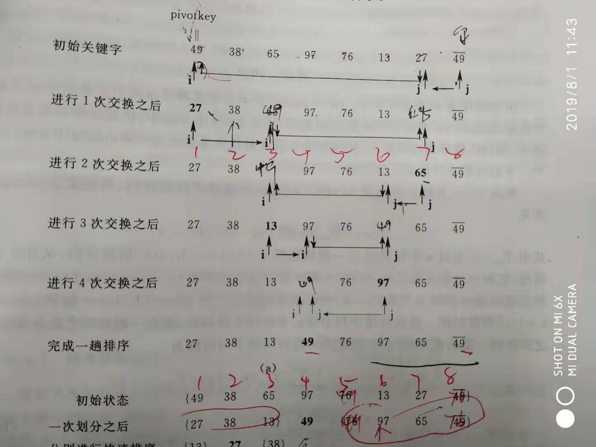

#### 冒泡排序

[**冒泡排序及其改进**](https://www.cnblogs.com/mistermoney/p/9550590.html)

- 正常冒泡

> 思想就是每次把最大数选择出来，放在最后一个位置上。
>
> j < nums.length - i - 1	// 因为要比较 nums[j] 和 nums[j + 1],

```java
public static void bubbleSort(int []nums) {

     for(int i = 0; i < nums.length - 1; i++) {
          for(int j = 0; j < nums.length - i - 1; j++) {
               if(nums[j] > nums[j + 1]) {
                    int temp = nums[j];
                    nums[j] = nums[j + 1];
                    nums[j + 1] = temp;
               }
          }
     }

}
```

- 冒泡改进一

> 如果每次排序的时候，再拍第 i 次的时候， 经过前面元素的交换， 数组现在已经有序了， 如果原先的方法 10 个数就是要比较 9 次。
>
> 如果我们这次记录下来，在进行 第 i 次排序的时候，我们用字段 isSort （boolean)记录前面的元素是否有交换， 如果没有，则说明数组已经有序，可以提前终止 比较。

```java
public static void bubbleSortIm1(int []nums) {

     for(int i = 0; i < nums.length - 1; i++) {
          boolean isSort = false;	// 
          for(int j = 0; j < nums.length - i - 1; j++) {
               if(nums[j] > nums[j + 1]) {
                    int temp = nums[j];
                    nums[j] = nums[j + 1];
                    nums[j + 1] = temp;
                    isSort = true;
               }
          }
          if(!isSort) {	// false 表示已经 无元素需要比较，提前终止
               break;
          }
     }

}
```

- 冒泡改进二

> 我们刚才的方法只是考虑了数组前面的元素， 如果我们在排序时。发现 虽然 10 个元素我们要比较 9 次， 但是有可能只交换了 5次， 所以，如果我们记录下来最后一次交换元素的下标， 也就是说 这之后，数组就是有序的。
>
> 并且， 我们结合改进方法一， 如果前面的元素也有序，我们终止循环。

```java
public static void bubbleSortIm2(int []nums) {

     int borderIndex = nums.length - 1;
     for(int i = 0; i < nums.length - 1; i++) {
          boolean isSort = false;
          int tempIndex = 0;
          for(int j = 0; j < borderIndex; j++) {
               if(nums[j] > nums[j + 1]) {
                    int temp = nums[j];
                    nums[j] = nums[j + 1];
                    nums[j + 1] = temp;
                    tempIndex = j + 1;
                    isSort = true;
               }
          }
          borderIndex = tempIndex + 1;	// 交换的下标是取到 j + 1; 但是又因为 j < borderIndex ,所以我们取元素  tempIndex + 1
          if(!isSort) {	
               break;
          }
     }
}
```

#### 希尔排序

> 希尔排序就是有点类似于 插入排序。第三层内 第 i 个 元素 要和 第 i - h 个元素比较， 如果 i > i - h, 则终止比较， 因为 前 i - h, i - 2h 。。。已经有序。

```java
public static void shellSort(int []nums) {
     int temp;
     int h = 1;
     while(h < (nums.length / 3)) {
          h = 3 * h + 1;
     }
     while(h >= 1) {
          for(int i = h; i < nums.length; i++) {
               for(int j = i; j >= h; j -= h) {
                    if(nums[j] < nums[j - h]) {
                         temp = nums[j];
                         nums[j] = nums[j - h];
                         nums[j - h] = temp;
                    }
               }
          }
          h = h / 3;
     }
}
```

#### 插入排序

> 插入排序的思想就是当前元素是 第 i 个元素， 前 i - 1个元素已经有序。现在要做的就是 把 第 i 个 元素 和 之前的元素相比较， 如果 第 i - 1 个元素 小于 第 i 个元素。我们就可以认为 前 i 个元素已经有序。

```java
public static void insertSort(int []nums) {
        int temp;
        for(int i = 1; i < nums.length; i++) {
            for(int j = i; j > 0; j--) {
                if(nums[j] < nums[j - 1]) {
                    temp = nums[j];
                    nums[j] = nums[j - 1];
                    nums[j - 1] = temp;
                }
            }
        }
    }
```

> 这种插入排序比较有意思， 就是每次利用 当前 currValue 和 之前的数比较， 如果小， 则交换， 否则终止， 再循环结束后， nums[j] = currValue.

```java
for(int i = 1, j = i; i < nums.length; j = ++i) {
     int currValue = nums[i];
     while(currValue < nums[j - 1]) {
          nums[j] = nums[j - 1];
          if(--j == 0) {
               break;
          }
     }
     nums[j] = currValue;
}
```

> ==这种比较有意思， 就是如果 我的前面一些是有序的， 我就跳过这些， 直接从非有序开始==

```java
public static void insertSort2(int []nums) {

     int i = 0;
     do{
          if(i >= nums.length) {
               return;
          }
     }while (nums[++i] >= nums[i - 1]);
     for(int j = i; i < nums.length; j = ++i) {
          int currValue = nums[i];
          while(currValue < nums[j - 1]) {
               nums[j] = nums[j - 1];
               if(--j == 0) {
                    break;
               }
          }
          nums[j] = currValue;
     }
}
```

#### 快速排序



> 快速排序的思想就是首先找到一个能把 数组分成两部分的一个关键字 keyNote 的下标（==最好是能评分整个数组为两部分==）然后对 low - (keyNoteIndex  - 1)和 keyNoteIndex + 1 - high 两部分进行上面的操作，也是一个递归操作。
>
> 唯一的退出条件就是 low = high, 所以最后的返回值 low 和 返回 high 相同

```java
public static void swap(int []nums, int low, int high) { // 交换函数
     int temp;
     temp = nums[high];
     nums[high] = nums[low];
     nums[low] = temp;
}

public static int quickSort(int []nums, int low, int high) {
     int keyNote = nums[low];

     while(low < high) {	// 唯一的退出条件就是 low = high, 所以最后的返回值 low 和 返回 high 相同
          while(low < high && nums[high] >= keyNote) {
               high --;
          }
          swap(nums, low, high);
          while(low < high && nums[low] <= keyNote) {
               low ++;
          }
          swap(nums, low, high);
     }
     System.out.println(low + " = low\t" + "high = " + high);
     return low;
}

public static void quickSortMain(int []nums, int low, int high) {
     if(low >= high) {
          return;
     }
     int keyNoteIndex = quickSort(nums, low, high);
     quickSortMain(nums, low, keyNoteIndex - 1);
     quickSortMain(nums, keyNoteIndex + 1, high);
}
```

#### 2路归并排序

```java
public static void merge(int []num, int low, int mid, int high) {
     int []temp = new int[high - low + 1 ];	 // 也可以直接写成 nums.length;一般传过来的数组为 
      //(1, 3) high - low + 1 三个元素
     int firstStart = low;
     int secondStart = mid + 1;	
	// 要知道第二次循环的时候是  sort(nums, low, mid) 和 sort(nums, mid + 1, high)
     int tempStart = 0;	// 这是暂时数组的下标
     while(firstStart <= mid && secondStart <= high) {
          if(num[firstStart] <= num[secondStart]) {
               temp[tempStart] = num[firstStart++];
          }else{
               temp[tempStart] = num[secondStart++];
          }
          tempStart ++;
     }
     if(firstStart <= mid ){	// 如果A数组没有完全比较
          for(int start = firstStart; start <= mid; start ++) {
               temp[tempStart ++] = num[start];
          }
     }

     if(secondStart <= high ){	// 如果B数组没有完全比较
          for(int start = secondStart; start <= high; start ++) {
               temp[tempStart ++] = num[start];
          }
     }

     for(int i = 0; i < temp.length; i++) {	
          num[low++] = temp[i];
     }
}
public static void sort(int []num, int low, int high) {
     if(high <= low) { // 递归的判断
          return;
     }				//因为是递归，千万不要再循环
     int mid = (low + high) / 2;
     sort(num, low, mid);
     sort(num, mid + 1, high);
     merge(num, low, mid, high);
}
public static void main(String[] args) {
     int []temp = new int[] {1, 3, 2, 4, 9, 0, 1, 3, 10, 5, 7, 9, 0};
     sort(temp, 0, temp.length - 1); // 这里比较有意思的是， 0， temp.length - 1, 是为了放置数组越界， 因为后面的比较都是 <= high的。
}
```

#### 堆排序

[完全二叉树和满二叉树的介绍](https://blog.csdn.net/CTO_1649900265/article/details/87913192)

[堆排序详解代码](https://www.cnblogs.com/skywang12345/p/3602162.html)

==堆分为"最大堆"和"最小堆"。最大堆通常被用来进行"升序"排序，而最小堆通常被用来进行"降序"排序==

> 堆排序的思想：
>
> ​	（1）、首先创建堆。 （2）、堆进行排序
>
> - 首先创建堆
>
>   从 array.length / 2 - 1 开始， 到 0 结束， 这里比较有意思的是： 左子树： 2 * i + 1 ， 右子树： 2 * i + 2
>
>   ```java
>   for(int start = array.length / 2 - 1; start >= 0; start --) {	// 堆创建
>        heapSortSmall(array, start, array.length - 1);
>   }
>   ```
>
> - 堆排序
>
>   > 这里比较有意思的是， childIndex < end, 因为后面要比较 
>   >
>   > array[childIndex] > array[childIndex + 1])， 所以 这里要设置  childIndex < end (childIndex 表示左子树)
>
>   ```java
>   if(childIndex < end && array[childIndex] > array[childIndex + 1]) {
>        childIndex += 1;
>   }
>   ```
>
>   > 首先做交换， 把 数组第一个元素和当前数组的 堆中最后元素交换， i - 1;
>   >
>   > i - 1 是因为 创建堆的时候，已经创建好了 最大堆或最小堆， 经过上面的交换， 可以 0 - arrayLength - 2;
>
>   ```java
>   for(int i = array.length - 1; i > 0; i--) {	//
>        temp = array[0];
>        array[0] = array[i];
>        array[i] = temp;
>        System.out.println(Arrays.toString(array));
>        heapSortSmall(array, 0, (i - 1));
>   }
>   ```
>
>   

##### 最小堆(降序)

```java
public static void heapSortSmall(int []array, int start, int end) {

     int currIndex = start;
     int childIndex = start * 2 + 1;
     for(; childIndex <= end; currIndex = childIndex,childIndex = childIndex * 2 + 1) {
          if(childIndex < end && array[childIndex] > array[childIndex + 1]) {
               childIndex += 1;
          }
          if(array[currIndex] <= array[childIndex]) {	// 停止循环
               break; // 这里表示 左右子树 都小于 根节点
          }else{		// 交换元素
               int temp = array[childIndex];
               array[childIndex] = array[currIndex];
               array[currIndex] = temp;
          }
     }
}

public static void heapSortSMain(int []array) {

     int temp;
     for(int start = array.length / 2 - 1; start >= 0; start --) {
          heapSortSmall(array, start, array.length - 1);
     }
     System.out.println(Arrays.toString(array));
     for(int i = array.length - 1; i > 0; i--) { 
          temp = array[0];
          array[0] = array[i];
          array[i] = temp;
          System.out.println(Arrays.toString(array));
          heapSortSmall(array, 0, (i - 1));
     }
}
```

```java
[5, 2, 4, 6, 3, 7, 1]
[7, 3, 4, 6, 5, 2, 1]
[7, 5, 4, 6, 3, 2, 1]
[6, 5, 7, 4, 3, 2, 1]
[7, 6, 5, 4, 3, 2, 1]
[7, 6, 5, 4, 3, 2, 1]
```

##### 最大堆(升序)

```java
public static void heapSortMax(int []array, int start, int end) {

     int temp;
     int currNode = start;
     int childIndex = start * 2 + 1;
     for (;childIndex <= end; currNode = childIndex, childIndex = childIndex * 2 + 1) {
          if(childIndex < end && array[childIndex] < array[childIndex + 1]) {
               childIndex += 1;
          }
          if(array[currNode] >= array[childIndex]) {
               break;
          }else{
               temp = array[currNode];
               array[currNode] = array[childIndex];
               array[childIndex] = temp;
          }
     }
}

public static void heapSortMaxMain(int []array) {
     int temp;
     heapSortMax(array, 0, array.length - 1);
     for(int i = array.length - 1; i > 0; i--) {
          temp = array[0];
          array[0] = array[i];
          array[i] = temp;
          System.out.println(Arrays.toString(array));
          heapSortMax(array, 0, i - 1);
     }
}
```

```java
[1, 6, 5, 2, 3, 4, 7]
[4, 3, 5, 2, 1, 6, 7]
[1, 3, 4, 2, 5, 6, 7]
[2, 3, 1, 4, 5, 6, 7]
[1, 2, 3, 4, 5, 6, 7]
[1, 2, 3, 4, 5, 6, 7]
```

