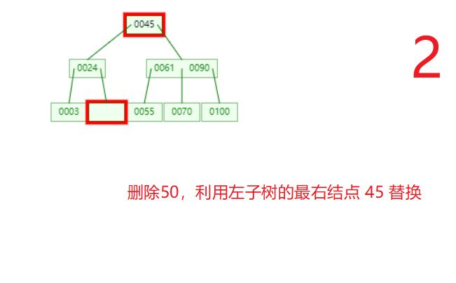

# 图

## DFS(depth first search)

>深度优先遍历:
>
>1. 其实就是 顺着当前结点 一直往下走，直到 走到 currNode 的子结点都被遍历，或者没有子结点（当然这里的意思就是直接相连的边）
>2. 然后，返回上一层，找到一个从未遍历的结点（有可能是当前结点的另外一条边连接的顶点），执行第一步

## BFS(broad first search)

> 广度优先遍历: 比如，我们用 邻接表 存储 （其实就是数组结合链表）
>
> 1. 如果，当前结点从未遍历，首先将该结点遍历，然后遍历所有直接相连的结点
> 2. 按照数组的下标，遍历每个结点直接相连的结点。

## Dijstra 算法

> 其实，就是希望找到从结点 A 到其他所有结点的最短路径

## `拓扑排序`

> 拓扑排序，其实还是挺简单的，就是每次找出入度为零的结点（为零的可能有多个），去掉当前顶点以及以当前顶点作为尾巴的边，然后再查找下一个入度为零的结点

> 1. 其实 关键路径就是 所有路径中最长的路径，并且有可能不唯一，那么关键路径的延期，必然导致工程的延期
> 2. 但是==一个或者某些==关键路径的提前，并不能保证整个工程的提前，就像前面 提到的，有可能有多条 关键路径。
> 3. 所有的关键路径提前才会导致 整个工程的提前。

## 关键路径

> 关键路径，也挺简单
>
> 关键路径： 路径长度最长的路径
>
> 最早发生时间：就是当前结点在所有前序结点都执行完，最早开始的时间
>
> 最迟发生时间：就是（关键路径）- 后续路径所消耗的时间，就是，当前任务最晚发生，依然可以保证任务完成。
>
> 时间余量：就是最晚发生时间 - 最早发生时间
>
> 关键活动： 关键路径上的所有活动都是关键活动。
>
> `最早开始时间： 开始端 + 最长权值`
>
> `最晚开始时间： 结束端 - 最长权值`
>
> 计算方式： 
>
> 	1. 首先找出最长路径
>  	2. 查看路径之和 == 最长路径
>  	3. 只需求出 路径之和 == 最长路径的最早发生和最晚发生，如果之差 == 0，就是关键路径

# 树

## Huffman 编码（最优二叉树）（带权路径最短的树）

[==20172303 2018-2019-1《程序设计与数据结构》哈夫曼树编码与解码==](https://www.cnblogs.com/PFrame/p/10111647.html)

> 1. 只包含 度 为零 和 度为 2 的结点， 如果有 n 个结点，`那么生成的haffman 树一共包含 2n - 1 个结点`
>
> 2. huffman 树 （前缀编码）对应的编码不唯一，·`**哈夫曼树并不唯一，但带权路径长度一定是相同的**`。==也必须是最小的==
>
> 3. 可以通过 2n  - 1 个数组来存储 元素， 每个结点包括 value, parent, left, right;
>
> 4. 每次都要找出 最小的两个值，记住，可能同时有多个相同值的元素，但是在构成 haffuman 树的时候，一定要保证权值的最小
>
>    ```java
>    public class Node {
>        
>     	int value;
>        Node parent; // 父节点
>        Node left; // 左子树
>        Node right; // 右子树
>        
>        Node() {}
>        
>        Node(int value, Node parent, Node left, Node right) {
>            this(value, left, right);
>         	this.parent = parent;
>        }
>        
>        Node(int value, Node left, node right) {
>         	this.value = value;
>            this.left = left;
>            this.right = right;
>        }
>            
>    }
>    ```

## 平衡二叉树


## 红黑二叉树

> **红黑树的特点：**
>
> 　　(1)每个节点或者是黑色，或者是红色。
>
> 　　(2)根节点是黑色。
>
> 　`　(3)每个叶子节点（NIL）是黑色。 [注意：这里叶子节点，是指为空(NIL或NULL)的叶子节点！]`
>
> `　·　(4)如果一个节点是红色的，则它的子节点必须是黑色的。`
>
> 　　(5)从一个节点到该节点的子孙节点的所有路径上包含相同数目的黑节点。[这里指到叶子节点的路径]

# 查找


# B树

## [简单剖析B树（B-Tree）与Ｂ+树](https://blog.csdn.net/z_ryan/article/details/79685072?utm_medium=distribute.pc_relevant.none-task-blog-BlogCommendFromMachineLearnPai2-1.nonecase&depth_1-utm_source=distribute.pc_relevant.none-task-blog-BlogCommendFromMachineLearnPai2-1.nonecase)


> 1. m 阶 B 树首先是 平衡的，无论删除还是 插入，都必须保证 平衡，此外 m 阶 B 树 至少包含 ceil(m / 2) - 1 个关键字，并且至少包含 ceil(m / 2) 个子树，也就是说，如果 有 n 个 关键字，必须包含 n + 1 个 子树
> 2. 删除主要分两步：
>    1. 删除当前 元素 A， 然后利用 A 结点的 右子树的 最左结点 B 中的最小关键字 进行替换
>    2. 也就表示 B 结点进行了 删除， 继续 执行 步骤 1
>    3. 如果 无子结点， 首先查看 B 结点的兄弟结点， 如果兄弟结点（首选右兄弟），元素个数 大于 ceil(m / 2) -1; 就将 有兄弟中最小关键字 替换 B 结点的父节点 ，然后 将 父节点的元素放置到 B 结点
>    4. 如果，兄弟结点 元素个数 等于 ceil(m / 2) -1, 就会将当前结点 与 父节点 合并至 兄弟结点。（当前这里的父节点 表示 比较 兄弟结点共有的关键字）
> 3. 如果，执行完 步骤 2 的 步骤 4， 发现还是出现 不平衡现象，继续执行 步骤 2





# B+树

> 1. n 个 子树就有 n 个关键字
> 2. m 阶 非根节点： 结点数最少位 ceil(m / 2) -1; 而最多 有 m - 1;  但是要记住的是，子树和关键字的个数之比是 1： 1
>
> 

> 1.有k个子树的中间节点包含有k个元素（B树中是k-1个元素），每个元素不保存数据，只用来索引，所有数据
> 都保存在叶子节点。
>
> 2.所有的叶子结点中包含了全部元素的信息，及指向含这些元素记录的指针，且叶子结点本身依关键字的大小
> 自小而大顺序链接。
>
> 3.所有的中间节点元素都同时存在于子节点，在子节点元素中是最大（或最小）元素。