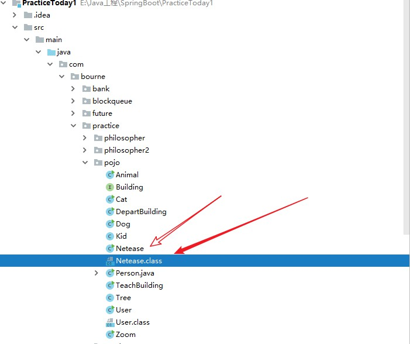

## **1. java 命令行运行 java**

​	先编译 ：javac person.java（要加后缀） 生成字节码文件
​	再运行字节码文件 java person (不要加后缀) 

## **2. java 的跨平台特性** 

​	首先编译 person .java 生成字节码文件（person.class）, 而 JVM 运行字节码文件 .class 文件
​	JVM 也是一个软件， 不同的系统平台JVM不同，但都可以实现标准的**.class** 字节码文件。(一次编译， 导出运行， Java程序 运行在JVM上， 而JVM对上 屏蔽了底层的操作系统差异）

## **3. 利用命令行编译 .java 文件 和 运行 .class 字节码文件**

​		

		- 利用 javac 编译 .java文件， （要加后缀）

​		***- cd src***

​		***- javac com/bourne/practicetoday/test.java***

- 利用 java 运行 .class 文件（不加后缀） ， 但是会出现**错误: 找不到或无法加载主类 test**
  ​		解决办法https://zhidao.baidu.com/question/523320925.html
  ​		一个类的全名应该是包名+类名。类A的全名：com.bourne.practicetoday.test，

​		*<font style="color: red;" >**所以我们回到 src 目录下**</font>， 执行 java com.bou**rne.practicetoday.test(不加后缀)***

​		- ***cd src***

  - ***java com.bourne.practicetoday.test*** 

  - 如果希望执行.class 文件时，添加参数就是

    - 普通参数 java com.bourne.practicetoday.test arg0 arg1

    - 如果参数为 文件名  就要写文件的绝对路径

      例如， java com.bourne.practicetoday.Test  E:\Java工程\PracticeToday\fileName.txt

      表示执行com.bourne.practicetoday.Test.class 文件， 参数为 E:\Java工程\PracticeToday\fileName.txt文件的名称

- 利用javap -c com.bourne.practicetoday.test（不加后缀）

   **-c                       对代码进行反汇编**
   
   **查看 字节码指令**

### 3-2 利用命令行编译 .java 文件 和 运行 .class 字节码文件*



编译 java.java 文件

```java
- cd src/main/java
- javac com/bourne/practice/pojo/Netease.java
```

==**运行java.class文件**==

```java
// 好像都需要进入到 main/java文件中进行运行 .class 文件， main/java 是文件夹， 而不是类所处在的包，所以不能连着 main.java一起
- java com.bourne.practice.pojo.Netease
```

### 3-3 获取 .class 的字节码（类文件）

> javap -verbose jvm/A

### [IDEA中通过hsdis查看Java代码的汇编指令](https://blog.csdn.net/dataiyangu/article/details/104990220)

## 4. 如何覆写 equals 方法 和 hashcode 方法**

​	https://blog.csdn.net/fulfillmydream/article/details/16858473

## 5.Java中静态(static)成员何时才会初始化

[==博客园==](		<https://blog.csdn.net/jisuanji198509/article/details/81260487>			)     https://blog.csdn.net/jisuanji198509/article/details/81260487
[==java类加载时机与过程==](https://www.cnblogs.com/javaee6/p/3714716.html)

## 6.基本数据类型 & 引用类型

1.1 基本概念

在讨论 **浅拷贝 & 深拷贝** 这个问题之前，我们需要先了解 基本数据类型 & 引用类型 这两者之间的区别，否则后面会很疑惑。在`Java`当中，这两类的代表分别为：

- **八种** 基本数据类型：`byte`、`short`、`int`、`long`、`float`、`double`、`char`、`boolean`。
- 引用类型：除去基本数据类型的其它类型都是引用数据类型，例如类、接口、数组。

在 [(1) JAVA 基本数据类型与引用数据类型](https://link.jianshu.com/?t=JAVA%E5%9F%BA%E6%9C%AC%E6%95%B0%E6%8D%AE%E7%B1%BB%E5%9E%8B%E4%B8%8E%E5%BC%95%E7%94%A8%E6%95%B0%E6%8D%AE%E7%B1%BB%E5%9E%8B) 一文中总结了这两者的区别：

| 基本数据类型                           | 引用数据类型                                                 |
| :------------------------------------- | :----------------------------------------------------------- |
| 变量名指向具体的数值                   | 变量名指向存数据对象的内存地址，即变量名指向`hash`值         |
| 变量在声明之后就会立刻分配给他内存空间 | 它以特殊的方式指向对象实体，这类变量声明时不会分配内存，只是存储了一个内存地址 |
| 基本类型之间的赋值是创建新的拷贝       | 对象之间的赋值只是传递引用                                   |
| “==”和“!=”是在比较值                   | `“==”`和`“!=”`是在比较两个引用是否相同                       |
| 使用时需要赋具体值，判断时使用`==`号   | 使用时可以赋值`null`，判断时使用`equals`方法                 |

### 1.2 基本数据类型 和 引用数据类型 传递区别

程序设计语言中有关参数传递给方法的两个专业术语是：

- 按值调用：表示方法接收的是调用者提供的值。
- 按引用调用：表示方法接收的是调用者提供的变量的地址。

在`Java`中 **不存在按引用调用， 都是按值 传递， 基本数据类型， 直接传值， 而 引用类型传递的也是值， 只不过时引用类型指向的地址**，也就是说，假如方法传递的是一个引用数据类型，那么可以修改 **引用所指向的对象的属性**，但不能 **让引用指向其它的对象**。

## 7 StringBuffer 和 StringBuilder tostirng

StringBuffer.toString() 以及 对应的字符串构造函数

问题的关键在于toString构造函数的最后一行，value并不是直接指向的，而是重新生成了一个新的字符串，使用系统拷贝函数进行内存复制。

private transient char[] toStringCache;// StringBuffer特有，缓存toString最后一次返回的值。 如果多次连续调用toString方法的时候由于这个字段的缓存就可以少了Arrays.copyOfRange的操作(每次调用其他的修改StringBuffer对象的方法时，这些方法的第一步都会先将toStringCache设置为null，详细参见源码） StringBuilder.toString()

```java
@Override
public synchronized String toString() {
    if (toStringCache == null) {
        toStringCache = Arrays.copyOfRange(value, 0, count);
    }
    return new String(toStringCache, true);
}
```

```java
/*
* Package private constructor which shares value array for speed.
* this constructor is always expected to be called with share==true.
* a separate constructor is needed because we already have a public
* String(char[]) constructor that makes a copy of the given char[].
*/
String(char[] value, boolean share) {
    // assert share : "unshared not supported";
    this.value = value;
}
```

StringBuilder.toString() 以及 对应的字符串构造函数

```java
@Override
public String toString() {
    // Create a copy, don't share the array
    return new String(value, 0, count);
}
```

```java
/**
 * Allocates a new {@code String} that contains characters from a subarray
 * of the character array argument. The {@code offset} argument is the
 * index of the first character of the subarray and the {@code count}
 * argument specifies the length of the subarray. The contents of the
 * subarray are copied; subsequent modification of the character array does
 * not affect the newly created string.
 *
 * @param  value
 *         Array that is the source of characters
 *
 * @param  offset
 *         The initial offset
 *
 * @param  count
 *         The length
 *
 * @throws  IndexOutOfBoundsException
 *          If the {@code offset} and {@code count} arguments index
 *          characters outside the bounds of the {@code value} array
 */
public String(char value[], int offset, int count) {
    if (offset < 0) {
        throw new StringIndexOutOfBoundsException(offset);
    }
    if (count <= 0) {
        if (count < 0) {
            throw new StringIndexOutOfBoundsException(count);
        }
        if (offset <= value.length) {
            this.value = "".value;
            return;
        }
    }
    // Note: offset or count might be near -1>>>1.
    if (offset > value.length - count) {
        throw new StringIndexOutOfBoundsException(offset + count);
    }
    this.value = Arrays.copyOfRange(value, offset, offset+count);
}
```

## new String()

   String 提供了一个保护类型的构造方法。目前不支持使用false，只使用true。那么可以断定，加入这个share的只是为了区分于String(char[] value)方法，不加这个参数就没办法定义这个函数，只有参数不同才能进行重载。那么，第二个区别就是具体的方法实现不同。这里直接将value的引用赋值给String的value。那么也就是说，这个方法构造出来的String和参数传过来的char[] value共享同一个数组。作用的话，肯定是性能好一点。假如把该方法改为public，而不是protected的话，对外开放访问，就可以通过修改数组的引用来破坏String的不可变性。

```java
String(char[] value, boolean share) {
    // assert share : "unshared not supported";
    this.value = value;// 没有真正复制，只是赋值引用
}
//    对比一下，下面是实际复制了数组元素的：
public String(char value[]) {
    this.value = Arrays.copyOf(value, value.length);//
     	//用到Arrays的copyOf方法将value中的内容逐一复制到String当中
}
```

## 8.  [String字符串的==、equals方法以及对象的==、equals方法的区别](https://blog.csdn.net/zm13007310400/article/details/78300547)

## [来看看String类和常量池内存分析以及8种基本类型和常量池例子](https://blog.csdn.net/qq_34115899/article/details/86583262)