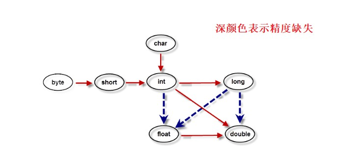
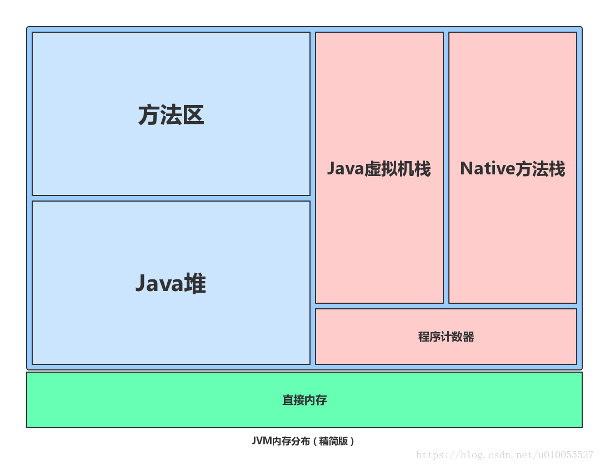

### 数据类型

#### int 占有几个字节

一般是 4 个字节，

#### boolean 占有几个字节

在编译之后都使用Java虚拟机中的``int``数据类型来代替，而``boolean``数组将会被编码成Java虚拟机的``byte``数组，``每个元素``boolean``元素占``8``位”。这样我们可以得出``boolean``类型占了单独使用是``4``个字节，``在数组中又是``1``个字节。

#### Long 占有几个字节

在java中一般咱有 8 个 字节， 但是在C++ 中， 如果 64位占有 8 个字节， 但是在32位中只占有 4个字节

#### 计算过程中数据类型的相互转换(long-float)

double - float - long - int



所以float的取值范围是-2^128到2^128，远远大于long的最大值。 

#### 为什么要拆箱装箱

##### 什么是拆箱和装箱

基本数据类型	int, boolean, long

封装类型： Integer Boolean

比如，int 和 Integer	

Integer num = 10;	// 这里就会发生自动装箱， Integer num = Integer.valueOf(10);	// 还有默认缓存看一下

int num2 = num;	// 这里就会发生自动拆箱，int num2 = num.intValue() //只是获取 整形对应的 value.

```java
public static Double valueOf(String s) throws NumberFormatException {
     return new Double(parseDouble(s));
}
public static void main(String[] args) {
     Double i1 = 100.0;
     Double i2 = 100.0;
     Double i3 = 200.0;
     Double i4 = 200.0;
     System.out.println(i1==i2);
     System.out.println(i3==i4);
}
// false
// false
/*
	原因是double 中的自动装箱 是自动创建新的对象。而不像整形中有缓存。
*/
```

##### 为什么要拆箱装箱

因为thinking in java 中有一句话， 一切都是对象， java 是面向对象编程， 所以需要把int 转化成Integer, 从而可以调用其的一些函数方法， 当然也就符合java 面向对象的继承、封装、多态三个基本特征。

最主要的特征， 创建新的对象 需要用 new 关键字， 在堆上创建对象， 而基本数据类型， 则是存储在堆栈中。

每个基本数据类型都有对应的包装类，比如int的包装类就是Integer等等.....由于“基本”类型特别小而且简单，用new在“堆”上创建一个对象不是特别有效。因此，不用new创建变量，而创建一个并非"引用"的“自动”变量，这个变量直接存储“值”，并置于“堆栈”中更加有效。 说道这发现，基本数据类型是在堆栈中创建的，显而易见不是对象；因为对象是在堆中创建的，这是基本的概念知识。 java是[面向对象](https://www.baidu.com/s?wd=面向对象&tn=SE_PcZhidaonwhc_ngpagmjz&rsv_dl=gh_pc_zhidao)的编程，为了解决这个，故而每个基本数据类型都有一个对应的包装类。若需要时，java的自动包装功能自动装换为包装类型，也就是[面向对象](https://www.baidu.com/s?wd=面向对象&tn=SE_PcZhidaonwhc_ngpagmjz&rsv_dl=gh_pc_zhidao)了。 举个简单的例子： char c = 'x'; 与 Character ch = new Character('x');
一个在堆栈创建的变量，一个在堆上new出来创建的对象。

#### ==java面向对象基本特征==

- 封装：特点-高度自治和相对封闭， 对象属性只能通过一些方法行为进行改变或者获取。这些方法就是对外的接口。

- 继承：就是在基础类上， 添加一些新的属性和方法， 以及重写一些方法行为， 就像有一个小狗类， 继承了一个动物类， 可以添加 小狗 类的一些特有属性， 比如， 汪汪叫，守家护院。

-  抽象（可以不说）就是把真实存在的且有共同属性和行为的实体抽象成实体类

-  多态：靠的是父类或者是接口定义的引用变量可以指向子类或具体实现类的实例对象， 而程序调用的方法在运行期间才动态绑定，就是引用变量所指向的具体实例对象的方法，也就是内存里正在运行的那个对象的方法，而不是引用变量的类型定义的方法。

```java
Animal animal = new Dog(2, "旺财");
animal.printName();
((Dog) animal).printAge();
```

#### == vs equal

== 是比较变量的值， 只有分为两种， 如果是基本数据类型， 则直接比较 两个数的值， 如果是对象， 则比较两个对象在内存中的首地址。

#### Run-Time Data Areas（运行时数据区域）



| area          | 作用域                                         | 生命周期                                                     |
| ------------- | ---------------------------------------------- | ------------------------------------------------------------ |
| 程序计数器    | 线程私有（每个线程都拥有一个这样的程序计数器） | 与所处线程的生命周期一样                                     |
| java 虚拟机栈 | 线程私有（每个线程都拥有一个这样的程序计数器） | 与所处线程的生命周期一样                                     |
| Java堆        | 所有线程共享                                   | 在JVM开启时创建，对象的堆内存由在GC的时候被销毁，整个堆的消失实在JVM关闭的时候 |
| 方法区        | 所有线程共享                                   | 在JVM开启时创建，部分内容在GC的时候被销毁，整个的消失实在JVM关闭的时候 |
| 运行时常量池  | 所有线程共享                                   | 在JVM开启时创建，部分内容在GC的时候被销毁，整个的消失实在JVM关闭的时候 |

- **The pc Register(PC寄存器)**：包含当前正在执行的Java虚拟机指令的地址
- **Java Virtual Machine Stacks（java 虚拟机栈）：**它保存局部变量和部分结果，并在方法调用和返回中起作用
- **Heap（堆）**:对象存放（包括数组）
- **Method Area（方法区域）：**（作用类似堆）类信息（包括类的名称、方法信息、字段信息）、常量、静态变量和编译器编译后的代码
- **运行时常量池**：方法区域的一部分。存放编译器生成的各种字面量和符号引用。
- **Native Method Stacks（本地方法栈）**

#### String、StringBuffer和 StringBuilder的区别

**1- 可变与不可变**

​	String 字符串是不可变的， 底层使用 	/** The value is used for character storage. */private final char value[];

​	StringBuffer 和 StringBuilder 是可变的字符串， 底层使用 char[] value实现，并可以通过 append 拼接字符串， 如果字符串长度大于当前， 会调用 Arrays.CopyOf() 重新分配 数组。

**2- StringBuffer 和 StringBuilder 的区别**

StringBuffer 是线程安全的， 效率比较低， StringBuilder 是线程不安全的， 效率比较高

==StringBuffer 是由缓冲区的，如果未发生修改， 可以直接读取缓冲区的数据。==

```java
@Override
public synchronized String toString() {
     if (toStringCache == null) {
          toStringCache = Arrays.copyOfRange(value, 0, count);
     }
     return new String(toStringCache, true);
}
```

**3- 拼接字符串**

更多的利用StringBuffer 或者 StringBuilder, String name = new String("firstName") + new String("lastName"); // 就会自动调用 StringBuffer 中的append ,中间也会生成多个中间变量， 效率较低。（但是在toString() 方法中也使用 字符串的拼接， 而不用 append方法）

#### java  中的集合

java 中的集合分成 存储 value 的（collection）和 存储 key-value (map) 两种。

##### List 和 set 都实现 collection 接口。

- list 有序可重复。 （有序也不是元素自动排序，而是插入和取出元素顺序相同。）

```
- ArrayList  底层数组实现，方便改查。（增删 比较慢，因为要移动元素。）
- ListedList （双向链表）  内存可连续，也可以不连续。删除和添加较方便（查询需要从头开始。）
```

- set 无序不可重复

特点：无序， 存储可能有序， 无序是说明 添加的顺序和获取的顺序可能不同

不可重复：如果几何中已经存在， 则不会再次添加进去。（两种子集的实现）

hashSet 利用hashCode 和 equals 进行元素的比较

treeSet 利用comparable（接口）中的compareTo 方法进行元素的比较（）比较的顺序（较重要的-》次级重要）

> ==我们认为下面的示例中，名字比年龄更重要， 我们首先比较姓名（就是字符串的比较），然后再比较年龄==也就是说首先按照姓名顺序存储，如果姓名相同，则会按照年龄大小存储。

```java
@Override
public int compareTo(Person o) {

     int nameSub = this.name.compareTo(o.name);
     if(nameSub != 0) {
          return nameSub;
     }
     int ageSub = this.age.compareTo(o.age);
     if(ageSub != 0) {
          return ageSub;
     }
     return 0;
}
TreeSet<Person> personSet = new TreeSet<>();
personSet.add(new Person("CaoBourne2", 25));
personSet.add(new Person("CaoBourne4", 26));
personSet.add(new Person("CaoBourne4", 25));
personSet.add(new Person("CaoBourne1", 25));
System.out.println(personSet.size());
System.out.println(personSet);
/*
[
Person{name='CaoBourne1', age=25}, 
Person{name='CaoBourne2', age=25}, 
Person{name='CaoBourne4', age=25},
Person{name='CaoBourne4', age=26}
]
*/
```

##### Map 

- hashMap 和 treeMap

hashSet 的底层就是 hashMap ，但是与 hashSet 不同的是：hashSet 如果重复则不插入， 而hashMap 中的put 方法， 如果不存在， 则插入， 如果存在，则更改。


