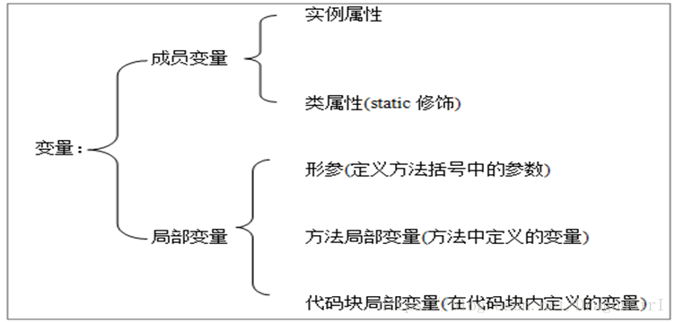

# 静态方法与静态域

### 静态修饰符

**静态修饰符static 可以修饰方法、全局变量、==代码块==和==内部类==，切记，不可*修饰外部类和局部变量。***

### 静态域（类成员）

> ==静态域属于类（所以叫类变量），它属于类，而不是属于任何独立的对象。==例如，如果我们创建了100个学生对象， 每个对象都有自己的名称，但是所在学校的字段是共享的。

```java
public class Student {
     public String name;
     public static String schoolName = "杭州电子科技大学"//表示这里的学生都来自杭电，并且这个字段被共享。
}
```

> ==静态域是共享的，如果被修改，全部被影响，所以可以将静态域设置为 静态常量==
>
> **下面的方式中，学校的名称不会被更改。**

```java
public class Student {
     public String name;
     public final static String schoolName = "杭州电子科技大学"//表示这里的学生都来自杭电，并且这个字段被共享。
}
```

### 局部变量和成员变量

> 记住，局部变量不会影响成员变量。
>
> 成员变量一般有默认值， 但是局部变量一般需要声明和赋值。

*

>在 java 类中不能出现 重名的变量， 但是全局变量和局部变量可以重名，如果，内部变量域外部变量重名，**在方法内部， 实际读取内部变量（覆盖），对局部变量的修改不会影响全局变量的值**（无论是静态变量还是非静态变量， 记住， ==局部变量不能为静态==）

```java
static int i = 10;
String name = "CaoBourne";
static
{
     int i = 5;
     String name = "CaoBourne2";
     System.out.println(i);	// 5		局部变量
     System.out.printlb(Test.i);		// 10 	全局变量
     System.out.println(name);	// CaoBourne2
}
public static void main(String[] args) {
     Test test = new Test();
     System.out.println(test.name);	// CaoBourne	全局变量
     System.out.println(Test.i);	// 10	全局变量
     int i = 20;
     System.out.println(i);		// 20 	局部变量
     System.out.println(Test.i);	// 10	全局变量
}
/*
5
CaoBourne2
CaoBourne
10
20
10
*/
```

```java
static int i = 10;
String name = "CaoBourne";
{
	name = "CaoBourne2";	// 这样的话， 就是修改了成员变量；而不是局部变量。
}
```

### 实例变量与静态变量的区别：

***1.两个变量的声明周期不同***

实例变量随着对象的创建而存在，随着对象被回收而释放

静态变量随着类的加载而存在，随着类的消失而消失

**2.调用方式不同**

实例变量只能被对象调用

静态变量可以被对象调用，还可以被类名调用

~~4**.存储位置不同（这儿不确定）**~~

~~成员变量数据存储载对内存的对象中，所以也叫对象的特有数据~~

~~静态变量数据存储在方法区（也叫数据区，是用来存储方法的区域）的静态区中，所以它也叫对象的共享数据；~


**static使用的注意事项**

1.静态方法只能访问静态成员，非静态既可以访问静态，又可以访问非静态

2.静态方法中不能使用this或者super关键字

### 静态方法

> ==静态方法是没有this 的方法，也就是不能直接调用非静态方法，但是可以通过创建对象，访问非静态方法。==
>
> ==但是在非静态方法中可以直接调用静态方法。（同类方法中， 可以直接方法或变量，但是别的类需要加类名）==

```java
static int i = 10;
String name = "CaoBourne";

public static void printInfo1() {
     System.out.println("printInfo1");
     System.out.println(i);  // 类变量
     System.out.println(Test.i); // 类变量
     printInfo2();       // 静态方法
     Test.printInfo2();       // 静态方法
     Test test = new Test();
     test.printInfo3();  // 非静态方法
}

public static void printInfo2() {
     System.out.println("printInfo2");
}

public void printInfo3() {
     System.out.println("printInfo3");
     Test.printInfo2(); // 调用本类静态方法。
     printInfo2();   // 调用本类方法
}

public static void main(String[] args) {
     printInfo1();
}
```

