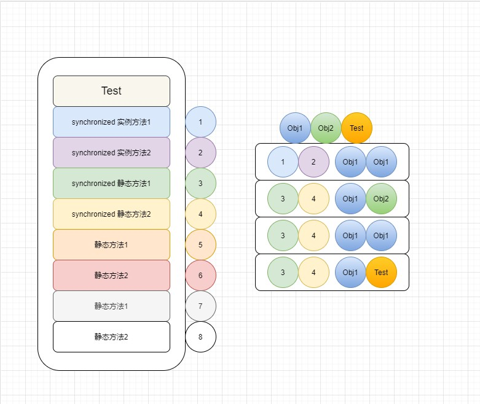

# Synchronized



> java 中的每个对象都可以作为锁
>
> 对于普通同步方法，锁就是当前实例对象
>
> 对于静态同步方法，所示当前类的class对象
>
> 对于同步方法块， 所示 synchronized 括号里配置的对象

## 实例同步方法

### 两个实例同步方法（同一对象）

```java
public static void main(String[] args) throws InterruptedException {
    OuterClassLock outerClassLock = new OuterClassLock();
    InnerLock innerLock = new InnerLock();
    Thread t1 = new Thread(()->{
        try {
            Thread.sleep(1000);
        } catch (InterruptedException e) {
            e.printStackTrace();
        }
        innerLock.printInfo1();
    });
    Thread t2 = new Thread(()->{
        try {
            Thread.sleep(20);
        } catch (InterruptedException e) {
            e.printStackTrace();
        }
        innerLock.printInfo2();
    });
    t1.start();
    t2.start();
    t1.join();
    t2.join();
    System.out.println(innerLock.getNum());
}
/**
Method 2 start
Method 2 execute
Method 2 end
Method 1 start
Method 1 execute
Method 1 end
*/
```

### 一个实例同步，一个普通实例（无法串行）

```java
public static void main(String[] args) throws InterruptedException {
    OuterClassLock outerClassLock = new OuterClassLock();
    InnerLock innerLock = new InnerLock();
    Thread t1 = new Thread(()->{
        try {
            Thread.sleep(1000);
        } catch (InterruptedException e) {
            e.printStackTrace();
        }
        innerLock.printInfo1();
    });
    Thread t2 = new Thread(()->{
        try {
            Thread.sleep(20);
        } catch (InterruptedException e) {
            e.printStackTrace();
        }
        innerLock.printInfo3();
    });
    t1.start();
    t2.start();


    t1.join();
    t2.join();
    System.out.println(innerLock.getNum());
}
/*
Method 3 start
Method 3 execute
Method 1 start
Method 1 execute
Method 3 end
Method 1 end
*/
```

### 一个实例同步，一个静态同步（无法串行）

```java
public static void main(String[] args) throws InterruptedException {
    OuterClassLock outerClassLock = new OuterClassLock();
    InnerLock innerLock = new InnerLock();
    Thread t1 = new Thread(()->{
        try {
            Thread.sleep(1000);
        } catch (InterruptedException e) {
            e.printStackTrace();
        }
        innerLock.printInfo1();
    });
    Thread t2 = new Thread(()->{
        try {
            Thread.sleep(20);
        } catch (InterruptedException e) {
            e.printStackTrace();
        }
        InnerLock.printInfo4();
    });
    t1.start();
    t2.start();


    t1.join();
    t2.join();
    System.out.println(innerLock.getNum());
}
/**
Method 4 start
Method 4 execute
Method 1 start
Method 1 execute
Method 4 end
Method 1 end
*/
```

### 一个实例同步，一个静态方法（无法串行）

```java
public static void main(String[] args) throws InterruptedException {
    OuterClassLock outerClassLock = new OuterClassLock();
    InnerLock innerLock = new InnerLock();
    Thread t1 = new Thread(()->{
        try {
            Thread.sleep(1000);
        } catch (InterruptedException e) {
            e.printStackTrace();
        }
        innerLock.printInfo1();
    });
    Thread t2 = new Thread(()->{
        try {
            Thread.sleep(20);
        } catch (InterruptedException e) {
            e.printStackTrace();
        }
        InnerLock.printInfo6();
    });
    t1.start();
    t2.start();


    t1.join();
    t2.join();
    System.out.println(innerLock.getNum());
}
/*
Method 6 start
Method 6 execute
Method 1 start
Method 1 execute
Method 6 end
Method 1 end
*/
```

## 静态同步方法

### 两个静态同步（可串行）

> obj1
>
> obj2
>
> Test
>
> obj1.static  obj2.static	串行
>
> obj1.static Test.static   串行

```java
public static void main(String[] args) throws InterruptedException {
    OuterClassLock outerClassLock = new OuterClassLock();
    InnerLock innerLock1 = new InnerLock();
    InnerLock innerLock2 = new InnerLock();
    Thread t1 = new Thread(()->{
        try {
            Thread.sleep(1000);
        } catch (InterruptedException e) {
            e.printStackTrace();
        }
        InnerLock.printInfo5();
    });
    Thread t2 = new Thread(()->{
        try {
            Thread.sleep(20);
        } catch (InterruptedException e) {
            e.printStackTrace();
        }
        InnerLock.printInfo4();
    });
    t1.start();
    t2.start();
    t1.join();
    t2.join();
    System.out.println(innerLock1.getNum());
}
Method 4 start
Method 4 execute
Method 4 end
Method 5 start
Method 5 execute
Method 5 end
```

### 静态同步 和 静态普通（无法串行）

## 实例对象（每个实例都包含一个实例对象，因此，同一个实例调用不同的同步方法可行）

### 同一个对象，同步方法串行

```java
public static void main(String[] args) throws InterruptedException {
    OuterClassLock outerClassLock = new OuterClassLock();
    InnerLock innerLock1 = new InnerLock();
    InnerLock innerLock2 = new InnerLock();
    Thread t1 = new Thread(()->{
        try {
            Thread.sleep(80);
        } catch (InterruptedException e) {
            e.printStackTrace();
        }
        innerLock1.increment1();
    });
    Thread t2 = new Thread(()->{
        try {
            Thread.sleep(20);
        } catch (InterruptedException e) {
            e.printStackTrace();
        }
        innerLock1.increment2();
    });
    t1.start();
    t2.start();


    t1.join();
    t2.join();
    System.out.println(innerLock1.getNum());
}
```

### 不同对象，同步方法不串行

```java
public static void main(String[] args) throws InterruptedException {
    OuterClassLock outerClassLock = new OuterClassLock();
    InnerLock innerLock1 = new InnerLock();
    InnerLock innerLock2 = new InnerLock();
    Thread t1 = new Thread(()->{
        try {
            Thread.sleep(80);
        } catch (InterruptedException e) {
            e.printStackTrace();
        }
        innerLock1.increment1();
    });
    Thread t2 = new Thread(()->{
        try {
            Thread.sleep(20);
        } catch (InterruptedException e) {
            e.printStackTrace();
        }
        innerLock2.increment2();
    });
    t1.start();
    t2.start();


    t1.join();
    t2.join();
    System.out.println(innerLock1.getNum());
}
```

## 静态对象（静态对象只会初始化依次，因此，多个对象共享该对象）

### 同一个对象，同步方法（串行）

```java
public static void main(String[] args) throws InterruptedException {
    OuterClassLock outerClassLock = new OuterClassLock();
    InnerLock innerLock1 = new InnerLock();
    InnerLock innerLock2 = new InnerLock();
    Thread t1 = new Thread(()->{
        try {
            Thread.sleep(80);
        } catch (InterruptedException e) {
            e.printStackTrace();
        }
        innerLock1.increment3();
    });
    Thread t2 = new Thread(()->{
        try {
            Thread.sleep(20);
        } catch (InterruptedException e) {
            e.printStackTrace();
        }
        innerLock2.increment4();
    });
    t1.start();
    t2.start();


    t1.join();
    t2.join();
    System.out.println(innerLock1.getNum());
}
```

### 不同对象，同步方法（串行）

```java
public static void main(String[] args) throws InterruptedException {
    OuterClassLock outerClassLock = new OuterClassLock();
    InnerLock innerLock1 = new InnerLock();
    InnerLock innerLock2 = new InnerLock();
    Thread t1 = new Thread(()->{
        try {
            Thread.sleep(80);
        } catch (InterruptedException e) {
            e.printStackTrace();
        }
        innerLock1.increment3();
    });
    Thread t2 = new Thread(()->{
        try {
            Thread.sleep(20);
        } catch (InterruptedException e) {
            e.printStackTrace();
        }
        innerLock2.increment4();
    });
    t1.start();
    t2.start();


    t1.join();
    t2.join();
    System.out.println(innerLock1.getNum());
}
```

