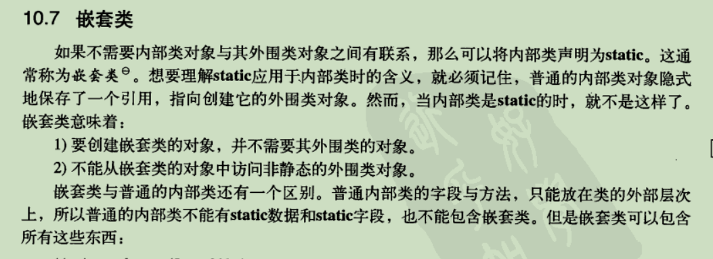

# [Java 内部类详解](https://www.runoob.com/w3cnote/java-inner-class-intro.html)

## 修饰符

>  public, protected, default, private, abstract, final, static, interface, enum, annotate
>
> public  可以在 外围类之外访问
>
> protected 可以在当前包或者包外的子类中（继承外围类）
>
> private 只能在外围类内部访问
>
> default 可以在当前包访问
>
> `但是要记住， 内部类的修饰符也受限于外部类的访问修饰符`
>
> `内部类可以拥有 private 访问权限、protected 访问权限、public 访问权限及包访问权限。比如上面的例子，如果成员内部类 Inner 用 private 修饰，则只能在外部类的内部访问，如果用 public 修饰，则任何地方都能访问；如果用 protected 修饰，则只能在同一个包下或者继承外部类的情况下访问；如果是默认访问权限，则只能在同一个包下访问。这一点和外部类有一点不一样，外部类只能被 public 和包访问两种权限修饰。我个人是这么理解的，由于成员内部类看起来像是外部类的一个成员，所以可以像类的成员一样拥有多种权限修饰`

## 成员内部类

> 成员内部类也和其他成员方法一样，可以任意访问外部类的任意成员变量和任意方法，当如果外围类的成员变量和方法被隐藏时，==需要通过 OuterClass.this.field 或者OuterClass.staticField （方法相同）==
>
> 但是，如果外部类希望访问内部类的方法和成员变量，首先需要创建内部类对象，才能访问；

```java
public class ThirdOuter {
    private String name;
    public static int num1 = 20;
    private void printInfo1() {
        System.out.println("ThirdInner1");
    }
    protected class ThirdInner {
        String name;
        static final int num = 20;
        void innerInvoke1() {
            System.out.println(ThirdOuter.num1);
            System.out.println(ThirdOuter.this.name);
            printInfo1();
            ThirdOuter.this.printInfo1(); // 作用和 printInfo1 相同
        }
    }
}
```

### 如何创建对象

> 成员内部类的创建依赖于外部类， 因此需要创建外部类对象，然后才能创建内部类对象

```java
public ThirdInner getInstance() {
    return new ThirdInner();
}

public static void main(String[] args) {
	// 1
    ThirdOuter outer1 = new ThirdOuter();
    ThirdInner inner = outer1.new ThirdInner();
	// 2
    ThirdOuter outer2 = new ThirdOuter();
    ThirdInner inner2 = outer2.getInstance();
}
```

### 成员内部类为什么可以自由访问外围类成员变量和方法

> 编译器会在内部类中定义外部类的一个变量，利用构造函数，使得当前变量指向外围类的当前对象。修改了内部类的所有构造器，添加一个外围类引用的隐式参数，``

```java
protected class ThirdInner {
    ThirdInner () {

    }
    ThirdInner (String name) {
        this.name = name;
    }
}
//  内部类编译的结果
class ThirdOuter$ThirdInner {
    // 外围类的对象
    final com.bourne.innerclass.inner3.ThirdOuter this$0;
    ThirdOuter$ThirdInner(ThirdOuter var1) {
        this.this$0 = var1;
    }
    ThirdOuter$ThirdInner(ThirdOuter var1, String var2) {
        this.this$0 = var1;
        this.name = var2;
        this.innerInvoke1();
    }
}
```

### 内部类的域和方法

> 内部类的域和方法都不能是 static, 但是内部类的方法可以任意调用外部类的 任意成员变量和任意方法。
>
> `但是 域 可以是 static final  类型`(但是只能是原生类型和字符串类型)
>
> byte, boolean, short, int , float, long, double, String name = ""; 千万不能有 引用类型或者基本类型的包装类型。

### `内部类的域和方法为什么不能是 static`

> ==1. 我们要知道，内部类其实和外部类的实例变量相同，只有在创建了外部类对象之后才能被访问，但是，如果定义了静态方法和类变量，则有可能直接通过内部类.类变量，这是不允许的。==
>
> ==2. 外部类的加载并不能保证内部类的加载==
>
> 那为什么 嵌套类 可以定义静态方法和类变量那：
>
> 因为，嵌套类与外部类没有联系，所以不需要创建外部类对象，而是可以直接通过 外部类.内部类.方法（）

> 首先，类变量实在类加载的初始化阶段完成，而获取方法的实际调用入口也要等到 类加载的解析阶段。并且，外部类的加载并不能保证内部类的加载和初始化，因此，也就不能直接通过内部类访问静态方法和类变量。

> JVM的类加载规则 ：
>
> 1. static类型的属性和方法，在类加载的时候就会存在于内存中。
>
> 2. 要想使用某个类的static属性和方法，那么这个类必须要加载到JAVA虚拟机中。
>
> 3.	`非静态内部类并不随外部类一起初始化，只有在实例化外部类之后才会初始化。现在考虑这个情况：在外部类并没有实例化，内部类还没有加载，这时候如果调用内部类的静态成员或方法，内部类还没有加载，却试图在内存中创建该内部类的静态成员，这明显是矛盾的。所以非静态内部类不能有静态成员变量或静态方法。`
> 	
> 	**上面的例子一共有3出错误，**
> 	
> 	1. `成员内部类中不能有静态成员变量`
> 	
> 	  类加载只保证当前类和父类被加载，而不能确保内部类被加载，内部类只有在外部类创建实例的时候才会加载，因此，内部类是作为外部类实例的一部分。并且我们知道 静态成员变量和静态方法都是在类加载的初始化阶段进行，但是如果在内部类未加载（未创建外部类实例）的情况下，通过类名访问静态成员变量和方法是非法的。
> 	
> 	  `静态成员变量和方法是属于类，而不是每个方法，内部类是属于外部类实例的一部分，因此，我们希望每个实例的唯一性，而不是共享这某一段静态变量的内存。`
>     
>2. `成员内部类中不能有非编译期常量（非编译期）`
>    
> 	   我们知道，创建该类型数组，通过该类类名调用父类静态成员变量，访问其他类的编译器常量是不会加载类的，但是 引用类型的静态常量需要在类加载的初始化阶段才能完成，需要加载类。因此，出错

### 内部类为什么可以是 private 

> 要知道，外部类只能是默认或者public修饰符，但是内部类都可以，内部类是一种编译器现象，与虚拟机无关`， ``编译器将会把内部类翻译成用$分割外部类名与内部类名的常规类文件。而虚拟机对此一无所知。``
>
> `在虚拟机中不存在私有类，因此，编译器将会利用私有构造器生成一个包可见的类`
>
> ==如果，内部类是 private 和 default ，会被编译成 default class OuterClass$InnerClass==
>
> ==如果，内部类是 protected 和 public, 会被编译成 public class OuterClass$InnerClass==

## 局部内部类

> ==在方法中只能声明局部内部类。而不能是接口，枚举，或者注解类型==

`要区分在静态方法中和实例方法中的`

> `实例方法`
>
> 1. 局部内部类同样可以访问外围类的方法和成员变量，同样可以访问 所在方法的 局部变量
> 2. 因为局部内部类只能在当前方法中有效， 因此， 在同一个 编译单元中，可以有多个`同名的局部类`名，甚至可以和`成员内部类`的名称相同，但是不能和所在`外围类名称相同`
> 3. ==局部内部类只能声明为 只能为 `default`, 当然也可以有`final `, 甚至可以用 `abstract` 修饰==

```java
public class ThirdOuter {
    private String name;
    public ThirdOuter() {}
    public ThirdOuter(String name) {
        this.name = name;
    }
    public void getName(int num) {
        class ThirdInner {
            public void printInfo() {
                System.out.println(num + "\t" + name);
            }
        }
        ThirdInner inner = new ThirdInner();
        inner.printInfo();
    }
    public static void main(String[] args) {
        ThirdOuter outer = new ThirdOuter();
        outer.getName(20);
    }
}
/*内部类反编译的结果*/
class com.bourne.innerclass.inner3.ThirdOuter$1ThirdInner {
  final int val$num;  // 局部变量
  final com.bourne.innerclass.inner3.ThirdOuter this$0;  // 外围类对象
  com.bourne.innerclass.inner3.ThirdOuter$1ThirdInner();
  public void printInfo();
}
```

> `静态方法`
>
> 1. 我们知道，静态方法属于类， 而不是某个实例， 因此，在静态方法中定义的内部类无法访问外部类的实例成员变量和实例方法，只能通过创建新的对象，才能，`这是因为 静态方法中的内部类并不包含外部类的引用`,==外部类的静态方法和类变量都可以随意访问。==

```java
public static void getName(int num) {
    class ThirdInner {
        public void printInfo() {
            System.out.println(num);
            System.out.println(ThirdOuter.id);
        }
    }
    ThirdInner inner = new ThirdInner();
    inner.printInfo();
}
/**/
class com.bourne.innerclass.inner3.ThirdOuter$1ThirdInner {
  final int val$num;
  com.bourne.innerclass.inner3.ThirdOuter$1ThirdInner();
  public void printInfo();
}
```

### 局部内部类同样不能包含static 域 和 方法

> 和成员内部类相同

### `在局部内部类用到的局部变量（这个局部变量指的是 方法中定义的（==形参和局部变量==），而不是在内部类中定义的）都必须是final` 

> 1. new出来的对象在堆内存当中。
> 2. 局部变量是跟着方法走在栈内存当中。
> 3. 方法运行结束后，立刻出栈，局部变量就会立刻消失。
> 4. 但new出来的对象会在堆内存当中持续保存，直到垃圾回收消失
>
> `为了保证保存在 栈中的局部变量和保存在堆中的成员变量相同， 就直接将 变量声明为 final 类型，基本类型不能修改值，而引用类型则是不修改指向。`

### 局部内部类是怎样解决声明周期不同的

> 1. 方法运行结束后，立刻出栈，局部变量就会立刻消失。
>
> 2. 但new出来的对象会在堆内存当中持续保存，直到垃圾回收消失
>
>    所以， 局部内部类会定义一个成员变量，将局部变量的值 copy 赋值给内部类的成员变量，基本类型就是传值，而引用类型则是 指向堆中的地址。
>    
> 3. ==我们会发现， 为了解决外部方法中局部变量和局部类中变量周期相同，局部内部类不仅添加了外部类的引用，也添加了 外部方法声明的局部变量且在方法中使用的变量作为局部内部类的成员变量出现。==

```java
class Practice$1InnerClass
{
    public void printNum()
    {
        int i = val$var1;
    }
    final int val$var1;
    final Practice this$0;
    Practice$1InnerClass()
    {
        this$0 = final_practice;
        val$var1 = I.this;
        super();
    }
}
```

## 匿名内部类

> 虚拟机同样会为 匿名内部类添加成员变量来保证局部变量和成员变量的生命周期相同。

```java
static interface Creature
{
    public abstract void sing();
}

public Creature printInfo2(final int num)
{
    return new Creature() {
        public void sing() {
            System.out.println(num);
        }
        final int val$num;
        final Practice this$0;
        {
            this$0 = Practice.this;
            num = i;
            super();
        }
    };
}
```

> 匿名内部类既可以扩展类，也可以实现接口，但是二者不可以同时出现
>
> 匿名内部类中局部变量也必须是 final ,但是没有必要在 方法定义的地方声明 final, 只是不能在当前方法中任何地方发生修改。但是在方法调用者中可以被修改；


### 调用父类构造器

```java
public Person getObject(final String name) {
    int num = 30;
    return new Person(){
        @Override
        public void printInfo() {
            System.out.println(name);
            System.out.println(num);
            System.out.println("这是匿名内部类的方法");
        }
        String innerName = name;
    };
}
public Person getObject2(final String name) {
    return new Person(name) {
        @Override
        public void printInfo() {
            System.out.println("这是 getObject2 方法内部的匿名类");
        }
    };
}
```

## 嵌套内部类



> 静态内部类 可以包含任何静态方法和非静态方法，并且只能访问外部类的静态变量和方法。

```java
static class Node {
    int val;
    Node left;
    Node right;
    static int Num = 30;
    public Node(int val) {
        this.val = val;
    }
    public Node(Node left, int val, Node right) {
        this.left = left;
        this.val = val;
        this.right = right;
    }
    public static int getNum() {
        return Num;
    }
    public void printInfo() {
        System.out.println(ThirdOuter.id);
    }
    @Override
    public String toString() {
        return this.left + "\t 当前结点的根节点" + this.val + "\t" + this.right;
    }
}
```

## 外部类的继承

> 可以发现必须要有传递外部类的引用，才可以。

```java
public class ThirdOuter {
    class ThirdInner {
        public void printInfo() {
            System.out.println("\t" + name2);
        }
    }
}
class ThirdOuter2 extends ThirdOuter.ThirdInner{
    public ThirdOuter2(ThirdOuter outer) { 
        outer.super();
    }
}
```

## 内部类可以被覆盖吗

> 不可以