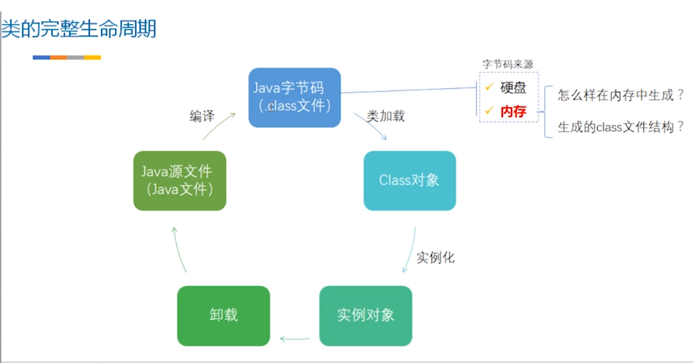

# ==`Class`==

## 反射的原理

> 我们知道，在类加载的过程中，就会将 当前类的classFile 存放在方法区，并且，会在方法区创建java.lang.Class 对象，左右当前对象访问方法的入口，而 java.lang.Class 指向ClassFile， 也就可以访问任意的方法，属性

## `getDeclaringClass 、getDeclaringClasses 和 getClasses 的区别`

> getDeclaringClass  是获取内部类所属的外部类的名称，
>
> getDeclaringClasses 是 getClasses 进阶版，获取 内部声明的所有 内部类和静态类。
>
> getClasses 只会返回 public 修饰的 所有内部类。

## `私有方法、构造器等的调用`==

> 反射会破坏 封装，我们又知道在 Class 中的添加 ==declaring==的方法和不添加 ==declaring==的方法的区别，因此，在获取 私有方法、成员变量或者构造方法时，需要调用带有 declaring 的方法，例如
>
> ```
> getDeclaredMethod
> getDeclaredField
> getDeclaredConstructors
> ```

## `Declaring 和 不加 区别`

> 记住，Declaring  无需 public 修饰，但是没有 Declaring  的方法一般只获取 public 修饰的类或方法

## Class

> 类class的实例表示运行中的Java应用程序中的类和接口。枚举是一种类，注释是一种接口。每个数组还属于一个类，这个类反映为一个类对象，由具有相同元素类型和维数的所有数组共享。原始Java类型(The primitive Java types (`boolean`, `byte`, `char`, `short`, `int`, `long`, `float`, and `double`), and the keyword `void`也被表示为类对象。
>
> ==记住，要记住 基本类型不是对象，他们的包装类型才是对象== java.lang.Class 是 表示的一种 java 类型，而不是一种类（数据类型和基本类型，而没有数组类和基本类）
>
> `Class` has no public constructor. Instead `Class` objects are constructed automatically by the Java Virtual Machine as classes are loaded and by calls to the `defineClass` method in the class loader.
>
> java.lang.Class 对象没有公共的构造器，而是，通过在类加载的时候，虚拟机在调用 DefineClass 方法的时候就会自动在方法区创建 ==这种类的类型对象==

## `forName`

> 使用给定的类装入器，返回与给定字符串名称的类或接口关联的类对象。给定类或接口的完全限定名(==使用与getName返回的格式相同的格式==)，此方法尝试定位、加载和链接类或接口。指定的类装入器用于装入类或接口。如果参数==loader==为空，则通过引导类装入器装入类。只有当initialize参数为true且未更早地初始化时，类才会被初始化。
>
> `如果name表示原语类型或void，则会尝试在未命名包中查找名称为name的用户定义类。因此，此方法不能用于获取表示基本类型或void的任何类对象。`
>
> `如果name表示数组类，则加载数组类的组件类型，但未初始化。`
>
> ```java
> Class<?> anInt = Class.forName("[I");
> System.out.println(anInt.getName());// [I 表示Int 类型的数组，也就是 基本类型的数组也是可以的，但是基本类型就是不可以
> Class<?> BInt = Class.forName("I"); // error 
> Class<?> CInt = Class.forName("int"); // error 
> ```
>
> 例如，在一个实例方法中，表达式:
>
> Class.forName("Foo")
>
> is equivalent to:
>
> Class.forName("Foo", true, this.getClass().getClassLoader())
>
> 注意，这个方法会抛出与Java语言规范12.2、12.3和12.4节中指定的加载、链接或初始化相关的错误。注意，此方法不检查所请求的类是否可以被其调用者访问。
>
> 如果加载器是空的，并且存在一个安全管理器，并且调用者的类加载器不是空的，那么此方法使用RuntimePermission(“getClassLoader”)权限调用安全管理器的checkPermission方法，以确保访问引导类加载器是正确的。
>
> **Parameters:**
>
> `name` - 所需类的完全限定名-- 
>
> `initialize` - 如果为真，类将被初始化
>
> `loader` - 类装入器，必须从其中装入类
>
> **Returns:**  class object representing the desired class

## `newInstance`

> 创建由这个类对象表示的类的新实例。类的实例化就好像是由一个带有空参数列表的新表达式进行的。如果类还没有初始化，则初始化它。
>
> 注意，此方法传播由nullary构造函数抛出的任何异常，包括已检查的异常。使用此方法可以有效地绕过编译器执行的编译时异常检查。构造函数。newInstance方法通过将构造函数抛出的任何异常包装在(检查的)InvocationTargetException中来避免这个问题。
>
> **Returns:**
>
> a newly allocated instance of the class represented by this object.
>
> `IllegalAccessException` - 如果类的构造函数不可访问（准确的说是  无参 构造函数 不可访问）
>
> `InstantiationException` - 如果此类表示抽象类、接口、数组类、基元类型或void;或者如果类没有nullary构造函数;或者实例化由于其他原因失败。
>
> -- 第一： 抽象类 和 接口 不能实例化对象
>
> -- 第二： 基本类型： 不包含 构造器，只是 java 中一种类型
>
> -- 第三： 数组类型：记住，java 当中并不会包含数组类型的类，元素类型无论是基本类型还是引用类型，都是虚拟机自动创建 这种元素类型数组的 java.lang.Class 对象
>
> ==主要的原因是 这些 java 类型都没有·`无参`构造器==

## isInstance

> 1. 非空
> 2. 可以强制类型为 引用类型
> 3. ==如果 Class 类型 当前 object 是 java.lang.Class 的类型或者是子类型==(就是该类或者该类的子类型)
> 4. ==如果Class 类型是数组类型，那么 Object 类型必须是引用类型的数组==（如果 class 是数组类型的，因此，``实例必须是 引用类型的数组，而不能是其他类型或者基本类型的数组`）。
> 5. 如果Class 类型是接口类型，可以是其的实现或者实现的子类，(别忘了 接口或者抽象类型不能初始化实例)
> 6. ==如果Class 类型是基本类型，那就肯定返回 false==

> 确定指定的对象是否与由该类表示的对象分配兼容。这个方法是Java语言instanceof操作符的动态等价。`如果指定的对象参数是非空的，并且可以强制转换为由这个类对象表示的引用类型`，而不引发ClassCastException，则该方法返回true。否则返回false。
>
> 具体来说，==如果这个类对象表示声明的类，如果指定的对象参数是所表示类(或其任何子类)的实例，则该方法返回true==;否则返回false。如果这个类对象表示数组类，如果指定的对象参数可以通过标识转换或扩展引用转换转换为数组类的对象，则此方法返回true;否则返回false。如果这个类对象表示一个接口，那么如果指定对象的类或任何超类是argum，则此方法返回true

```java
Object obj = new Object();
Class c6 = Object.class;
System.out.println(c6.isInstance(practice)); // true
System.out.println(c6.isInstance(obj));  // true
```

## cast（将对象转换成 practiceClass ）

> 将对象强制转换为由这个类对象表示的类或接口。
>
> 最好是将 cast 方法 和 isInstance 一起使用，否则会抛出  ClassCastException 异常
>
> ```java
> Class<Practice> practiceClass = Practice.class;
> Practice cast;
> if (practiceClass.isInstance(practice)) {
>     cast = practiceClass.cast(practice);
> ```

## isInterface

> Determines if the specified `Class` object represents an interface type.

## isArray

> Determines if this `Class` object represents an array class
>
> 无论基本类型还是引用类型的数组，都会返回 true

```java
int [] nums = new int[1];
Integer[]nums2 = new Integer[2];
System.out.println(nums.getClass().isArray());
System.out.println(nums2.getClass().isArray());
```

## isPrimitive

> 确定指定的类对象是否表示基元类型。
>
> 有9个预定义的类对象来表示8个基本类型和void。它们由Java虚拟机创建，与它们所表示的基本类型具有相同的名称，即布尔型、字节型、char型、short型、int型、long型、float型和double型。
>
> ==记住， 基本类型只能通过 primitive.class.isPrimitive==

```java
System.out.println(int.class.isPrimitive());
```

## isAnnotation

> 如果此类对象表示注释类型，则返回true。注意，如果这个方法返回true, isInterface()也将返回true，因为所有注释类型也是接口。

## isSynthetic(合成的)

>  且仅当该类是Java语言规范定义的合成类时为 true。

## isEnum

> 是不是枚举类型

## isAnonymousClass

> 判断是匿名类

## isLocalClass

>是不是局部类

## isMemberClass

> 判断是否是 成员类
>
> 判断当前类 是不是一个内部类 或者静态类 都可返回 true
>
> ```java
> boolean memberClass = Inner1.class.isMemberClass();
> System.out.println(memberClass);
> ```

## getEnumConstants

> 返回枚举类的元素，如果类对象不表示枚举类型，则返回null。

## `getName`全限定名称（）

> Returns the name of the entity (class, interface, array class, primitive type, or void) represented by this `Class` object, as a `String`.
>
> 返回 所有 类型的 全限定名称，包括 数组 
>
> 1. 如果这个类对象表示的引用类型===不是数组类型==，则返回Java™语言规范指定的类的二进制名称。（java.lang.Integer） 全限定名称
>
> 2. 如果这个类对象表示基元类型或void，则返回的名称是一个字符串，等于与基元类型或void对应的Java语言关键字。（直接返回 int, boolean 等基本类型字符串）
>
> 3. 如果这个类对象表示一个数组类，则名称的内部形式由元素类型的名称前面加上一个或多个表示数组嵌套深度的'['字符组成。元素类型名称编码如下:
>
>    数组类型，
>
>    ​	基本类型就是  == [I, [S ==
>
>    ​	引用类型就是  [java.lang.Integer
>
>    Z  boolean
>
>    B
>
>    C
>
>    S
>
>    I
>
>    F
>
>    J  lng
>
>    D

```java
 String.class.getName()
     returns "java.lang.String"
 byte.class.getName()
     returns "byte"
 (new Object[3]).getClass().getName()
     returns "[Ljava.lang.Object;"
 (new int[3][4][5][6][7][8][9]).getClass().getName()
     returns "[[[[[[[I"  
```

## getSimpleName

> 获取类的普通名称
>
> 返回源代码中给出的基础类的简单名称。如果基础类是匿名的，则返回空字符串。
>
> 数组的简单名称是附加了“[]”的组件类型的简单名称。特别是组件类型为匿名的数组的简单名称是“[]”
>
> 就是返回基本名称，数组就是简单类型 + [];  基本类型就是 int, boolean 基本字符串

```java
String simpleName = Practice.class.getSimpleName();
System.out.println(simpleName);

System.out.println(int[].class.getSimpleName());
System.out.println(int.class.getSimpleName());
```

> Practice
> int[]
> int

## getTypeName

> 返回此类型名称的信息字符串。 
>
> 和 getSimpleName 相同

## getClassLoader

> 返回类的类装入器。有些实现可能使用null来表示引导类装入器。如果该类是由引导类装入器装入的，则此方法将在此类实现中返回null。
>
> 如果安全管理器存在,和调用者的类加载器不是零和调用者的类加载器不一样或祖先类装入器的类的类加载程序请求,那么这个方法调用安全经理的checkPermission方法RuntimePermission(“getClassLoader”)许可,以确保它可以访问类的类加载器。
>
> ==如果此对象表示基本类型或void，则返回null。==

## getTypeParameters(当前类)

> 返回该类 在定义时候 声明的 类型参数，而不是 真正调用时用到的类型参数，例如 ArrayList<E>
>
> 用到的参数是 E， 而不是实际传入的 Integer

> 返回一个可类型可变对象数组，该数组表示由此GenericDeclaration==泛型声明==对象表示的泛型声明声明的类型变量，并按声明顺序执行。如果基础泛型声明没有声明类型变量，则返回长度为0的数组。
>
> ==记住 是类定义的时候  声明的类型参数，多数 是 T, E, V==

```java
ArrayList<Integer> arrayList = new ArrayList<>();
Class aClass1 = arrayList.getClass();
System.out.println(Arrays.toString(aClass1.getTypeParameters()));
// [E]   
```

## getSuperclass

>返回表示该类所表示的实体(类、接口、基本类型或void)的超类。如果该类表示对象类、接口、原语类型或void，则返回null。如果此对象表示数组类，则返回表示该对象类的类对象。
>
>1. ==如果该类表示Object(超级类)、==接口==、基本类型==或==void==，则返回null 
>
>2. 如果数组类型，元素类型无论是基本类型还是引用类型，都会返回 Object 类 java.lang.Object

## getGenericSuperclass

> 返回表示该类所表示的实体(类、接口、原语类型或void)的直接超类的类型。
>
> 1. 如果超类是参数化类型，则返回的类型对象必须准确地反映源代码中使用的实际类型参数。表示超类的参数化类型将被创建(如果以前没有创建超类的话)。有关参数化类型的创建过程的语义，请参阅ParameterizedType的声明。
>
>    ==如果超类是参数化类型==，则返回的类型对象必须准确地反映源代码中使用的实际类型参数（==记住，是子类继承父类时，声明的具体 类型参数，例如下面的 Integer==）
>
>    ```java
>    Type genericSuperclass = Person.class.getGenericSuperclass();
>    System.out.println(genericSuperclass);
>    // com.bourne.pack.Creature<java.lang.Integer>
>    public class Person extends Creature<Integer> {
>    ```
>
>    ```java
>    public class Person<T> extends Creature<T> {
>        // com.bourne.pack.Creature<T>
>    ```
>
> 2. 如果该类表示对象类、接口、原语类型或void，则返回null。(如果是 超级类， 接口，基本类型和 void 都会返回 null)
>
> 3. 如果此对象表示数组类，则返回表示该对象类的类对象。(如果是数组类型，就会返回 Object)

## getPackage

> 获取该类的包。该类的类装入器用于查找包。如果类是由引导类装入器装入的，则会搜索从CLASSPATH装入的一组包，以查找类的包。如果该类的类装入器没有创建包对象，则返回Null。
>
> 只有当信息在伴随类的清单中定义，并且类装入器使用清单中的属性创建了包实例时，包才具有版本和规范的属性。

## getInterfaces

> 确定由该对象表示的类或接口实现的接口。
>
> 1. 如果该对象==表示一个类==，==则返回值是一个数组==，其中包含表示该类实现的所有接口的对象。该数组中接口对象的顺序与该对象所表示的类声明的implements子句中接口名称的顺序相对应。例如，给定声明:
>
>    class Shimmer implements FloorWax, DessertTopping { ... }==suppose the value of `s` is an instance of `Shimmer`; the value of the expression:==
>
>    s.getClass().getInterfaces()[0] is the `Class` object that represents interface `FloorWax`; and the value of:
>
> 2. ==接口==如果此对象表示接口，则数组包含表示该接口扩展的所有接口的对象。数组中接口对象的顺序与此对象所表示的接口声明的extends子句中接口名称的顺序相对应。
> 3. 如果此对象表示不实现任何接口的类或接口，则该方法返回长度为0的数组。
> 4. ==基本类型==如果此对象表示基本类型或void，则该方法返回长度为0的数组。
> 5. ==数组==如果这个类对象表示数组类型，则接口Cloneable和java.io。Serializable在这个顺序中返回

## getGenericInterfaces

> 和 getGenericSuperclass 有点类似，只是要返回 当前类在实现 接口时 声明的实际类型参数==不过这个返回的可是数组==
>
> 1. 返回表示由该对象表示的类或接口直接实现的接口的类型。
> 2. 如果超接口是参数化类型，则为其返回的类型对象必须准确地反映源代码中使用的实际类型参数。如果以前没有创建过超接口，则会创建表示每个超接口的参数化类型。有关参数化类型的创建过程的语义，请参阅ParameterizedType的声明。
> 3. 如果该对象表示一个类，则返回值是一个数组，其中包含表示该类实现的所有接口的对象。==该数组中接口对象的顺序与该对象所表示的类声明的implements子句中接口名称的顺序相对应==。
> 4. ==数组==对于数组类，接口Cloneable和Serializable按此顺序返回。
> 5. 如果此对象表示接口，则数组包含表示该接口直接扩展的所有接口的对象。数组中接口对象的顺序与此对象所表示的接口声明的extends子句中接口名称的顺序相对应。
> 6. 如果此对象表示不实现任何接口的类或接口，则该方法返回长度为0的数组。
> 7. 如果此对象表示基本类型或void，则该方法返回长度为0的数组。

```java
interface interface2<E> {}
public class Person<T> extends Creature<T> implements interface2<Integer>{
}
Type[] genericInterfaces = Person.class.getGenericInterfaces();
System.out.println(Arrays.toString(genericInterfaces));
```

> com.bourne.pack.interface2<java.lang.Integer>]

## getComponentType

> 返回表示数组组件类型的类。如果该类不表示数组类，此方法将返回null。
>
> 返回数组元素类型的实际类型，引用类型就是全限定名称，基本类型就是 int, boolean 等基本字符串

```java
Class<?> componentType = Person[].class.getComponentType();
System.out.println(componentType);
Class<?> componentType2 = int[].class.getComponentType();
System.out.println(componentType2);

System.out.println(int.class.getComponentType());
// class com.bourne.pack.Person
int
null
```

## getModifiers

> ==返回该类或接口的Java语言修饰符== ，编码为整数。修饰符由Java虚拟机的公共、保护、私有、最终、静态、抽象和接口等常量组成;它们应该使用类修饰符的方法进行解码。 
>
> 如果基础类是数组类，则其公共、私有和受保护修饰符与其组件类型的修饰符相同。如果这个类表示一个基本类型或void，它的public修饰符总是true，它的protected和private修饰符总是false。如果该对象表示数组类、原始类型或void，则其final修饰符始终为真，其接口修饰符始终为假。其其他修饰符的值不由本规范确定。

## getDeclaringClass`(返回所有的内部类)

> ==如果，当前类 在一个类中 定义， 通过当前类可以获取 其所在类的类名，也就是 调用·`getDeclaringClass 的类必须是 内部类，然后获取 外部类的 类名`==
>
> ==实际就是为了获取 当前类 内部声明的内部类==,不包括 局部类或者匿名类
>
> 如果这个类对象表示的类或接口是另一个类的成员，则返回表示声明它的类的类对象。如果该类或接口不是任何其他类的成员，则此方法返回null。如果这个类对象表示数组类、基元类型或void，则此方法返回null。 

```java
public class Practice {

    Pair<Integer, Integer> pair;

    class Inner1 {}
    class  Inner2{}
}
[class com.bourne.practice.Practice$Inner2, class com.bourne.practice.Practice$Inner1]
```

## `getDeclaredClasses()`

> `返回当前类中声明定义的所有内部类，静态类，但是不包括局部类和匿名类`
>
> *：*返回一个类对象数组，反映声明为由这个类对象表示的类成员的所有类和接口。这包括公有的、受保护的、默认的(包)访问，以及类声明的私有类和接口，但是不包括继承的类和接口。如果类声明没有类或接口作为成员，或者类对象表示基本类型、数组类或void，则此方法返回长度为0的数组。

```java
public class Practice {
    public class Inner1 {}
    static class  Inner2{}
    public static void main(String... args) throws Exception {
        Practice practice = new Practice();        System.out.println(Arrays.toString(practice.getClass().getDeclaredClasses()));
    }
}
// 	
	[
        class com.bourne.practice.Practice$Inner2, 
        class com.bourne.practice.Practice$Inner1
    ]
```

## getClasses

> 返回包含类对象的数组，这些类对象表示由这个类对象表示的类的所有公共类和接口。这包括从超类继承的公共类和接口成员，以及类声明的公共类和接口成员。如果该类对象没有公共成员类或接口，则此方法返回长度为0的数组。如果类对象表示原始类型、数组类或void，则此方法还返回长度为0的数组。 
>
> ==好像返回当前类中声明的`公共`内部类== `必须有 public 有时才可以`

```java
public class Practice {
    public Person person = new Person();
    public class Inner1 {}
    public class  Inner2{}
}
[
    class com.bourne.practice.Practice$Inner2, 
    class com.bourne.practice.Practice$Inner1
]
```

## getEnclosingClass

> 可能时获取 匿名类或者内部类

## getCanonicalName（规范）

> 全部名称，不想 getName 有基本的类型表示，
>
> 引用类型 ： java.lang.object
>
> 数组类型 int[], 引用类型 com.bourne.pack.Person[]
>
> 基本类型 int

## `getFields`(记住，只要是没有 Declared 就是只获取 public 修饰的)

> 返回一个包含字段对象的数组，该字段对象反映由这个类对象表示的类或接口的`所有可访问的公共字段。`
>
> 如果这个类对象表示一个没有不可访问的公共字段的类或接口，则此方法返回一个长度为0的数组。
>
> ==包括超级类当中的字段==如果这个类对象表示一个类，那么这个方法将返回这个类及其所有超类的公共字段。
>
> ==包括超级类当中的字段==如果这个类对象表示一个接口，那么这个方法将返回该接口及其所有超接口的字段。
>
> ==数组，基本类型或者 Void==如果这个类对象表示数组类型、基元类型或void，则此方法返回长度为0的数组。
>
> 返回数组中的元素没有排序，也没有任何特定的顺序。

```java
[public com.bourne.pack.Person com.bourne.practice.Practice.person, public int com.bourne.practice.Practice.num]
```

## getField(String name)

> 返回一个字段对象，该对象反映由该类对象表示的类或接口的指定·`公共成员字段`。name参数是一个字符串，指定所需字段的简单名称。
>
> 要反射的字段由下面的算法确定。设C为该对象表示的类或接口:
>
> 1. 如果C用指定的名称声明了一个公共字段，那么这个字段就是要反射的字段。
> 2. 如果在上面的步骤1中没有找到字段，则递归应用该算法对c的每个直接超接口进行搜索。直接超接口按照声明的顺序进行搜索。
> 3. 如果在上面的步骤1和步骤2中没有找到字段，并且C有超类S，那么该算法将在S上递归调用。如果C没有超类，那么将抛出NoSuchFieldException
>
> 如果此类对象表示数组类型，则此方法不会找到数组类型的长度字段。

## getDeclaredField(String name)

> 返回一个字段对象，该对象反映由该类对象表示的类或接口的指定声明的字段。name参数是一个字符串，用于指定所需字段的简单名称。
>
> 如果此类对象表示数组类型，则此方法不会找到数组类型的长度字段。

## `getMethods`

> 返回一个包含方法对象的数组，该方法对象反映由这个类对象表示的类或接口的所有公共方法，包括那些由类或接口声明的方法，以及那些从超类和超接口继承的方法。
>
> 如果这个类对象表示一个具有多个具有相同名称和参数类型但返回类型不同的公共方法的类型，则返回数组对每个方法都有一个方法对象。
>
> 如果这个类对象用一个类初始化方法<clinit>表示一个类型，那么返回的数组没有相应的方法对象。
>
> ·`如果这个类对象表示数组类型，则返回的数组对于数组类型从object继承的每个公共方法都有一个方法对象。它不包含clone()的方法对象。`
>
> 如果这个类对象表示一个接口，那么返回的数组不包含object中任何隐式声明的方法。因此，如果在这个接口或它的任何超接口中没有显式声明任何方法，那么返回的数组的长度为0。(注意，表示类的类对象总是拥有从object继承的公共方法。)
>
> 如果这个类对象表示基本类型或void，则返回的数组长度为0。
>
> 在类对象表示的类或接口的超接口中声明的静态方法不被认为是类或接口的成员。
>
> 返回数组中的元素没有排序，也没有任何特定的顺序

## getMethod(String name, Class<?> ...parameterTypes)

> 根据方法名称和方法的参数

## `getDeclaredMethod(String name,                                Class<?>... parameterTypes)`

> Class<?>... parameterTypes 其实就是 ==类型.class==
>
> 记住，如果是，实例方法，就必须传入一个实例对象，如果，是类方法，只需传入 null,

```java
public void printInfo(int num) {
}
public static void main(String []args) {
    Practice practice = new Practice();
    Method printInfo = practice.getClass().getMethod("printInfo", int.class);
    System.out.println(printInfo);
}
Method printName = aClass1.getDeclaredMethod("printName", String.class, int.class);
int modifiers = printName.getModifiers();
if(Modifier.isPrivate(modifiers)) {
    printName.setAccessible(true);
}
printName.invoke(null, "CaoBourne", 30);
```

## getConstructors

> 如果类没有公共构造函数，或者类是数组类，或者类反映原始类型或void，则返回长度为0的数组。注意，这个方法返回一个构造函数数组。对象(即类中的构造函数数组)，此方法的返回类型为Constructor&lt; &gt;[]，而不是如预期的那样的Constructor&lt;T&gt;[]。这种信息较少的返回类型是必要的，因为从这个方法返回后，可以修改数组以保存不同类的构造函数对象，这将违反构造函数的类型保证。

## getConstructor(Class<?>... parameterTypes)

> parameterTypes参数是一个类对象数组，它按照声明的顺序标识构造函数的形参类型。如果此类对象表示在非静态上下文中声明的内部类，则形式参数类型将显式封闭实例作为第一个参数。

## getDeclaredMethods

> 返回所有的方法

> 返回一个包含方法对象的数组，该方法对象反映由这个类对象表示的类或接口的所有声明方法，包括公共、受保护、默认(包)访问和私有方法，但不包括继承的方法
>
> 如果这个类对象表示一个类型，该类型具有多个声明的方法，这些方法具有相同的名称和参数类型，但返回类型不同，那么返回的数组对每个方法都有一个方法对象。
>
> 如果这个类对象表示具有类初始化方法<clinit>的类型，则返回的数组没有相应的方法对象
>
> 如果这个类对象表示没有声明方法的类或接口，则返回的数组长度为0。。
>
> 如果这个类对象表示数组类型、基元类型或void，则返回的数组长度为0。
>
> 返回数组中的元素没有排序，也没有任何特定的顺序。

## getDeclaredConstructors

> 返回所有的构造器
>
> 返回构造函数对象的数组，反映由这个类对象表示的类声明的所有构造函数。它们是公共的、受保护的、默认(包)访问和私有构造函数。返回的数组中的元素没有排序，也没有任何特定的顺序。如果类有一个默认构造函数，那么它将包含在返回的数组中。如果该类对象表示接口、基元类型、数组类或void，则此方法返回长度为0的数组。

## getDeclaredConstructor(Class<?>... parameterTypes)

> 返回一个构造函数对象，该对象反映由这个类对象表示的类或接口的指定构造函数。parameterTypes参数是一个类对象数组，它按照声明的顺序标识构造函数的形参类型。如果此类对象表示在非静态上下文中声明的内部类，则形式参数类型将显式封闭实例作为第一个参数

## getAnnotation

> 如果存在指定类型的元素注释，则返回该元素的注释，否则为空。

## 反射机制和new 的区别[学会反射后，我被录取了（干货）](https://juejin.im/post/6864324335654404104)

> 1. 反射可以在 运行时 根据需求创建对象。
> 2. new出来的对象中，我们是无法反问她的私有属性，而反射可以（通过setAccessible（）取访问）
> 3. new属于静态编译，而反射属于动态编译，静态编译就是在编译的时候把你所有的模块都编译进exe里去，当你启动这个exe的时候所有模块都加载进来了。你写小程序没问题，但程序一大，加载的过程（就是当你运行程序时初始化的过程）就比较费力了。。大多数ppc的硬件配置还是很一般的。动态编译就不一样了，你编译的时候那些模块都没有编译进去，一般情况下你可以把那些模块都编译成dll，这样你启动程序（初始化）的时候这些模块不会被加载，而是在运行的时候，用到那个模块就调用哪个模块。

## [java中Class对象详解和类名.class, class.forName(), getClass()区别](https://www.cnblogs.com/cunlau/p/3624878.html)

> 1. 类名.class      说明： JVM将使用类装载器, 将类装入内存(前提是:类还没有装入内存),`不做类的初始化工作.返回Class的对象 `
>
> 2. Class.forName("类名字符串") （注：类名字符串是包名+类名）  说明：装入类,`并做类的静态初始化，返回Class的对象 `
>
> 3. 实例对象.getClass()  说明：对类进行静态初始化、非静态初始化；返回引用o运行时真正所指的对象(因为:子对象的引用可能会赋给父对象的引用变量中)所属的类的Class的对象 
>
> 4. `forName 不可以获取基本类型和 void 类型的java.lang.Class 对象，但是 int.class 可以`
>
> ```java
> public class Dog {
> static {
>   System.out.println("dog ---静态的参数初始化---");
> }
> }
> Class<Dog> dogClass = Dog.class; // 这个不会执行静态代码，也就是不会初始化
> Class<?> aClass = Class.forName("com.bourne.pack.Dog"); // 这个会执行 静态代码
> ```

## 反射常见的应用场景

> 1. Spring 实例化对象：当程序启动时，Spring 会读取配置文件`applicationContext.xml`并解析出里面所有的  标签实例化到`IOC`容器中。
>
> 2. 反射 + 工厂模式：通过`反射`消除工厂中的多个分支，如果需要生产新的类，无需关注工厂类，工厂类可以应对各种新增的类，`反射`可以使得程序更加健壮。
>
> 3. JDBC连接数据库：使用JDBC连接数据库时，指定连接数据库的`驱动类`时用到反射加载驱动类
>
> **优点和缺点**
>
> - **增加程序的灵活性**：面对需求变更时，可以灵活地实例化不同对象
>
> - **破坏类的封装性**：可以强制访问 private 修饰的信息
> - **性能损耗**：反射相比直接实例化对象、调用方法、访问变量，中间需要非常多的**检查步骤和解析步骤**，JVM无法对它们优化。

## `getMethod`

```java
@CallerSensitive
public Object invoke(Object obj, Object... args)
    throws IllegalAccessException, IllegalArgumentException,
       InvocationTargetException
{
    if (!override) {
        if (!Reflection.quickCheckMemberAccess(clazz, modifiers)) {
            Class<?> caller = Reflection.getCallerClass();
            checkAccess(caller, clazz, obj, modifiers);
        }
    }
    MethodAccessor ma = methodAccessor;             // read volatile
    if (ma == null) {
        ma = acquireMethodAccessor();
    }
    return ma.invoke(obj, args);
}
```

```java
Class<Dog> dogClass = Dog.class;
Dog dog = dogClass.newInstance();
Method printNum = dogClass.getDeclaredMethod("printNum", int.class);
printNum.invoke(dog, 10);
Method printStatic = dogClass.getDeclaredMethod("printStatic", int.class);
printStatic.invoke(Dog.class, 10);
Method printPrivate = dogClass.getDeclaredMethod("printPrivate", int.class);
printPrivate.invoke(dog, 10);
```

> `我们可以看到 获取方法利用 getMethod, 然后可以调用 invoke 方法，但是 invoke 调用实例方法，接受的第一个参数，是当前类的实例，但是如果，调用类方法，传入 null 就可以，私有方法可以通过 setAccessible(true) 将当前方法设置成外部可调用，而类的属性，构造器都可以通过这种方式被外部访问

```java
Practice practice = new Practice();

Class<? extends Practice> aClass = practice.getClass();
// 调用某个方法
Method printInfo = aClass.getMethod("printInfo", int.class, int.class);
int invoke = (int) printInfo.invoke(practice, 20, 30);
System.out.println(invoke);
```

## `Constructor`

```java
// 调用有参构造器创建对象
Constructor constructor = aClass.getConstructor(int.class);
Practice o = (Practice)constructor.newInstance(20);
int i = o.printInfo(20, 30);
System.out.println(i);
```

## `Field`

```java
// 获取 域
Field num = aClass.getDeclaredField("num");
System.out.println(num.getName());
int modifiers = num.getModifiers();
System.out.println(Modifier.isPublic(modifiers));
```

## 如何使用getModifiers

> ```java
> for(Field item: declaredFields) {
>     int modifiers = item.getModifiers();
>     if(Modifier.isPrivate(modifiers)) {{ // 判断是否是 私有域
>         item.setAccessible(true);
>         System.out.println(item.getName());
>     }}
> }
> ```

# 代理





## $Proxy

> 1. 继承自 Proxy, 实现 SportFactory, 记住，代理类和被代理类要继承相同的接口SportFactory， 实现相同的方法  sport
>
> 2. $Proxy0 我们要知道，我们需要保证 InvocationHandler 帮我们规范代理类的行为，因此， 代理类必须接受一个 InvocationHandler  对象作为参数
>
> 3. 因为我们知道，在使用静态代理的时候，静态代理类中必须包含 被代理类的对象，``但是我们发现在生成的动态代理类  $Proxy0 并没有包含 被代理类的对象，因此，这个对象要在 InvocationHandler  对象中声明。也就是我们要代理的类`
>
> 4. 我们发现动态生成的代理类中，定义了一些 Method 类型的方法，这也就是我们要调用的方法，因此我们可以通过 class.getMethod(methodName, 方法参数的类型数组) 获取 方法对象。
>
> 5. 然后再实现 sport 方法中调用 InvocationHandler 对象中的 invoke 方法，方法的参数为  
>
>    ```java
>    /**
>     * 通过动态代理
>     * @param proxy       -- 被代理的类
>     * @param method	  -- 调用的被代理类的方法
>     * @param args		  -- 被调用方法的参数
>     * @return
>     * @throws Throwable
>     */
>    @Override
>    public Object invoke(Object proxy, Method method, Object[] args) throws Throwable {
>    
>        System.out.println("前置增强服务");
>        Object invoke = method.invoke(factory, args);
>        System.out.println("后置增强服务");
>        return invoke;
>    
>    }
>    ```
>
> 6. main 方法中，

```java
public final class $Proxy0 extends Proxy implements SportFactory {

    private static Method m2;
    /**
     * 传入  InvocationHandler
     * @param arg0
     * @throws Exception
     */
    // 2
    public $Proxy0(InvocationHandler arg0) throws  Exception{
        super(arg0);
    }

    public void sport(int num) throws Exception {
        try {
            super.h.invoke(this, m2, new Object[]{num});
        } catch (RuntimeException | Error arg3) {
            throw arg3;
        } catch (Throwable arg4) {
            throw new UndeclaredThrowableException(arg4);
        }
    }
	// 
    static {
        try {
            // m1 = Class.forName("java.lang.Object").getMethod("equals", Object.class);
            // 获取被代理的方法，一般是从 接口中获取，也就是 代理类和被代理类共同实现的接口中的方法
            m2 = Class.forName("com.bourne.proxy.dynamicproxy.SportFactory").getMethod("sport", int.class);
        } catch (NoSuchMethodException arg1) {
            throw new NoSuchMethodError("没有该方法");
        } catch (ClassNotFoundException arg2) {
            throw new NoClassDefFoundError(arg2.getMessage());
        }
    }

    public static void main(String[] args) {

        ProxyCompany company = new ProxyCompany(); // 获取 InvocationHandler 对象，定义动态代理方法的规范
        company.setFactory(new Soccer()); // 设置要被代理的类（实现类）
        try {
            $Proxy0 proxy0 = new $Proxy0(company); // 
            proxy0.sport(20); // 调用 proxy0 中的sport 对象
        } catch (Exception e) {
            e.printStackTrace();
        }

    }

}
```

## newProxyInstance proxy

> 获取被代理类的一个实例

```java
public static Object newProxyInstance(ClassLoader loader,
                                      Class<?>[] interfaces,
                                      InvocationHandler h)
    throws IllegalArgumentException
{
    Objects.requireNonNull(h);

    final Class<?>[] intfs = interfaces.clone();
    final SecurityManager sm = System.getSecurityManager();
    if (sm != null) {
        checkProxyAccess(Reflection.getCallerClass(), loader, intfs);
    }
	// 获取代理类
    /*
     * Look up or generate the designated proxy class.
     */
    Class<?> cl = getProxyClass0(loader, intfs);
}
```

## getProxyClass0  proxy

> 获取代理类，会首先从缓存中加载

```java
private static Class<?> getProxyClass0(ClassLoader loader,
                                       Class<?>... interfaces) {
    if (interfaces.length > 65535) {
        throw new IllegalArgumentException("interface limit exceeded");
    }

    // If the proxy class defined by the given loader implementing
    // the given interfaces exists, this will simply return the cached copy;
    // otherwise, it will create the proxy class via the ProxyClassFactory
    return proxyClassCache.get(loader, interfaces);
}
```

## WeakCache get

> 从缓存中获取 java.lang.Class 对象，如果没有调用  subKeyFactory.apply(key, parameter) 生成

```java
public V get(K key, P parameter) {
    Objects.requireNonNull(parameter);

    expungeStaleEntries();

    Object cacheKey = CacheKey.valueOf(key, refQueue);

    // lazily install the 2nd level valuesMap for the particular cacheKey
    ConcurrentMap<Object, Supplier<V>> valuesMap = map.get(cacheKey);
    if (valuesMap == null) {
        ConcurrentMap<Object, Supplier<V>> oldValuesMap
            = map.putIfAbsent(cacheKey,
                              valuesMap = new ConcurrentHashMap<>());
        if (oldValuesMap != null) {
            valuesMap = oldValuesMap;
        }
    }

    // create subKey and retrieve the possible Supplier<V> stored by that
    // subKey from valuesMap
    Object subKey = Objects.requireNonNull(subKeyFactory.apply(key, parameter));
    Supplier<V> supplier = valuesMap.get(subKey);
    Factory factory = null;
}
```

## apply proxy

> 生成 代理类
>
> generateProxyClass (生成字节码文件)  -> defineClass0（动态生成类）

```java
@Override
public Class<?> apply(ClassLoader loader, Class<?>[] interfaces) {

    Map<Class<?>, Boolean> interfaceSet = new IdentityHashMap<>(interfaces.length);
    // 将所有的接口添加至 interfaceSet
    for (Class<?> intf : interfaces) {
        /*
         * Verify that the class loader resolves the name of this
         * interface to the same Class object.
         */
        Class<?> interfaceClass = null;
        try {
            interfaceClass = Class.forName(intf.getName(), false, loader);
        } catch (ClassNotFoundException e) {
        }
        if (interfaceClass != intf) {
            throw new IllegalArgumentException(
                intf + " is not visible from class loader");
        }
        /*
         * Verify that the Class object actually represents an
         * interface.
         */
        if (!interfaceClass.isInterface()) {
            throw new IllegalArgumentException(
                interfaceClass.getName() + " is not an interface");
        }
        /*
         * Verify that this interface is not a duplicate.
         */
        if (interfaceSet.put(interfaceClass, Boolean.TRUE) != null) {
            throw new IllegalArgumentException(
                "repeated interface: " + interfaceClass.getName());
        }
    }
	// 获取 包名称
    String proxyPkg = null;     // package to define proxy class in
    int accessFlags = Modifier.PUBLIC | Modifier.FINAL;

    /*
     * Record the package of a non-public proxy interface so that the
     * proxy class will be defined in the same package.  Verify that
     * all non-public proxy interfaces are in the same package.
     */
    for (Class<?> intf : interfaces) {
        int flags = intf.getModifiers();
        if (!Modifier.isPublic(flags)) {
            accessFlags = Modifier.FINAL;
            String name = intf.getName();
            int n = name.lastIndexOf('.');
            String pkg = ((n == -1) ? "" : name.substring(0, n + 1));
            if (proxyPkg == null) {
                proxyPkg = pkg;
            } else if (!pkg.equals(proxyPkg)) {
                throw new IllegalArgumentException(
                    "non-public interfaces from different packages");
            }
        }
    }

    if (proxyPkg == null) {
        // if no non-public proxy interfaces, use com.sun.proxy package
        proxyPkg = ReflectUtil.PROXY_PACKAGE + ".";
    }

    /*
     * Choose a name for the proxy class to generate.
     */
    // 获取 动态代理类的名称
    long num = nextUniqueNumber.getAndIncrement();
    String proxyName = proxyPkg + proxyClassNamePrefix + num;
	
    /*
     * Generate the specified proxy class.
     */
    // 生成 proxy 的字节码
    byte[] proxyClassFile = ProxyGenerator.generateProxyClass(
        proxyName, interfaces, accessFlags);
    try {
        // 根据字节码文件生成代理类
        return defineClass0(loader, proxyName,
                            proxyClassFile, 0, proxyClassFile.length);
    } catch (ClassFormatError e) {
        /*
         * A ClassFormatError here means that (barring bugs in the
         * proxy class generation code) there was some other
         * invalid aspect of the arguments supplied to the proxy
         * class creation (such as virtual machine limitations
         * exceeded).
         */
        throw new IllegalArgumentException(e.toString());
    }
}
```

```java
// 获取 域
Field num = aClass.getDeclaredField("num");
System.out.println(num.getName());
int modifiers = num.getModifiers();
System.out.println(Modifier.isPublic(modifiers));
```