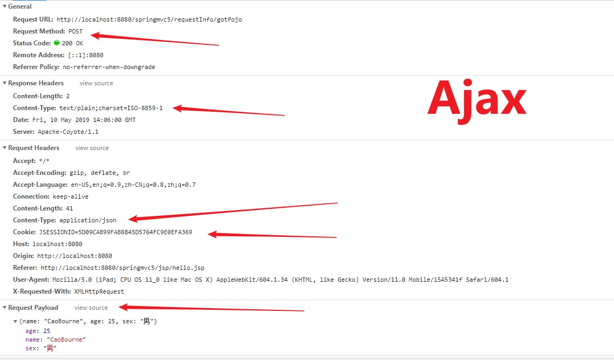
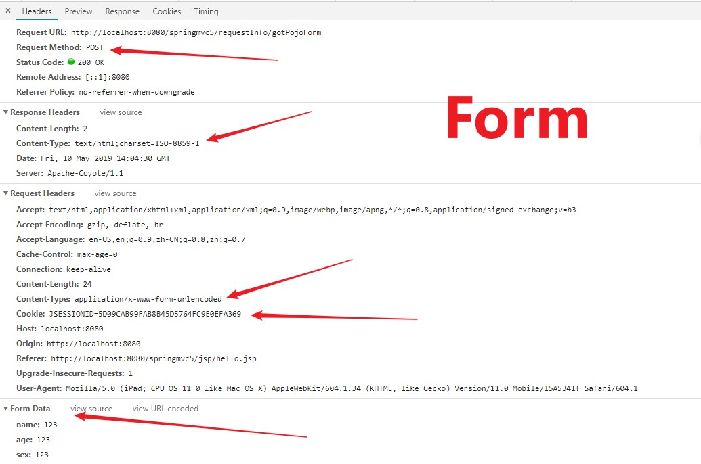

### SpringMVC

#### 配置文件

###### pom.xml

```pom
<properties>
  <project.build.sourceEncoding>UTF-8</project.build.sourceEncoding>
  <maven.compiler.source>1.8</maven.compiler.source>
  <maven.compiler.target>1.8</maven.compiler.target>
</properties>

<dependencies>
  <dependency>
    <groupId>org.springframework</groupId>
    <artifactId>spring-webmvc</artifactId>
    <version>5.1.5.RELEASE</version>
  </dependency>
  <!-- https://mvnrepository.com/artifact/javax.servlet/j avax.servlet-api -->
  <dependency>
    <groupId>javax.servlet</groupId>
    <artifactId>javax.servlet-api</artifactId>
    <version>3.1.0</version>
    <scope>provided</scope>
  </dependency>
</dependencies>
```

###### web.xml

```xml
<?xml version="1.0" encoding="UTF-8"?>
<web-app xmlns="http://xmlns.jcp.org/xml/ns/javaee"
         xmlns:xsi="http://www.w3.org/2001/XMLSchema-instance"
         xsi:schemaLocation="http://xmlns.jcp.org/xml/ns/javaee
                      http://xmlns.jcp.org/xml/ns/javaee/web-app_3_1.xsd"
         version="3.1"
         metadata-complete="true">
    <servlet>
        <servlet-name>springmvc</servlet-name>
        <servlet-class>org.springframework.web.servlet.DispatcherServlet</servlet-class>
    </servlet>
    <servlet-mapping>
        <servlet-name>springmvc</servlet-name>
        <url-pattern>/</url-pattern>
    </servlet-mapping>
</web-app>
```

urlPattern 的写法的问题

- /  ==匹配所有的==

- /* ==(不要用)==

- *.do  要匹配     控制器Name.do ，可以下面的 改写成 helloController.do

  ```xml
  <servlet-mapping>
      <servlet-name>springmvc</servlet-name>
      <url-pattern>*.do</url-pattern>
  </servlet-mapping>
  url 就要写成  helloController.do
  ```

###### springmvc-servlet.xml

```xml
<?xml version="1.0" encoding="UTF-8"?>
<beans xmlns="http://www.springframework.org/schema/beans"
       xmlns:xsi="http://www.w3.org/2001/XMLSchema-instance"
       xsi:schemaLocation="http://www.springframework.org/schema/beans http://www.springframework.org/schema/beans/spring-beans.xsd">
    <!--配置视图解析器-->
    <bean class="org.springframework.web.servlet.view.InternalResourceViewResolver">
        <property name="prefix" value="/jsp/"></property>
        <property name="suffix" value=".jsp"></property>
    </bean>
    <bean class="com.bourne.springmvc.controller.HelloController" name="/helloController">

    </bean>
</beans>
```

###### 控制器代码

```java
import org.springframework.web.servlet.ModelAndView;
import org.springframework.web.servlet.mvc.Controller;

public class HelloController implements Controller {

    @Override
    public ModelAndView handleRequest(javax.servlet.http.HttpServletRequest httpServletRequest, javax.servlet.http.HttpServletResponse httpServletResponse) throws Exception {
        ModelAndView model = new ModelAndView();
        model.addObject("girl", "菲菲");
        model.setViewName("girl");
        return model;
    }
}
```

###### 视图解析

```jsp
<%--
  Created by IntelliJ IDEA.
  User: Bourne
  Date: 2019/4/28
  Time: 16:30
  To change this template use File | Settings | File Templates.
--%>
<%@ page contentType="text/html;charset=UTF-8" language="java" %>
<html>
<head>
    <title>Title</title>
</head>
<body>
    我的女孩${girl}
</body>
</html>
```

默认spring-servlet.xml 名称

```xml
<!--
	通过设置init-param, 设置默认spring 文件的名称
-->
<servlet>
    <servlet-name>springmvc</servlet-name>
    <servlet-class>org.springframework.web.servlet.DispatcherServlet</servlet-class>
    // 设置 servlet 默认名称
     <init-param>
        <param-name>namespace</param-name>
        <param-value>spring-servlet</param-value>
    </init-param>
     // 设置servlet 默认位置, 一般maven 工程会把 配置文件放在 resources 下面， 就可以按照下方式设置成类路径
     <init-param>
         <param-name>contextConfigLocation</param-name>
         <param-value>classpath:springmvc.xml</param-value>
     </init-param>
</servlet>
<servlet-mapping>
    <servlet-name>springmvc</servlet-name>
    <url-pattern>*.do</url-pattern>
</servlet-mapping>
```

类路径

```xml
 <init-param>
     <param-name>contextConfigLocation</param-name>
     <param-value>classpath:springmvc.xml</param-value>
 </init-param>
```

#### 注解开发

###### 开发步骤

记得设置扫描包

在指定类上添加@controller

如果同一个controller 中包含多个URI， 这样就需要在 controller 类和方法中添加 @RequestMapping， 如果

/orders/addorders 发起请求， 则会访问第一个方法，但是而这相同的是都会加载 orders.jsp

URL 也可以用驼峰命名

```java
@Controller
@RequestMapping("/orders")
public class OrderController {
    @RequestMapping("/addorders")
    public String addOrders(Model model) {       
        model.addAttribute("orders", orders);
        return "orders";
    }

    @RequestMapping("/delorders")
    public String delOrders(Model model) {       
        model.addAttribute("orders", orders);
        return "orders";
    }
}
```

###### 重定向和转发

- 跳转至页面  匹配试图解析规则
- 重定向到页面 redirect:path
- 转发到另外一个控制器 forward:path

```java
@RequestMapping("/request")
public class Request {
     @RequestMapping("/forword")
     public String forWard(Model model) {
          System.out.println("我跳转了");
          model.addAttribute("skill", "跳转");
          return "forward"; // 跳转到指定 jsp 界面
     }
     @RequestMapping("/redirect")
     public String reDirect(Model model) {
          System.out.println("我重定向了");
          model.addAttribute("skill", "重定向");
          // return "redirect:redirect.jsp"	// 不带斜杠， 说明根据当前上下文决定， 就会请求 request/redirect.jsp         
          return "redirect:/jsp/redirect.jsp";	// 重定向， 不会取匹配试图的解析规则。所以需要添加详细的重定向地址
     }
     @RequestMapping("/forwardController")
     public String forward2(Model model) {
          System.out.println("我重定向了2");
          model.addAttribute("skill", "重定向2");
          return "forward:/bye";	// 也可以跳转另外一个 controller ，
     }
}
```

###### 重定向 首页

```java
// 返回 首页 index.jsp
@RequestMapping("/logout")
/**
     * 用户登陆检验
     * @param account
     * @param model
     * @return
     */
public String loginAccount(HttpSession httpSession) {
     httpSession.removeAttribute("accountInfo");
     httpSession.invalidate();
     return "redirect:/index.jsp";
}
```

###### 关于 springmvc 访问web元素

- request
- session
- application

###### 请求的路径问题

- **？任意一个字符**

  ```java
  @RequestMapping(value={"/DelOrder1?"}) // 表示匹配 /DelOrder1 + 任意字符（除 / ）但必须有一个
  public String delOrders2(Model model) {
       model.addAttribute("order", "删除订单321");
       return "delOrders";
  }
  // http://localhost:8080/springmvc4/Orders/DelOrder12	 true  匹配
  // http://localhost:8080/springmvc4/Orders/DelOrder1	 false 不匹配
  ```

- **'*' 0到多个字符, 但是不能 为 /（路径分隔符）**

  ```java
  @RequestMapping(value={"/DelOrder1*"}) // 表示 匹配 DelOrder1 + 0 或 多个字符， 但是不能为 /
  public String delOrders2(Model model) {
       model.addAttribute("order", "删除订单321");
       return "delOrders";
  }
  http://localhost:8080/springmvc4/Orders/DelOrder15655  true
  http://localhost:8080/springmvc4/Orders/DelOrder1  true
  http://localhost:8080/springmvc4/Orders/DelOrder12  true
  ```

- url/'**'  支持任意多层 路径，表示 url 之后可以有多层，

  ```java
  @RequestMapping(value={"/DelOrder1/**"})
  public String delOrders2(Model model) {
      model.addAttribute("order", "删除订单321");
      return "delOrders";
  }
  //http://localhost:8080/springmvc4/Orders/DelOrder1/123/123/123  true
  // http://localhost:8080/springmvc4/Orders/DelOrder1 true
  ```

- url '**’ 作用和 url * 作用相似

  ```java
  @RequestMapping(value={"/DelOrder1**"})
  public String delOrders2(Model model) {
      model.addAttribute("order", "删除订单321");
      return "delOrders";
  }
  // http://localhost:8080/springmvc4/Orders/DelOrder1	true
  // http://localhost:8080/springmvc4/Orders/DelOrder1123	true
  ```

- url/* 表示 url/下一层路径 可以为任意 0 到多个字符， 但是只有一层

  ```java
  @RequestMapping(value={"/DelOrder1/*"})
  public String delOrders2(Model model) {
      model.addAttribute("order", "删除订单321");
      return "delOrders";
  }
  // http://localhost:8080/springmvc4/Orders/DelOrder1/  true
  // http://localhost:8080/springmvc4/Orders/DelOrder1/123  true
  // http://localhost:8080/springmvc4/Orders/DelOrder1/123/123 false
  ```
  
- url/\*\*/* url下的任意一层任意方法， 如果 请求中有 参数， 也必须携程这种，

  > /issues/showAllIssue/parm1/parm2 后面两个是参数， 但是在过滤器中的path 中也要携程
  >
  > ​    <mvc:exclude-mapping path="/issues/showAllIssue/==\*\*/*=="/>

  ```java
  @Controller
  @RequestMapping("/issues")
  public class IssueController {
       
      @Autowired
      private IssueService issueService;
       
      @RequestMapping("/showAllIssue/{pageSize}/{currPage}")
      public String showAllIssue(@PathVariable("pageSize")Integer pageSize, @PathVariable("currPage") Integer currPage, Model model) {
          System.out.println(pageSize + "" + currPage + "输出信息");
          PageInfo<Issue> pageInfo = issueService.showAllIssueImpl(pageSize, currPage);
          model.addAttribute("pageInfo", pageInfo);
          return "issueShow";
      }
  }
  ```

  ```xml
  <mvc:interceptor>
      <mvc:mapping path="/**/*"/>
      <mvc:exclude-mapping path="/user/login"/>
      <mvc:exclude-mapping path="/issues/showAllIssue/**/*"/>
      <bean class="com.bourne.springmvc.interceptor.SessionInterceptor"/>
  </mvc:interceptor>
  ```

###### 常用 注解

**@RequestMapping**

- name

  ```java
  java.lang.String name() default "";// 名字
  ```

- value 匹配路径（）

  ```java
  @org.springframework.core.annotation.AliasFor("path")
  java.lang.String[] value() default {};	// URI, 可以为数组
  ------
  @RequestMapping(value={"/redirect1", "/redirect2"})
  public String reDirectFunc(Model model) {
      model.addAttribute("order", "跳转了");    
      return "redirect:/jsp/delOrders.jsp";
  }
  // 也就是说路径 为 。。/redirect1 或者 。。/redirect2 都可以重定向至该页面
  ```

- path  和 value 有相同的功能

- Method 请求的方式（数组类型）

  ```java
  GET, HEAD, POST, PUT, PATCH, DELETE, OPTIONS, TRACE;
  // 如果不限定， 则为 这八种请求方式的任一种
   @RequestMapping(value={"/redirect1", "/redirect2"}, method = RequestMethod.GET)// 利用get 请求
  也可以是个数组 method = {RequestMethod.GET, RequestMethod.POST}
  ```

- params 

  可以指定参数， 还可以限制这个请求的特征， 例如

  ```java
  @RequestMapping(value={"/DelOrder1", "/DelOrder2"}, params = {"girl", "boy"})
  // 表示 只匹配 包含参数 girl 和 boy 请求URI
  ```

  ```java
  @RequestMapping(value={"/DelOrder1", "/DelOrder2"}, params = {"girl=wangfei", "boy=douxiao"})
  // 表示之匹配包含参数 girl 和 boy 的请求， 并且参数 girl = wangfei, boy = douxiao 的URI
  ```

- headers 限制发起请求的浏览器的头信息

- consumers  媒体类型

- produces 响应的类型

  这个可以表示 接受 JSON数据还是XML格式数据，produces = {} // 可以为数组也可以为简单值

  对应的有一个枚举类型值	produces = MediaType.APPLICATION_XML_VALUE， MediaType 中有多个值

**@GetMapping**

表示只接受 get请求

```java
http://localhost:8080/springmvc4/Orders/DelOrder3, 在网页就可以请求
```

**@PostMapping**

表示只接受post请求（只有post请求才会响应）

**非post 和 get请求**

- 过滤器添加(web.xml)

  //该过滤器是对 非 post 和 非 get请求的一种处理

  ```xml
  <filter>
      <filter-name>hiddenHttp</filter-name>
      <filter-class>org.springframework.web.filter.HiddenHttpMethodFilter</filter-class>
  </filter>
  <filter-mapping>
      <filter-name>hiddenHttp</filter-name>
      <url-pattern>/*</url-pattern>
  </filter-mapping>
  
  ```

- 请求内容

  // jsp 中要添加的就是一个  <input type="hidden" name="_method" value="put">， 其中 value的值就是 请求类型， put， delete

  ```jsp
  <form method="post" action="${pageContext.request.contextPath}/otherController/putUrl">
      <input type="hidden" name="_method" value="put">
      <input type="text" name="name">
      <input type="submit" value="提交">
  </form>
  ```

- Controller 书写

  ```java
  @Controller	// 可被扫描
  @RequestMapping("/otherController")	// url
  public class OtherReqController {
      @PutMapping("/putUrl")	// url
      @ResponseBody	// 返回数据类型， 详见 该注解
      public String putReq(String name) {	// name 需要对应表单中 name 标签
          System.out.println(name + "name");
          return "Ok";	// 这里只是返回了 字符串 ok
      }
  }
  ```

**@PathVariable**

@PathVariable("name") 这里面的name 属性名称 是根据  URL 中的参数列表相同的， 下面例子中的 nameParam 与 该注解中的 nameParam 必须相同， 而形式参数中的 name 可以为任意名字， 只要是 望文生义。

//

```java
@GetMapping(value={"/addOrder3/{nameParam}"})
public String addOrder3(@PathVariable("nameParam")String name) {
    System.out.println(name);
    return "product";
}
```

**@ResponseBody**

返回数据一般情况下返回Json 数据

**@SessionAttributes**

该注解要安放在类上面， 它会将模型自动填充到 会话中去

```java
@SessionAttributes("product")
public class OtherReqController {
     @ModelAttribute
     public Product init() {
          System.out.println("率先执行了 init ");
          Product product = new Product();
          product.setId(123456);
          product.setName("CaoBourne123");
          return product;
     }
     @RequestMapping("/forwardController")
     public String forward2(Product product) {
          System.out.println("我重定向了2");
          return "redirect:/jsp/product.jsp";
     }
}
```

```jsp
<body>
    ${sessionScope.product.getName()}	// 这样就可以获取 成员变量值
</body>
```

**@SessionAttribute**

要求 当前这次访问当中的会话里面必须要有某个对象, 像下面的例子， 首先要请求register， 使得 SessionAttribute 中包含 product这个变量， 第二次再请求 forwardController， 就可以获取 product 这个对象， 只要再同一个会话中。

```java
@PutMapping("/register") // put 请求
public Product register(Product product) {
    System.out.println("有狼狗");
    return product;
}
@PostMapping("/forwardController")	// post请求
public String forward2(@SessionAttribute Product product) {
    System.out.println("我重定向了2");
    return "redirect:/jsp/product.jsp";
}
```

首先发起 register请求

```jsp
<form method="post" action="${pageContext.request.contextPath}/otherController/register">
    <input type="hidden" name="_method" value="put">
    <input type="text" name="name"><br>
    <input type="submit" value="提交"><br>
</form>
```

再次发起 请求， 就可以获取 product

```java
<form method="post" action="${pageContext.request.contextPath}/otherController/forwardController">
    <input type="text" name="name"><br>
    <input type="submit" value="提交"><br>
</form>
```

product.jsp

```jsp
${sessionScope.product.getName()}
```

**@CookieValue**

```java
@GetMapping("/hehe")
public String getCookie(@CookieValue("JSESSIONID") String name) {
    System.out.println("我重定向了2"+name);
    return "product";
}
```

**@ModelAttribute****

- 方式一

  ```jsp
  <form method="post" action="${pageContext.request.contextPath}/otherController/putUrl">
      <input type="hidden" name="_method" value="put">
     <%-- <input type="text" name="id">
      <input type="text" name="name">--%>
      <input type="submit" value="提交">
  </form>
  ```

  ```java
  @ModelAttribute
  public Product init() {
      System.out.println("率先执行了 init ");
      Product product = new Product();
      product.setId(123456);
      product.setName("CaoBourne123");
      return product;
  }
  @PutMapping("/putUrl")
  @ResponseBody
  public String putReq(Product product) {
      System.out.println(product.getId() + "name" + product.getName());
      return "OK";
  }
  // 如果前端有 值，则可以 输出 前端传过来的值
  例如， 前端传值： 123 和 CaoBourne, 则会输出 123 和 CaoBourne
  // 如果前端没有传值， 则会 @ModelAttribute 中的Product 对象
  // 如果 像 上面被注释掉的内容， 也就是无法从 前端获取内容，也就会输出 init 初始的对象
  ```

  

  

  

  

  


#### 静态资源访问的问题

###### ${pageContext.request.contextPath}

[关于${pageContext.request.contextPath}的理解 （转载）](https://www.cnblogs.com/hy1988/p/5811445.html)

[**拦截器 与 注解驱动冲突的解决办法**](http://www.cnblogs.com/banning/p/6195072.html)

<font style="color: red;"> **<mvc:annotation-driven/>**这是为了让原先的注解生效， 添加一个注解驱动 </font>

```xml
// 要把前两行放置在拦截器之前
<mvc:annotation-driven/>
<mvc:default-servlet-handler/>
<mvc:interceptors>
    <mvc:interceptor>
        <mvc:mapping path="/**/*"/>    <!--拦截路径-->
        <bean class="com.bourne.springmvc.interceptor.MethodTimeInterceptor"/>
    </mvc:interceptor>
    <mvc:interceptor>
        <mvc:mapping path="/user/**/*"/>    <!--拦截路径-->
        <mvc:exclude-mapping path="/user/login"/>
        <bean class="com.bourne.springmvc.interceptor.SessionInterpretor"/>
    </mvc:interceptor>
</mvc:interceptors>
```

css 样式路径设置

```jsp
<link rel="stylesheet" type="text/css" href="${pageContext.request.contextPath}/static/css/index.css" />
```

由于我们的servlet 设置了URL默认的匹配方式为　　／　，　所以他将静态支援也当作一个后台的请求，比如　ｈttp://localhost:8080/springmvc4/static/css/index.css　　　

他会尝试匹配static/css/index.css 的一个 Controller 里面的RequestMapping的组合，因为没有， 所以出错

解决办法 1

==设置默认的servlet处理者	 <mvc:default-servlet-handler/>==

==<mvc:annotation-driven/>， 注解的放行， 因为我们还有一些自定义的controller 需要处理， 而不是被默认处理器拦截==

```xml
<?xml version="1.0" encoding="UTF-8"?>
<beans xmlns="http://www.springframework.org/schema/beans"
       xmlns:mvc="http://www.springframework.org/schema/mvc"
       xmlns:xsi="http://www.w3.org/2001/XMLSchema-instance"
       xmlns:context="http://www.springframework.org/schema/context"

       xsi:schemaLocation="http://www.springframework.org/schema/beans
        https://www.springframework.org/schema/beans/spring-beans.xsd
        http://www.springframework.org/schema/mvc
        https://www.springframework.org/schema/mvc/spring-mvc.xsd http://www.springframework.org/schema/context http://www.springframework.org/schema/context/spring-context.xsd">

    <context:component-scan base-package="com.bourne.springmvc4.controller"/>
    <bean class="org.springframework.web.servlet.view.InternalResourceViewResolver">
        <property name="prefix" value="/jsp/"></property>
        <property name="suffix" value=".jsp"></property>
    </bean>
    <bean class="com.bourne.springmvc4.controller.HelloController" name="/helloController"/>
    <mvc:default-servlet-handler/>
    <mvc:annotation-driven/>
</beans>
```

#### 中文乱码解决

web.xml

```xml
<!--中文乱码解决-->
<filter>
    <filter-name>characterEncodingFilter</filter-name>
    <filter-class>org.springframework.web.filter.CharacterEncodingFilter</filter-class>
    <init-param>
        <param-name>encoding</param-name>
        <param-value>UTF-8</param-value>
    </init-param>
    <init-param>
        <param-name>forceRequestEncoding</param-name>	处理请求乱码
        <param-value>true</param-value>
    </init-param>
    <init-param>
        <param-name>forceResponseEncoding</param-name>	处理相应乱码
        <param-value>true</param-value>
    </init-param>
</filter>
<filter-mapping>
    <filter-name>characterEncodingFilter</filter-name>
    <url-pattern>/*</url-pattern>
</filter-mapping>
```

#### 关于 form 表单 提交数据的方式

**<font style="color: red">（记住pojo 实体类做形参只能接受form 表单， 但是 AJAX数据需要添加@RequestBody）</font>**

- 方式一 通过属性名字绑定

  通过属性名称进行绑定， 可以完成数据传递，

  页面当中表单元素的name 属性 要和后台的形参的名字保持一致

  **<font style="color: red">日期暂时不可以</font>**

  // 有多个属性， 就可以在形参列表中添加多个形参

  ```java
  @Controller
  @RequestMapping("/otherController")
  public class OtherReqController {
       @PutMapping("/putUrl")
       @ResponseBody
       public String putReq(String name) {
            System.out.println(name + "name");
            return name;
       }
  }
  ```

  ```jsp
  <form method="post" action="${pageContext.request.contextPath}/otherController/putUrl">
      <input type="hidden" name="_method" value="put">
      <input type="text" name="name">
      <input type="submit" value="提交">
  </form>
  ```

- 方式二 利用 @RequestParam 注解获取参数， 注意 只要 注解中绑定了 name属性， 形参列表可与 属性名称不同

  ```javascript
  @PutMapping("/putUrl")
  @ResponseBody
  public String putReq(@RequestParam("name") String name1) {
       System.out.println(name1 + "name");
       return "OK";
  }
  ```

- 方式三 利用 相关实体类 的形式传递参数

  - 首先定义一个实体类， Product

    String name,  Integer id;

  - 形参

    ```java
    @PutMapping("/putUrl")
    @ResponseBody
    public String putReq(Product product) {
        System.out.println(product.getId() + "name" + product.getName());
        return "OK";
    }
    ```

#### 怎样提交一个实体类和其他非实体类参数(只是form 表单)

#### 怎样提交一个实体类中包含另一个实体类(只是form 表单)

>  例如， comment 中包含 issue 实体类， 所以在接受参数时就需要 issue.title, 和 issue.content

```jsp
<form action="${pageContext.request.contextPath}/comments/commentUpdate" method="post">
    <input type="hidden" name="commentId" value="${comment.commentId}" ><br>
    <input type="hidden" name="pageSize" value="${pageSize}"><br>
    <input type="hidden" name="currPage" value="${currPage}"><br>
    问题标题<textarea name="issue.title" cols="30" rows="2">${comment.issue.title}</textarea><br>
    问题内容<textarea name="issue.content" cols="30" rows="2">${comment.issue.content}</textarea><br>
    问题创建时间<textarea name="issue.createTime" cols="30" rows="2">${comment.issue.createTime}</textarea><br>
    问题创建用户<textarea name="user.userName" cols="30" rows="2">${comment.user.userName}</textarea><br>
    评论内容<textarea name="content" cols="30" rows="4">${comment.content}</textarea><br>
    创建时间<input type="text"   name="commentTime" value="${comment.commentTime}"><br>
    <input type="submit" value="提交"><br>
</form>
```

```java
@RequestMapping("/commentUpdate")
public String commentUpdate(Comment comment,
                            @RequestParam("pageSize") Integer pageSize,
                            @RequestParam("currPage") Integer currPage,
                                  Model model, HttpSession session) {
    User user = (User) session.getAttribute("user");
    comment.setCommentTime(new Date());
    Integer row = commentService.updateCommentImpl(comment);
    PageInfo<Comment> pageInfo = commentService.showUserCommentsImpl(pageSize, currPage, user);

    model.addAttribute("pageInfo", pageInfo);
    model.addAttribute("pageType", "userComments");
    return "components/commentsUserShow";

}
```

#### 表单怎样发起put 请求

> 会在表单中添加<input type="hidden" name="_method" value="put">
>
> 也就表示该表示提交类型 为 put, 所以后台接收也就只能 为PutMapping 或 RequestMapping

```html
<form th:action="@{/emp/edit}" method="post">

     <div class="form-group">
          <input type="hidden" name="_method" value="put">
          <label th:text="#{employee.lastName}">lastName</label>
          <input type="text" class="form-control" id="lastName" name="lastName" placeholder="zhangsan"
                 th:value="${employee.lastName}">
     </div>     
     <div class="form-group">
          <label th:text="#{employee.gender}">gender</label>
          <div class="form-check">
               <input class="form-check-input" type="radio" name="gender" id="female" value="0" th:checked="${employee.gender == 0}">
               <label class="form-check-label">
                    女
               </label>
          </div>
          <div class="form-check">
               <input class="form-check-input" type="radio" name="gender" id="male" value="1" th:checked="${employee.gender == 1}">
               <label class="form-check-label">
                    男
               </label>
          </div>
     </div>

     <div class="form-group">
          <label th:text="#{employee.department.id}">depart</label>
          <select class="form-control" name="department.id">
               <option th:each="depart: ${departs}" th:text="${depart.departmentName}"
                       th:value="${depart.id}"
                       th:selected="${depart.id} == ${employee.department.id}"
                       ></option>
               <!--th:selected="${depart.id} == ${employee.department.id} ? selected: false"-->
          </select>
     </div>

     <div class="form-group">
          <label th:text="#{employee.birth}">birth</label>
          <input type="text" class="form-control" id="birth" name="birth" placeholder="2018-09-29"
                 value="2018-09-29" th:value="${#dates.format(employee.birth,  'yyyy-MM-dd')}">
     </div>
     <div class="form-group">
          <button type="submit" class="btn btn-primary">提交</button>
     </div>
</form>
```


#### 日期类型参数获取

一定要记住， 类中的 date 一定要和前端传过来的数据的属性名称相同， 否则会出现 找不到 bean

- **下面这是通过实体类获取**

product 类

```java
public class Product {
    private Integer id;
    private String name;
    private Date date;
    public Integer getId() {
        return id;
    }
    public void setId(Integer id) {
        this.id = id;
    }
    public String getName() {
        return name;
    }
    public void setName(String name) {
        this.name = name;
    }
    public Date getDate() {
        return date;
    }
    public void setDate(Date date) {
        this.date = date;
    }
}
```

form 表单

```jsp
<form method="post" action="${pageContext.request.contextPath}/otherController/putUrl">
    <input type="hidden" name="_method" value="put">
    <input type="text" name="id"><br>
    <input type="text" name="name"><br>
    <input type="text" name="date"><br>
    <input type="submit" value="提交"><br>
</form>
```

Controller

```java
@InitBinder
public void init(WebDataBinder dataBinder) {
    SimpleDateFormat sdf = new SimpleDateFormat("yyyy-MM-dd");
    sdf.setLenient(false);
    dataBinder.registerCustomEditor(Date.class, new CustomDateEditor(sdf, false));
}
@PutMapping("/putUrl")
@ResponseBody
public String putReq(Product product) {
    System.out.println(product.getId() + "name" + product.getName()+"" +product.getDate());
    return "OK";
}
```

- 通过形参列表获取

  ```java
  @InitBinder
  public void init(WebDataBinder dataBinder) {
      SimpleDateFormat sdf = new SimpleDateFormat("yyyy-MM-dd");
      sdf.setLenient(false);
      dataBinder.registerCustomEditor(Date.class, new CustomDateEditor(sdf, false));
  }
  @PutMapping("/putUrl")
  @ResponseBody
  public String putReq(Integer id, String name, Date date) {
      System.out.println(id + "name" + name + "" + date);
      return "OK";
  }
  ```

- **在属性上面添加额外的注释 @DateTimeFormat（记住这个是在实体类中添加的， 所以在 controller 中也要使用实体类形参）**

  controller 

  ```java
  @PutMapping("/putUrl")
  @ResponseBody
  public String putReq(Product product) {
      System.out.println(product.getDate() +"" + product.getId()+"" + product.getName());
      return "OK";
  }
  ```

  实体类

  // 记住， 属性名 要与 成员变量的get 方法 和 set方法同名，

  ```java
  // 如果变量成员 和 getter 方法和setter 方法不同， 但是参数属性名称 比喻要与这两个方法同名， 尤其是 set 方法
  private Date birth;
  public Date getDate() {
      return date;
  }
  public void setDate(Date date) {
      this.date = date;
  }
  ```

  

  ```java
  @DateTimeFormat(pattern="yyyy-MM-dd")
  private Date date;
  public Date getDate() {
      return date;
  }
  public void setDate(Date date) {
      this.date = date;
  }
  ```


#### Json 数据交互

###### 返回数据和跳转页面

**如果希望返回的只是数据， 而不是视图， 参考第一种即可， 不过这时候一定要添加@ ResponseBody 注解表示只返回数据，另外  @ResponseBody + @Controller = ==@RestController==， 也就是说一个Controller 所有的方法只是返回数据， 就可以写成 @RestController 这种形式，** 

- 返回数据， @ResponseBody 注解表示 只返回数据，而不是跳转页面

```java
@RequestMapping("/test")
@ResponseBody
public String getTest() {
    return "hello";
}
```

- 跳转页面, 这表示要跳转到 /jsp/hello.jsp

```java
@RequestMapping("/hello")
public String getHello(Model model) {  
    model.addAttribute("hehe", "info");
    return "hello";
}
```

###### 返回数据类型

- 普通类型

  ```java
  // 返回数据
  @RequestMapping("/test")
  @ResponseBody
  public String getTest() {
      return "hello";
  }
  ```

- java bean

  ```java
  // 返回JSON
  @RequestMapping("/jsonRtn")
  @ResponseBody
  public User getUserBean() {
      User user = new User("CaoBourne", 25, "男"); // 返回java bean 类型
      return user;
  }
  ```

- map 类型

  ```java
  // 返回JSON
  @RequestMapping("/jsonMap")
  @ResponseBody
  public Map<String, Object> getMapper() {
      Map<String, Object> map = new HashMap<>();
      map.put("name", "CaoBorune");
      map.put("age", 24);
      map.put("sex", "男");
      return map;
  }
  ```

- java bean Array 类型

  ```java
  / 返回JSON
  @RequestMapping("/jsonArray")
  @ResponseBody
  public User[] getJsonArray() {
      User user1 = new User("CaoBourne1", 24, "男");
      User user2 = new User("CaoBourne2", 25, "男");
      return new User[]{user1, user2};
  }
  // 
  [
    {
      "name": "CaoBourne1",
      "age": 24,
      "sex": "男",
      "id": 1
    },
    {
      "name": "CaoBourne2",
      "age": 25,
      "sex": "男",
      "id": 2
    }
  ]
  ```

- list javabean

  ```java
  // 返回JSON
  @RequestMapping("/jsonList")
  @ResponseBody
  public List<User> getJsonList() {
      List<User> list = new ArrayList<>();
      User user1 = new User("CaoBourne1", 24, "男");
      list.add(user1);
      return list;
  }
  ```

#### 前端如何解析

普通数据    data 存放的就是 返回值

数据和list 都需要用下标获取元素

map 使用键值对 data['name']

```javascript
$(function () {
     $('#b1').click(function () {
          $.ajax({
               url: '${pageContext.request.contextPath}/testController/test',
               type: 'post',
               success: function (data) {
                    alert(data); // 普通数据， 直接输出
               }
          })
     });
     // array
     $('#b2').click(function () {
          $.ajax({
               url: '${pageContext.request.contextPath}/testController/jsonArray',
               type: 'post',
               success: function (data) {
                    alert(data[0].name);	// 数组， 用下标， 然后去除数据
               }
          })
     })
     // list
     $('#b3').click(function () {
          $.ajax({
               url: '${pageContext.request.contextPath}/testController/jsonList',
               type: 'post',
               success: function (data) {
                    alert(data[0].name);
               }
          })
     })
     // map
     $('#b4').click(function () {
          $.ajax({
               url: '${pageContext.request.contextPath}/testController/jsonMap',
               type: 'post',
               success: function (data) {
                    alert(data['name']);
               }
          })
     })
	// javabean
     $('#b5').click(function () {
          $.ajax({
               url: '${pageContext.request.contextPath}/testController/jsonRtn',
               type: 'post',
               success: function (data) {
                    alert(data.name);
               }
          })
     })
     $('#b6').click(function () { list<map<String, Object>> 
          $.ajax({
               url: '${pageContext.request.contextPath}/testController/jsonListMap',
               type: 'post',
               success: function (data) {
                    alert(data[0].name);	// 首先用下标获取该元素， 然后用 . 获取元素
               }
          })
     })
})
```

#### 往后台传数据

记住：

==表单数据可以直接 pojo中的实体类接受， 但是AJAX 中的数据不能直接用 POJO中的类接受， 要添加 @RequestBody 注解==

==但是 AJAX 的格式为==

==**contentType: "application/json",	// json格式**==

- 传一个对象

```javascript
$('#b7').click(function () {
    var jsonObj = {	// json 一般为 key value
        "name": "CaoBourne",
        "age": 25,
        "sex": "男"
    };
    $.ajax({
        url: '${pageContext.request.contextPath}/requestInfo/gotPojo',	// 
        type: 'post',	// 请求类型
        data: JSON.stringify(jsonObj),	// 转化成json格式， 传送数据
        contentType: "application/json",	// json格式
        success: function (data) {		// 返回数据
            alert(data == 'OK');
        }
    })
})
```


**java controller** 要添加  @RequestBody 注解

```java
@Controller
@RequestMapping("/requestInfo")
public class ResController {
    @RequestMapping("/gotPojo")
    @ResponseBody
    public String getPojo(@RequestBody User user) { 
        System.out.println(user.getSex() + "" + user.getName());
        return "OK";
    }
}
```

- 传一组对象

```java
@RequestMapping("/gotPojoList")
@ResponseBody
public String getPoJoList(@RequestBody List<User> list) { // 一定记得添加
    System.out.println(list);
    return "OK";
}
```

```javascript
$('#b8').click(function () {
    var jsonObj1 = {
        "name": "CaoBourne1",
        "age": 25,
        "sex": "男"
    };
    var jsonObj2 = {
        "name": "CaoBourne2",
        "age": 25,
        "sex": "男"
    };
    var arrList = new Array();	// 添加到数组中
    arrList.push(jsonObj1);
    arrList.push(jsonObj2);
    $.ajax({
        url: '${pageContext.request.contextPath}/requestInfo/gotPojoList',
        type: 'post',
        data: JSON.stringify(arrList),
        contentType: "application/json",
        success: function (data) {
            alert(data == 'OK');
        }
    })
})
```


#### Form表单提交数据 与 Ajax 提交数据的区别

- 后台接受 

  - Ajax 

    ```java
    @Controller
    @RequestMapping("/requestInfo")
    public class ResController {
        @RequestMapping("/gotPojo")
        @ResponseBody
        public String getPojo(@RequestBody User user) { 
            System.out.println(user.getSex() + "" + user.getName());
            return "OK";
        }
    }
    ```

  - Form

    ```java
    @RequestMapping("/putUrl")
    @ResponseBody
    public String putReq(Product product) {
        System.out.println(product.getId() + "name" + product.getName());
        return "OK";
    }
    ```

- 前端 Request 请求体

  二者发送组转数据的区域存在不同，所以处理的方式也不同， 对于form表单提交数据contentType 也和 Ajax 不同。 

  - Ajax

    

  

  - Form

    


#### XML数据交互

- 导入xml 依赖

  ```xml
  <!--xml-->
  <dependency>
      <groupId>com.fasterxml.jackson.dataformat</groupId>
      <artifactId>jackson-dataformat-xml</artifactId>
      <version>2.9.8</version>
  </dependency>
  ```

- 后台接受

  记住一定要记得添加 produces = MediaType.APPLICATION_XML_VALUE

  ```java
  @Controller
  @RequestMapping("/xmlRequest")
  public class XMLController {
      @RequestMapping(value = "/testXml", produces = MediaType.APPLICATION_XML_VALUE)
      @ResponseBody
      public User testXml() {
          User user = new User("CaoBourne", 25, "男");
          return user;
      }
  }
  ```


- 