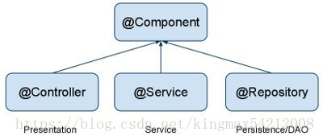

## Spring 学习

### spring 练习

#### 常用注解

- 组件扫描

  - @Component    表示这个类应该在 应用程序中被创建
  - @ComponentScan   自动发现应用程序中创建的类

- 自动装配

  - @Autowired  自动满足bean 之间的依赖

- 定义配置类

  - @Configuration	表示当前是一个配置类

- Spring注解@Component、@Repository、@Service、@Controller区别

   @Repository、@Service、@Controller是@Component的别名

  

```dockerfile
Spring 2.5 中除了提供 @Component 注释外，还定义了几个拥有特殊语义的注释，它们分别是：@Repository、@Service 和 @Controller。
在目前的 Spring 版本中，这 3 个注释和 @Component 是等效的，但是从注释类的命名上，很容易看出这 3 个注释分别和持久层、业务层和控制层（Web 层）相对应。
虽然目前这3 个注释和 @Component 相比没有什么新意，但 Spring 将在以后的版本中为它们添加特殊的功能。
所以，如果 Web 应用程序采用了经典的三层分层结构的话，最好在持久层、业务层和控制层分别采用上述注解对分层中的类进行注释。
@Service用于标注业务层组件
@Controller用于标注控制层组件（如struts中的action）
@Repository用于标注数据访问组件，即DAO组件
@Component泛指组件，当组件不好归类的时候，我们可以使用这个注解进行标注。
```

#### 测试用例

- Junit

  ```java
  @Test
  public void testApp() {
       ApplicationContext context = new AnnotationConfigApplicationContext(AppConfig.class);
       MessagePrinter printer = context.getBean("messagePrinter", MessagePrinter.class);
       printer.printMessage();
  }
  ```

- Spring-test

  ```xml
  <dependency>
       <groupId>org.springframework</groupId>
       <artifactId>spring-test</artifactId>
       <version>4.3.22.RELEASE</version>
       <scope>test</scope>
  </dependency>
  ```

  ```java
  @RunWith(SpringJUnit4ClassRunner.class)		// Spring 测试模块
  @ContextConfiguration(classes = AppConfig.class) // 加载配置类
  public class PlayerTest {
      @Autowired
      private MessagePrinter printer;	// 自动装配
  
      @Test
      public void testApp() {
          printer.printMessage();	// 测试
      }
  }
  ```

### 自动装配

#### Autoweird 的使用

- required

  @Autowired(required=true)：当使用@Autowired注解的时候，其实默认就是@Autowired(required=true)，表示注入的时候，该bean必须存在，否则就会注入失败。

  ```java
  @Autowired
  private MessageService service;
  @Autowired(required = false)
  private MessagePower power;
  ```

  如果， 该类没有被扫描到， 都不会 自动专配该类， 也就是该引用变量 为 null, 所以再引用该变量时， 一定要加 判断

  ```java
  if(power != null) {
      System.out.println(power.getPower());
  }
  ```

- 构造函数(效率最高)

  ```java
  @Autowired
  public MessagePrinter(MessageService service, MessagePower power) {
       this.service = service;
       this.power = power;
  }
  ```

  测试类也需要

  ```java
  @Autowired
  private MessagePrinter printer;
  
  @Test
  public void testApp() {
      printer.printMessage();
  }
  ```

- 利用变量的反射机制(不建议)

  ```java
  @Autowired
  private MessageService service;
  @Autowired
  private MessagePower power;
  ```

- set 方法

  ```java
  @Autowired
  public void setPower(MessagePower power) {
      this.power = power;
      System.out.println("set Power");
  }
  ```

- 任意函数（类似构造函数）

  ```java
  @Autowired
  public void setPrinter(MessageService service, MessagePower power) {
       this.service = service;
       this.power = power;
  }
  ```

  

#### 注解形式获取 类实例

```java
ApplicationContext context = new AnnotationConfigApplicationContext(Config.class);
MessagePrinter printer = context.getBean("messagePrinter", MessagePrinter.class);
printer.printMessage();
这个需要 @Component 和  @ComponentScan 配合
```

#### 设置专有配置类

```java
@Configuration
@ComponentScan
public class AppConfig { // 即使设置成空类， 也可以
}
```

```java
//然后再其他类中 获取 配置类， 也属于 注解形式获取类实例
public class Config {
    public static void main(String[] args) {
        ApplicationContext context = new AnnotationConfigApplicationContext(AppConfig.class);
        MessagePrinter printer = context.getBean("messagePrinter", MessagePrinter.class);
        printer.printMessage();
    }
}
```

#### 使用接口形式自动装配

@Component 一定要写在实现类中

再测试类中， 自动装配的应该写成 接口形式， 而不是实现类

- 接口

  ```java
  public interface UserService {
      void add();
  }
  ```

- 实现类

  ```java
  @Component
  public class UserServiceNormal implements UserService {
      @Override
      public void add() {
          System.out.println("我只想添加一个用户" + "UserServiceNormal");
      }
  }
  ```

- 测试类

  ```java
  public class ServiceTest {
      @Autowired
      private UserService userService; // 一定自动装配 接口， 而是实现类，
      @Test					//  但是 @Component 一定要添加到实现类
      public void testService() {
          userService.add();
      }
  }
  ```

#### 自动装配的歧义性

如果使用接口进行自动装配， 如果该接口有多个实现类， 这样就会出现spring 不知道装配哪一个 bean

```java
Could not autowire. There is more than one bean of 'UserService' type.
Beans:
    userServiceNormal   (UserServiceNormal.java) 
    userServiceRare   (UserServiceRare.java)
```

- 首选 bean

  可以设置首选 bean, 但是只能设置一个， 并且我们在测试时并不一定知道 选择哪一个实现类， 所以有一定的局限性

  ```java
  @Component
  @Primary
  public class UserServiceRare implements UserService {
      @Override
      public void add() {
          System.out.println("我只想添加一个用户" + "UserServiceRare");
      }
  }
  ```

- 限定符 @Qualifier("name")

  好处是， 每个实现类都会有一个 名称， 这样在测试类中灵活选用 需要自动装配的bean 

  ```java
  @Component
  @Qualifier("normal")
  public class UserServiceNormal implements UserService {
      @Override
      public void add() {
          System.out.println("我只想添加一个用户" + "UserServiceNormal");
      }
  }
  @Component
  @Qualifier("rare")
  public class UserServiceRare implements UserService {
      @Override
      public void add() {
          System.out.println("我只想添加一个用户" + "UserServiceRare");
      }
  }
  
  ```

  而在测试类

  ```java
  @Autowired
  @Qualifier("rare")
  private UserService userService;
  @Test
  public void testService() {
      userService.add();
  }
  ```

- 使用限定符 和 类 id

  可以使用 @Component("id / name"), 结合@Qualifier("name / id")使用， 其实使用@Component ， 每个类会有默认的id, 那就是类名第一个字母小写，有点类似于 java 方法的命名规则

  例如 UserServiceNormal == userServiceNormal

  ```java
  @Component(("rare"))
  public class UserServiceRare implements UserService {
      @Override
      public void add() {
          System.out.println("我只想添加一个用户" + "UserServiceRare");
     }
  }
  ```

#### 设置组件基础扫描包 

@ComponentScan 默认扫描 配置类 所属包中的任意类，AppConfig1 属于service 包， 也就是说 会扫描service 下的所有包 以及service 包下的子包中的类， 所以我们就需要设置默认扫描包

- 自动扫描包(可以有多个)

  ```java
  //@ComponentScan(basePackages = {"com.bourne.springpractice1.cdplayer", "com.bourne.springpractice1.message", "com.bourne.springpractice1.service"})
  设置扫描包， 最好使用全限定名称
  ```

- 自动扫描类（可以有多个， 可以设置 实现类， 也可以写接口)

  ```java
  @ComponentScan(basePackageClasses = {UserServiceNormal.class, UserServiceRare.class})
  ```

#### xml 获取类实例

```java
ApplicationContext context = new ClassPathXmlApplicationContext("applicationContext.xml");
CDPlayer cdPlayer = context.getBean("cdPlayer", CDPlayer.class);
cdPlayer.play();
```

#### 使用xml 启用组件扫描

设置多个组件扫描包

```xml
<context:component-scan base-package="com.bourne.springpractice1.service"/>
<context:component-scan base-package="com.bourne.springpractice1.cdplayer"/>
<context:component-scan base-package="com.bourne.springpractice1.message"/>
```

```java
@RunWith(SpringJUnit4ClassRunner.class)
// @ContextConfiguration(classes = AppConfig1.class)
@ContextConfiguration("classpath:applicationContext.xml")// 获取组件扫描 配置文件
public class ServiceTest {
    @Autowired
    @Qualifier("rare")
    private UserService userService;
    @Test
    public void testService() {
        userService.add();
    }
}

```

### 显示装配

由于一些 java  类 是第三方库， 所以无法在类中添加 @Component , 这样也就无法 被配置类扫描到。 所以只能使用显示装配

#### @Bean 作用

如果一个方法标了@Bean 注解， 就表明 该方法启动时被 spring  上下文 自动调用，  因为 一个方法上添加 @bean 注解， 就表明 spring 拦截了所有对该方法的调用， 就如同 下方  ==getUserDao()== 相同， 两次的对 该方法的调用 就会被拦截， spring 就会检查上下文是否创建了 UserDao 对象， 

- 如果这个对象已经被创建， 则不会再次调用， 第二次调用，则会 直接返回 已经存在的UserDao 对象。
- 如果没有创建该对象， 则会创建该对象

#### 在 配置类中显示装配

##### 通过构造函数 显示装配

```java
public UserServiceNormal(UserDao userDao) {
    this.userDao = userDao;
    System.out.println("创建了新的UserService 对象 有参");
}
```

依赖类的第一种写法

```java
// 这里与自动装配的区别在于 没有添加 @ComponentScan 注解
@Configuration
public class AppConfig {
    @Bean
    public UserDao getUserDao() {
        System.out.println("getUserDao");
        return new UserDaoNormal();
    }
    @Bean
    public UserService getUserService() {
        System.out.println("getUserService");
        return new UserServiceNormal(getUserDao());
    }
     // getUserDao 虽然被创建了 两次， 但是 只会创建一个UserDao 的对象。
}
```

第二种写法

== 标注了@Bean 注解的方法会自动执行，第二个方法在被调用时表示需要一个 UserDao 类型的 参数， 这是spring 就会检查上下文， 是否一创建了 UserDao 类型的对象。 则会作为参数被传递进来， 和上面的写法相同

```java
@Configuration
public class AppConfig {
    @Bean
    public UserDao getUserDao() {
        System.out.println("getUserDao");
        return new UserDaoNormal();
    }
    @Bean
    public UserService getUserService(UserDao userDao) {
        System.out.println("getUserService");
        return new UserServiceNormal(userDao);
    }
}
```

##### 通过set 方法

==其他类似构造函数， 或者是set 方法都可以==

set 方法

```java
public void setUserDao(UserDao userDao) {
    this.userDao = userDao;
}
```

配置类

```java
@Configuration
public class AppConfig {
    @Bean
    public UserDao getUserDao() {
        System.out.println("getUserDao");
        return new UserDaoNormal();
    }
    @Bean
    public UserService getUserService(UserDao userDao) {
        System.out.println("getUserService");
        UserServiceNormal userServiceNormal = new UserServiceNormal();
        userServiceNormal.setUserDao(userDao);
        return userServiceNormal;
    }
}
```

#### 处理显示装配的歧义性

- @Primary 首选 bean

  ```java
  @Configuration
  public class AppConfig {
      @Bean
      @Primary
      public UserDao getUserDaoNormal() {
          System.out.println("getUserDao");
          return new UserDaoNormal();
      }
  
      @Bean
      public UserDao getUserDaoCache() {
          System.out.println("getUserDao");
          return new UserDaoNormal();
      }
  
      @Bean
      public UserService getUserService(UserDao userDao) {
          System.out.println("getUserService");
          UserServiceNormal userServiceNormal = new UserServiceNormal();
          userServiceNormal.setUserDao(userDao);
          return userServiceNormal;
      }
  }
  ```

- @Qulifier

  ```java
  @Bean
  @Qualifier("normal")
  public UserDao getUserDaoNormal() {
      System.out.println("getUserDaoNormal");
      return new UserDaoNormal();
  }
  @Bean
  @Qualifier("cache")
  public UserDao getUserDaoCache() {
      System.out.println("getUserDaoCache");
      return new UserDaoNormal();
  }
  @Bean
  public UserService getUserService(@Qualifier("normal") UserDao userDao) {
      System.out.println("getUserService");
      UserServiceNormal userServiceNormal = new UserServiceNormal();
      userServiceNormal.setUserDao(userDao);
      return userServiceNormal;
  }
  ```

- @Bean 名称

  ```java
  @Configuration
  public class AppConfig {
      @Bean("normal")
      public UserDao getUserDaoNormal() {
          System.out.println("getUserDaoNormal");
          return new UserDaoNormal();
      }
      @Bean("cache")
      public UserDao getUserDaoCache() {
          System.out.println("getUserDaoCache");
          return new UserDaoNormal();
      }
      @Bean
      public UserService getUserService(@Qualifier("normal") UserDao userDao) {
          System.out.println("getUserService");
          UserServiceNormal userServiceNormal = new UserServiceNormal();
          userServiceNormal.setUserDao(userDao);
          return userServiceNormal;
      }
  }
  ```

- 默认 id, 该方法的 首字母小写（驼峰）

  ```java
  @Configuration
  public class AppConfig {
      @Bean
      public UserDao getUserDaoNormal() {
          return new UserDaoNormal();
      }
      @Bean
      public UserDao getUserDaoCache() {
          return new UserDaoCache();
      }
      @Bean
      public UserService getUserService(@Qualifier("getUserDaoCache") UserDao userDao) {
          UserServiceNormal userServiceNormal = new UserServiceNormal();
          userServiceNormal.setUserDao(userDao);
          return userServiceNormal;
      }
  }
  ```

  

### XML文件依赖注入

#### <font style="color: red">配置文件</font>

配置类中

```java
// ApplicationContext context = new AnnotationConfigApplicationContext(配置类)
// ApplicationContext context = new ClassPathXmlApplicationContext("applicationContext.xml") // 这种方式的前提是 得有@Component 和 @ComponentScan 关键字
// XML 配置规范 时 使用 下面的方式
// 没有 @Configration
// 没有 ComponentScan
public class AppConfig {
    public static void main(String[] args) {
        ApplicationContext context = new ClassPathXmlApplicationContext("applicationContext.xml");
        UserDaoNormal normal = context.getBean("userDaoNormal1", UserDaoNormal.class);
        normal.add();
    }
}
```

```xml
<bean class="com.bourne.saturday.service.impl.UserServiceNormal"/>
<bean class="com.bourne.saturday.service.impl.UserServiceCache"/> 
<!--这样就创建了 两个类的实例，-->
<!-- 有意思的是， 如果在 xml文件中写了多个 bean (同一个类的， 最好拥有name 或者 id 属性)， 意味着创建了 这个类的多个实例-->
<!--name  和 id 有相同的作用， 只是定义name时 ，可以对同一个实例命名多个名字-->
<bean name="normal1 normal2" class="com.bourne.saturday.service.impl.UserServiceNormal"/>
```

---

在 测试类中

```xml
<bean class="com.bourne.springpractice2.dao.impl.UserDaoNormal" id="userDaoNormal1"/>
```

==classpath 和 applicationContext.xml中间不能有空格==

```java
@RunWith(SpringJUnit4ClassRunner.class)
@ContextConfiguration("classpath:applicationContext.xml")
// 
public class TestUserDao {
    @Autowired
    private UserDaoNormal userDaoNormal1;	// 这里的userDaoNormal1 必须是在 xml 文件中出现的， 同样要使用 自动装配
    @Test
    public void testUserDao() {
        userDaoNormal1.add();
    }
}
```

---

#### <font style="color: red">实例的 name 和 id</font>

```java
/*@RunWith(SpringJUnit4ClassRunner.class)
@ContextConfiguration(classes = AppConfig.class)*/
//XML配置规范 与 配置类不同的方式
@RunWith(SpringJUnit4ClassRunner.class)
// -------------------------------------------------------------------------------------------
@ContextConfiguration("classpath:applicationContext.xml") // 
public class UserServiceTest {
     @Autowired
     private UserService normal1; // 记住这里的 normal1 和 normal2 必须要同xml中实例化的对象相同

     @Autowired
     private UserService normal2;

     @Autowired
     @Qualifier("normal1")	// 这里的normal3 是xml文件中未定义的， 但是 这里的Qualifier 标识 所引用对象的 id (normal1), 所以该变量引用的 和 normal1 是同一个对象实例
     private UserService normal3;

     @Test
     public void testAdd() {
          normal1.add();
          normal2.add();
          normal3.add();
          // xml 中只有 name = normal1 和 normal2的bean, 所以只会创建两个实例， 但是调用了三次方法， 第一次和第三次相同
     }
}
```

#### <font style="color: red">构造方法 和 c 命名空间  注入</font>

```xml
 
<!-- xmlns:c="http://www.springframework.org/schema/c" 这是要在 首部添加的声明-->
<bean id="userServiceNormal" class="com.bourne.saturday.service.impl.UserServiceNormal">
    <constructor-arg ref="userDaoNormal"></constructor-arg>
    <!--构造函数注入-->
</bean>
<bean id="userDaoNormal" class="com.bourne.saturday.dao.impl.UserDaoNormal"/>

<bean id="userServiceNormal2" class="com.bourne.saturday.service.impl.UserServiceNormal" c:_0-ref="userDaoNormal"/>
<!--
    c名称空间注入
    c:_0 表示 第一个参数
	起始在测试类中同上
-->
```

#### <font style="color: red">构造方法 和 c命名空间的简单 变量注入</font>

```xml
-- 构造函数 简单注入
<bean name="userDaoNormal1" class="com.bourne.sunday.dao.impl.UserDaoNormal">
    <constructor-arg type="java.lang.String" index="0" name="dbName" value="admin"/>
    <constructor-arg type="java.lang.String" index="1" name="dbPass" value="123456"/>
</bean>
    type -- 表示 参数的类型
    index -- 表示 参数的位置 从 0 开始
    name -- 表示 类变量的名称
    value -- 表示参数的值
-- c命名空间 简单注入
 <bean id="userDaoNormal1" class="com.bourne.sunday.dao.impl.UserDaoNormal"
       c:dbName="admin"
       c:dbPass="123456"/>
c:dbName 表示 dbName 
c:dbName-ref 表示 所要引用的实例
例如
 <bean name="userServiceNormal1"                     class="com.bourne.sunday.service.impl.UserServiceNormal" 		                     
       c:userDao-ref="userDaoNormal1">
        <!--<constructor-arg ref="userDaoNormal1"></constructor-arg>-->
 </bean>

```

#### <font style="color: red">List 类型的注入(set集合、数组 类型 语法相同)</font>

```xml
<bean id="user1" class="com.bourne.sunday.relative.User">
        <constructor-arg value="caobourne1"></constructor-arg>
        <constructor-arg value="123456"></constructor-arg>
</bean>
<bean id="user2" class="com.bourne.sunday.relative.User">
        <constructor-arg value="caobourne2"></constructor-arg>
        <constructor-arg value="123456"></constructor-arg>
</bean>

<bean id="userDaoNormal1" class="com.bourne.sunday.dao.impl.UserDaoNormal"
       c:dbName="admin"> // c 命名空间的注入
        <constructor-arg name="dbPass" value="123456"></constructor-arg> // 构造函数 的简单注入
        <constructor-arg> // 构造函数  List 类型的简单 类型注入
            <list>
                <value>CaoBourne1</value>
                <value>CaoBourne2</value>               
            </list>
        </constructor-arg>
    	<!--
			也可以采用下面这种方式 给 list类型，传参， 直接写成内部bean 的形式。并且不用加 id属性
		-->
    	<constructor-arg name="dogList">//  构造函数  List类型的List注入
            <list>
                <bean class="com.bourne.springpractice1.pojo.relative.Dog">
                    <property name="dName" value="豆豆1"/>
                    <property name="dAge" value="1"/>
                </bean>
                <bean class="com.bourne.springpractice1.pojo.relative.Dog">
                    <property name="dName" value="旺财1"/>
                    <property name="dAge" value="2"/>
                </bean>
            </list>
        </constructor-arg>
        <constructor-arg>		//  构造函数  User类型的List注入
            <list>
                <ref bean="user1"></ref>
                <ref bean="user2"></ref>          
            </list>
        </constructor-arg>
    	<constructor-arg>		//  构造函数  User类型的List注入
            <set>
                <ref bean="user1"></ref>
                <ref bean="user2"></ref>          
            </set>
        </constructor-arg>
        <constructor-arg>		//  构造函数  User类型的List注入
                <Array>
                    <ref bean="user1"></ref>
                    <ref bean="user2"></ref>          
                </Array>
        </constructor-arg>
    </bean>
```

#### <font style="color: red">Map类型的注入</font>

```xml
<constructor-arg>
    <map>
        <!---------------------------------------------------------------->
        <!-- 这是基本数据类型的注入<entry key="key1" value="value1"></entry>-->
        <!--下面这两杠是对应用类型的注入-->
        <!---------------------------------------------------------------->
        <entry key="use1" value-ref="user1"></entry>
        <entry key="use2" value-ref="user2"></entry>
    </map>
</constructor-arg>
```

#### <font style="color: red">属性 与 成员变量的区别</font>

==/*==
**成员变量就是定义在 类中的类变量， 而属性 则是类中 类变量的 set方法 后面所跟的函数名称**
**例如下面User类中 ，成员变量 为 userName 和 userPass ，二者对应的set方法， 也就是属性对应的名称**
**成员变量 userName set方法 setUserName1  属性 userName1**
**有意思的是 c标签是针对 类变量 进行赋值， 而 p标签是对 属性进行注入（）。后者对属性注入时会调用 无参构造函数**
==*/==

```java
public class User {
     private String userName;
     private String userPass;
     public void setUserName1(String userName) {
          this.userName = userName;
          System.out.println("调用一次");
     }
     public void setUserPass1(String userPass) {
          this.userPass = userPass;
     }
     public User() {
          super();
     }    
}
```

#### <font style="color: red">属性注入</font>

```xml
<bean class="com.bourne.sunday.relative.User" name="user1">
    <property name="userName1" value="caobourne1"></property>
    <property name="userPass1" value="123456"></property>
</bean>
<bean class="com.bourne.sunday.relative.User" name="user2">
    <property name="userName1" value="caobourne1"></property>
    <property name="userPass1" value="123456"></property>
</bean>
<bean class="com.bourne.sunday.dao.impl.UserDaoNormal" name="userDaoNormal">
    <property name="dbName" value="dspider2"></property>
    <property name="dbPass" value="123456"></property>
    <property name="user" ref="user1"></property>
</bean>
name 对应的 是 类中 set方法的方法名， 例如 setName1, 所以属性名 就是 name1 ，因为类中默认的set方法 就是类的成员变量首字母大写， 所以相同
value 表示基础类型，
ref 表示 引用类型
```

#### <font style="color: red">利用属性注入的方式注入 列表、数组 、set集合 和 map </font>

```xml
<!-- 列表、数组 、set集合 和 map 利用属性注入 和前面的构造函数 注入方式类似， 下面给出了数组类型的注入-->
<bean class="com.bourne.sunday.dao.impl.UserDaoNormal" name="userDaoNormal">
    <property name="dbName" value="dspider2"></property>
    <property name="dbPass" value="123456"></property>
    <property name="user" ref="user1"></property>  <!--对象类型 作为属性注入-->
    <property name="userArr">	<!--注入数组类型-->
        <array>
            <ref bean="user1"/>
            <ref bean="user2"/>
        </array>
    </property>
</bean>
```

#### <font style="color: red">p标签</font>

==xmlns:p="http://www.springframework.org/schema/p"==

```xml
<!--p  标签 只是对基本数据类型 和 引用类型 有用， 对列表， 数组、set集合 以及map只能用下面的方式-->\
<bean class="com.bourne.sunday.relative.User" name="user1">
    <property name="userName1" value="caobourne1"></property>
    <property name="userPass1" value="123456"></property>
</bean>
<bean class="com.bourne.sunday.relative.User" name="user2" p:userName1="caobourne2" p:userPass1="123456"/>
<bean class="com.bourne.sunday.dao.impl.UserDaoNormal" name="userDaoNormal" p:dbName="dspider2" p:dbPass="123456" p:user-ref="user1">
    <property name="userArr">
        <array>
            <ref bean="user1"/>
            <ref bean="user2"/>
        </array>
    </property>
</bean>
```

#### <font style="color: red">Util:list（列表和数组）</font>

==xmlns:util="http://www.springframework.org/schema/util===

```xml
<util:list id="userlist">  引用类型
     <ref bean="user1"/>
     <ref bean="user2"/>
     <ref bean="user3"/>
</util:list>

<util:list id="userList2">	基本数据类型
     <value>CaoBourne1</value>
     <value>CaoBourne2</value>
     <value>CaoBourne3</value>
     <value>CaoBourne4</value>
</util:list>

<util:map id="cDisks">	map 类型
     <entry key="name1" value-ref="cDisk1"/>
     <entry key="name2" value-ref="cDisk2"/>
</util:map>

<bean class="com.bourne.sunday.dao.impl.UserDaoNormal" name="userDaoNormal" 
      p:userArr-ref="userlist" /> 
<!--添加的数组引用-->
<!--类似的还包括 util:map 和 util:set, 用法一致-->

```